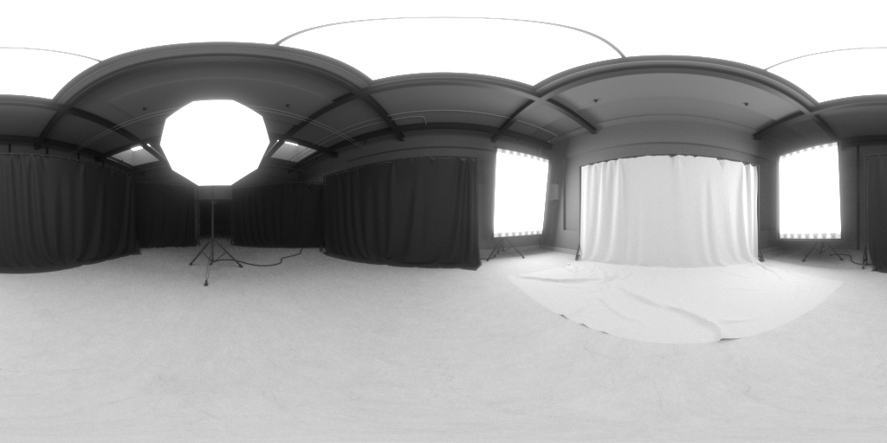
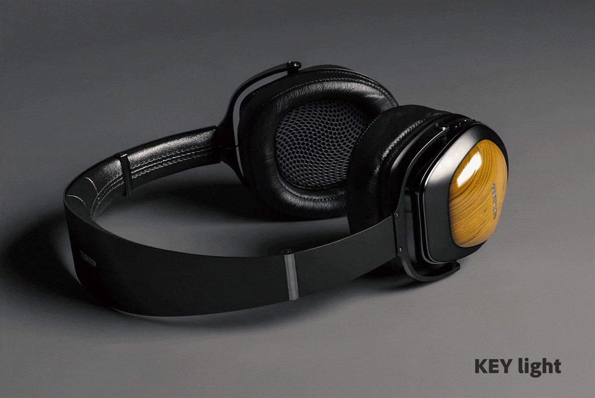
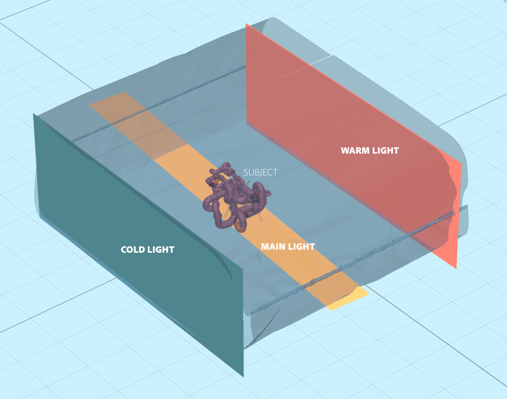

# CGI での 3D ライティングをマスターするためのヒントとテクニック

3D ライティングと、コンピューターで生成したシーンを完全に変える様々なライティング条件を作成する方法、およびシーン内のオブジェクトの外観について学習します。

私たちは感覚を使って周囲の世界を知覚します。聞く、感じる、匂う、見る。 光子と呼ばれる素粒子が持ち込んだ情報を目が取り込んでいるから見える。 この情報は脳によって処理され、画像が生成されます。 オブジェクトの色、光沢、透明度、または金属的性質として解釈されるものは、すべてフォトンとオブジェクトの表面との相互作用の産物です。

コンピューターで生成された 3D シーン内の光のメカニズムは、 [レイトレーシング](https://en.wikipedia.org/wiki/Ray_tracing_(graphics))を選択します。 光線はシェイプに跳ね返ってマテリアルと相互作用し、最終画像でオブジェクトがどのように見えるかを効果的に定義します。 ライトは、3D シーンに存在するあらゆる要素の次元を公開します。

一部のマテリアルは、他のマテリアルよりも光源条件に敏感です。 例えば金属の場合：クロムのオブジェクトは、基本的に周囲のすべてを反射します。 ライトを移動したり、ライトが明るくなったり大きくなったりすると、その情報はすべて、ほぼ鏡のようなディテールでクロム表面に直接表示されるため、ライトの状態によって外観が異なる場合があります。

## 3D ライトを使用して効果的な 3D レンダリングを作成する方法

3D レンダリングを作成するプロセスはまったく同じではありませんが、最も一般的な手順は次のとおりです。

1. オブジェクトの作成または取得
1. シーンアセンブリ
1. シーンのフレーミング
1. **照明**
1. マテリアルの作成または割り当て
1. レンダリング

照明の段階に入ったら、マテリアルを操作する前に照明を設定するのが理想的です。 このためには、中間色のグレーのマットなマテリアルをシーン全体に割り当てます。 これにより、ライトがシーン内のオブジェクトのシルエットに与える影響をより明確に確認し、理解することができます。 マテリアルが完成したら、照明をさらに調整する必要があります。

ライトは 1 つずつ操作することをお勧めします。 アクティブなライトはシーンに表示される唯一のライトであるべきで、その他のライトは一時的にオフにする必要があります。 これにより、特定のライトがシーンにどのように影響するかを確認し、位置、方向、強度などのプロパティを操作して変更できます。

もう 1 つの便利な方法は、光沢のある金属マテリアル（クロムまたはミラー）で球体を作成することです。 この「ミラーボール」は、周囲のシーン全体を効果的に反射するので、ライトの位置、方向、サイズを簡単に決定できます。 環境光の場合は、ミラーボールに反射が見えるので、空間での方向の設定に役立ちます。

## Adobeのライトの種類 [!DNL Dimension]

### 環境光

環境光は正距円筒図法（球状）の画像で、シーン全体を包み込みます。 その名前が示すように、これらのライトは環境全体をエミュレートします。これには光源も含まれ、環境内に保存されます。

で新しいシーンを作成する場合 [[!DNL Dimension]](https://www.adobe.com/products/dimension.html)を選択すると、デフォルトの環境光が作成されます。 このため、シーン内の何かをすぐに実際に見ることができます。 Adobe [!DNL Dimension] スターターアセットには、一定の数の環境光が含まれており、すぐに試すことができます。 さらに、 [Adobe [!DNL Stock]](https://stock.adobe.com/search?filters[content_type:3d]=1&amp;filters[3d_type_id][0]=2&amp;load_type=3d+lp) には、厳選された環境光が多数用意されています。

環境光は非常にリアルな結果を生成し、時間を大幅に節約できます。 手作業で同様の作業を行うには、3D（様々な光源を含む）で環境全体を実際に作成する必要があります。これは大量の作業です。

環境光を作成するには、3D シーンからキャプチャする、写真からキャプチャする、パラメトリックシステムを使用するなど、様々な方法があります。 3D シーンから環境光が作成されている場合、処理は簡単です。 出力画像は 32 ビットである必要があります。32 ビットでは、シーン内のすべてのライトのライト情報がキャプチャされます。 3D カメラは、（球面画像を出力するための）正距円筒図法を使用する必要があります。

現実世界の写真を撮影して、環境光を作成することもできます。 このワークフローでは、360 度カメラが必要です ( 例： [Ricoh Theta Z1](https://theta360.com/en/about/theta/z1.html))。 次に、カメラは露出ブラケットに使用されるか、同じ環境を複数枚撮影し、異なる範囲の露光値（露光量不足から露光量過多まで）で撮影されます。 これらのショットは、HDR（High Dynamic Range の略）と呼ばれる 32 ビット画像を構成するために使用されます。 このような画像を構成する 1 つの方法は、Photoshopの「HDR に統合」機能を使用することです。 埋め込まれた露光量範囲が、強度プロパティになります。

どちらの場合も、光源（およびその強度）はこれらのイメージに「焼き付け」られ、で使用されると光を発します [!DNL Dimension]を選択します。

これらの方法では、必要なライティング、反射、ディテールをすべてキャプチャしましたが、3D アプリでは 3D 空間で編集を続けられるため、ライティングの回転を調整したり、全体的な強度やカラーを変更したりできます。

### 指向性ライト

360 度からの光を放出する環境光に加えて、一方向からの光のみを放出する指向性ライトもあります。 フラッシュライトや、明確に定義されたエミッタから発せられるその他のタイプのライトをエミュレートするために使用され、円や正方形の形にすることができます。

指向性ライトを使用すると、ライティング設定を完全に制御できます。 これらのライトを使用してシーンをライティングする方法は、従来の写真と同じです。各ライトを個別に制御できるので、独自の仮想写真ライティングを作成できます。 最も一般的に使用される照明設定の 1 つは、3 点ライトシステムです。

[!DNL Dimension] には、「ライトをポイントに向ける」という便利なアクションがあり、3D オブジェクト全体をクリックしてドラッグするだけで、回転と高さを制御できます。 これにより、光線を動的に方向付けることができます。 これらのパラメーターは手動で調整することもできます。

指向性ライトのカラーと強度を変更したり、光源の形状を調整したりできます。円形または長方形にしたり、伸ばしたり、大きくしたりできます。 最後に、光源のエッジをソフトにすることができます。

![指向性ライトの形状の変更 (Adobe) [!DNL Dimension]](assets/Mastering3dlighting_12.gif)

光源をオブジェクトより小さくすると、照らされたオブジェクトを光線が通り抜けられないので、影がシャープになり、輪郭がより鮮明になります。 光源が大きいほど影が柔らかくなります。この場合、光線がオブジェクトのすべての側面から照射され（下の図では赤で示されています）、多数の影が作成されます。 これらのシャドウは、反対方向から照射される光線によってソフトになります。

### 太陽と空

太陽光は、特殊なタイプの指向性ライトです。 設定手順は通常の指向性ライトとほとんど同じですが、このライトは高さに応じて自動的にカラーを変更します。水平線に近い位置（高さの角度の値が低い位置）では、夕日をシミュレートするために徐々に暖色になります。 プリセットを使用してカラーを変更することもできます。 一方、曇り具合はシャドウの柔らかさに影響します。

![Adobeでの 3D 自動車モデルの太陽光照明プロパティの操作 [!DNL Dimension]](assets/Mastering3dlighting_15.gif)

環境光を使用して空を再現でき、空を特徴とする環境光を使用できます。 今、私たちは太陽光を整列させる必要があります ( で作られた [!DNL Dimension]) を太陽と共に、環境光で撮影します。 これをすばやく行う方法は、球体を作成して金属マテリアルを割り当てることです。これにより、環境の反射がリアルタイムで得られるので、「ライトをポイントに向ける」を使用して太陽光を太陽に揃えることができます。

曇り空が特徴の環境光の場合は、曇り具合のプロパティを使用して、これらの条件により近づくことができます。

![Adobeで 3D 自動車モデルの空の環境光の曇りのプロパティを操作 [!DNL Dimension]](assets/Mastering3dlighting_17.gif)

太陽光と空の環境光をペアにしたら、グローバル回転プロパティを使用して一緒に回転できます。

### オブジェクトベースのライト

マテリアルの [ グロー ] プロパティをオンにすると、オブジェクトを光源にすることができます。 これにより、電球、ネオンライト、ソフトボックス、あらゆる種類の画面やディスプレイなどのオブジェクトを作成できます。

このタイプの照明を使用する主な利点は、照度の減衰です。これにより、非常に自然な結果が得られます。 これは、製品のビジュアライゼーションやその他のスタジオベースのシーンで非常に便利です。

変形ツールを使用して、発光オブジェクトを拡大または縮小することで、影の柔らかさを制御できます。 大きくすると、光の強さも強くなります。

これまでに説明した種類のライトとは異なり、これらのライトでは単色の他にテクスチャも利用できます。 テクスチャはマテリアルのベースカラーにアタッチでき、光の強さは発光スライダーでコントロールします。

## 効果的な 3D ライティングの例

### 製品照明

プロダクトショットの照明を設定する写真技術は数多くあります。 ここでは、最もよく使用される設定の 1 つである 3 点ライトシステムを使用します。

この設定は、次の 3 つのライトで構成されています。

1. **キーライト：** 主光源として使用され、ほぼカメラの方向から光が当たります

   

1. **リムライト：** キーとは反対側に配置され、被写体のシルエットを見せるために使用されます。

   

1. **補助光：** 比較的弱い光で、暗い部分を補う役割をします。これは、前の 2 つのライトが届かない部分に使用されます。

   

で 3 点照明を作成するには、2 つの方法があります [!DNL Dimension]  — 指向性ライト（シーンに個別に追加するか、3 点ライトプリセットを使用）または発光オブジェクトを使用する。

### クリエイティブな照明

クリエイティブな照明は、物理的な精度が主な目標ではない場合に使用されます。 これにはあらゆる種類の抽象シーンや超現実シーンが含まれるため、私たちの想像力を際限なく発揮することができます。

上の例では、アイデアは夢のような環境を描くことでした。キャンディ、パステルカラー、滑らかな表面。 照明システムは、3 つの発光プレート（側面に 2 つ、下から輝く主な 1 つ）で構成されています。 発光プレートはすべて非現実的に大きく、非常に滑らかなシャドウとハイライトを作成します。 光源が色付けされ、その色がシーン内のオブジェクトに割り当てられたマテリアルに転送されます。

シーンの対象（パイプ）は、壁のジオメトリで完全に囲まれています。 これにより、光線が前後に跳ね返り、興味深い方法で混合されます。 クールなトーンと暖かいトーンを対比させると、良いコントラストが得られます（このテクニックはポートレート写真で使用されることもあります）。

### 内部視覚化

3D 内部のビジュアライゼーションを作成するには、一定の規則に従います。これにより、ほとんどの場合、良好な結果が保証されます。 この使用例では、自然光のみを考慮します（ランプのような人工光源は考慮しません）。

まず第一に、このようなシーンは閉じた環境にある必要があります。 実際の生活と同様に、内部には壁、床、天井、窓が必要です。 これにより、ライトが窓を通り抜け、（レイトレーシングと呼ばれるプロセスを通じて）周囲に反射します。 このビヘイビアーは、非常に自然なライティングを生成します（例えば、コーナーなどの閉塞領域は暗くなります）。

シーンはほぼ完全に建築ジオメトリに囲まれているため、照明はほとんど見られず、環境光からの反射はほとんどありません。 しかし、このケースでは、実際に独自の環境を構築しています。これは屋内自体です。 そのため、ライトはオブジェクトや周囲の壁で反射し、シーン内のオブジェクトと反応します。 オブジェクトは、オブジェクト同士およびオブジェクトを囲む壁のみを反射します。 ただし、空を特徴とする環境光を追加することをお勧めします。 これにより、拡散する青の塗りが追加されます。

このライトを設定する最も簡単な方法は、発光マテリアルを含む平面を使用することです。 この使用例では、3 つの平面を使用して、内部のすべての開口部をカバーします。

光の強さは、平面のマテリアル上の発光プロパティによって制御されます。 カラーやテクスチャを追加して、面白い影を付けることができます。 また、グローマテリアルを使用すると、光の強さの減衰が得られます。これは、屋内の照明にとって非常に重要です。

### 屋外照明

屋外照明の作成はかなり簡単で、太陽と空ライトシステムを使用することになります（上記を参照）。 太陽光を空ベースの環境光と正しく一致させることが重要です。方向と曇りの値の両方に注意してください。

このシーン自体が大きな役割を果たしています。 魅力的な結果を生み出すには、光と相互作用する触媒としてシーン内のオブジェクトを使用します。 上に示した森のレンダリングでは、オブジェクト（さまざまな植物、ログ、木）が互いに近くに配置されています。

つまり、ライトがオブジェクト間で跳ね返るので、複雑なレイトレーシングの相互作用が多くなります。 影の付いた部分は（予想通りに）暗く見えますが、露出した部分は明るいままです。

![Using the Global Rotation inAdobe [!DNL Dimension] 3D シーンで太陽と空ライトシステムの方向を変更するには](assets/Mastering3dlighting_34.gif)

この概要が、さまざまな状況で 3D ライトをマスターすることの重要性を示すことを願っています。 より説得力のある結果を生み出す準備が整っている必要があります。

素敵な照明です。 ダウンロード [最新リリース](https://creativecloud.adobe.com/apps/download/Dimension) Dimensionです。
