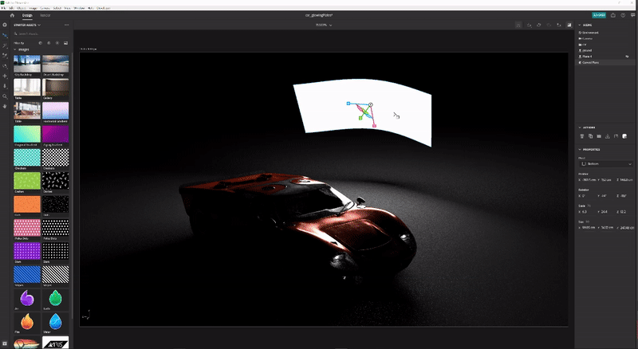
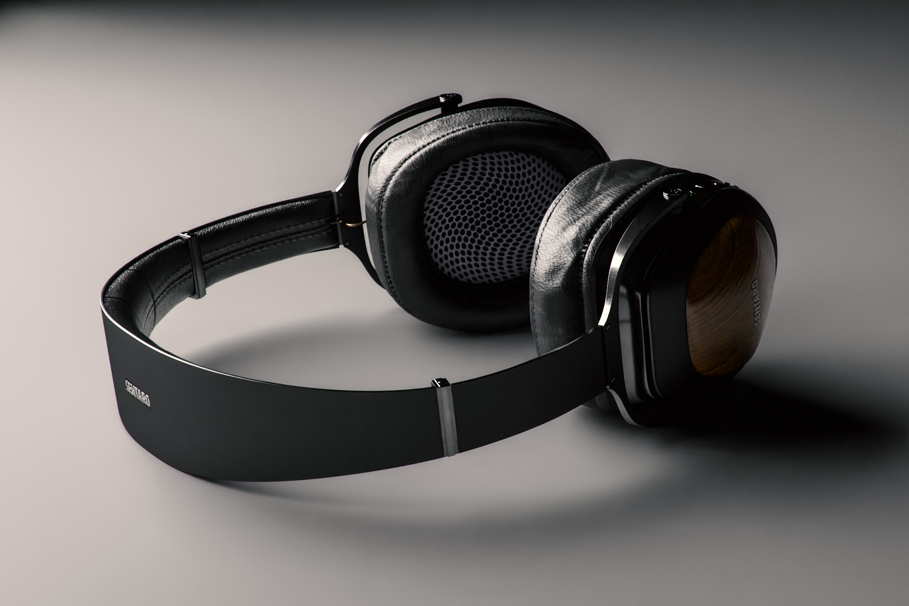

# CGIで3D照明をマスターするためのヒントとテクニック

3D照明について、およびコンピュータで生成されたシーンを完全に変更できるさまざまな光条件を作成する方法と、オブジェクトの内部での外観を説明します。

我々は、我々の感覚を使って周囲の世界を見抜く。耳、感じ、匂い、見る。 目が光子と呼ばれる素粒子によって私たちに伝わる情報を集めているので、私たちは目が見える。 この情報は、私たちの脳で処理され、画像を生成します。 オブジェクトカラー、光沢、半透明性、または金属の品質と解釈されるのは、フォトンとオブジェクトのサーフェス間の相互作用のすべての産物です。

コンピュータで生成された3Dシーンの光力学は、[レイトレース](https://en.wikipedia.org/wiki/Ray_tracing_(graphics))と呼ばれるプロセスを通じて、フォトン散乱の自然な原理に従います。 レイはシェイプから跳ね返り、マテリアルと相互に作用し、最終的なイメージでのオブジェクトの表示を効果的に定義します。 ライトは、3Dシーンに存在するすべての要素の次元を表示します。

照明条件に対する感度が高いマテリアルもあります。 例えば、金属を取ります。クロムのオブジェクトは、基本的に周囲のすべてを反映しています。 ライトを移動、明るく、または大きくすると、その情報はすべてクロムサーフェス上で鏡のような細部で直接見えるので、ライトの状態が異なるように見える場合があります。

## 3Dライトを使用して効果的な3Dレンダリングを作成する方法

3Dレンダリングの作成プロセスは決して同じではありませんが、最も一般的な手順は次のとおりです。

1. オブジェクトの作成または取得
1. シーンアセンブリ
1. シーンをフレーム化する
1. **照明**
1. 材料の作成または割り当て
1. レンダリング

照明フェーズに到達したら、マテリアルを使用する前にライトを設定するのが理想的です。 これを行うには、シーン全体に中間色のグレーのマットマテリアルを割り当てます。 こうすると、ライトがシーン内のオブジェクトシルエットに与える影響をより明確に確認し、理解できるようになります。 マテリアルが完成した後、照明をさらに洗練する必要が生じる場合があります。

一度に一つずつ明かりをつけるのが一番だ。 アクティブなライトはシーン内で唯一の可視ライトで、他のライトは一時的にオフにする必要があります。 この方法では、特定のライトがシーンにどのように影響するかを確認し、位置、方向、強度などのプロパティを操作して、シーンを変更できます。

もう1つの便利な方法は、光沢のある金属のマテリアル（クロムまたはミラー）を持つ球を作成することです。 この「ミラーボール」は、周囲のシーン全体を効果的に反映するので、ライトの位置、方向、サイズを簡単に決定できます。 環境ライトの場合は、ミラーボールに反射が見えるので、空間での方向の設定に役立ちます。

## Adobe [!DNL Dimension]のライトの種類

### 環境ライト

環境ライトは等角（球状）のイメージで、シーン全体にラップされます。 名前が示すように、これらのライトは、光源を含む環境全体をエミュレートし、その中に格納されます。

[[!DNL Dimension]](https://www.adobe.com/products/dimension.html)に新しいシーンを作成すると、既定の環境ライトが作成されます。 このため、シーン内の何もかも即座に見ることができます。 Adobe [!DNL Dimension] Starterアセットには、一定数の環境ライトが含まれています。このライトは、すぐに試してみることができます。 また、[Adobe [!DNL Stock]](https://stock.adobe.com/search?filters[content_type:3d]=1&amp;filters[3d_type_id][0]=2&amp;load_type=3d+lp)では、環境ライトの選択が非常に簡単です。

環境ライトは非常にリアルな結果を生み出し、時間を大幅に節約できます。 手動で同じような作業を行うには、非常に多くの作業を行う3D（さまざまな光源を含む）で環境全体を実際に作成する必要があります。

3Dシーンからのキャプチャ、写真からのキャプチャ、パラメトリックシステムの使用など、環境ライトを作成する方法は多数あります。 環境ライトが3Dシーンから作成されている場合、処理は簡単です。 出力イメージは32ビットにする必要があり、シーン内のすべてのライトのライト情報がキャプチャされます。 3Dカメラは、（球状のイメージを出力するために）等角投影を使用する必要があります。

現実の世界の写真をキャプチャして、環境ライトを作成することもできます。 このワークフローには、360台のカメラが必要です（例： [Ricoh Theta Z1](https://theta360.com/en/about/theta/z1.html)）。 次に、カメラは露出ブラケティングに使用されます。また、同じ環境の複数のショットを、異なる露出値（露出不足から露出過剰）で撮影します。 これらのショットは、32ビットのイメージを作成するために使用され、HDR（High Dynamic Rangeの略）と呼ばれる場合が多くなります。 このような画像を組み立てる方法の1つは、Photoshopの「HDRに合成」機能を使用する方法です。 埋め込まれた露出範囲が強度プロパティになります。

どちらの場合も、光源（とその強度）はこれらのイメージに「焼き付け」られ、[!DNL Dimension]で使用された後に光を放出します。

これらの方法では、必要な照明、反射、および詳細をすべてキャプチャしましたが、3Dアプリでは引き続き3D空間で編集できるため、照明の回転を調整し、全体の強度とカラーを変更できます。

### ディレクショナルライト

360度からライトを放出するEnvironmentライトに加えて、1方向からのみライトを放出するDirectionalライトもあります。 これらは、フラッシュライトや、明確に定義されたエミッタから発せられる他のタイプのライトをエミュレートするのに使用され、円や正方形の形状を作成できます。

ディレクショナルライトを使用すると、ライティングの設定を完全に制御できます。 これらのライトを使用してシーンを照明する方法は、従来の写真と同じです。従来の写真では、各ライトを個別に制御できるので、独自の仮想写真ライトを作成できます。 最も一般的に使用される照明設定の1つは、3点照明システムです。

[!DNL Dimension] には、「点での照明」という便利なアクションがあり、3Dオブジェクトをクリックしてドラッグするだけで、回転と高さを制御できます。この方法で、光線を動的に方向付けることができます。 これらのパラメータは、手動でも調整できます。

ディレクショナルライトのカラーと強度を変更したり、光源の形状を調整したり、円形または長方形にしたり、引き伸ばしたり、大きくしたりすることができます。 最後に、光源のエッジを柔らかくすることができます。

![Adobeでの指向性ライトの形状の変更  [!DNL Dimension]](assets/Mastering3dlighting_12.gif)

光源をオブジェクトより小さくすると、光線は照らされたオブジェクトを通り抜けることができないので、シャドウは輪郭が鮮明になり、シャープになります。 光源が大きいと、オブジェクトのすべての側面から光線が届き、影の配列が作成されるので、より柔らかい影が生成されます。 これらの影は、反対の方向から来る光線によって柔らかくなります。

### 太陽と空

サンライトは、特別なタイプの指向性ライトです。 設定のプロセスは通常の指向性ライトと非常に似ていますが、このライトは高さに応じて自動的にカラーを変更します。水平線（低い高さの角度値）に近づくと、日没をシミュレートするために徐々に暖かくなります。 プリセットを使用してカラーを変更することもできます。 一方、曇りは影の柔らかさに影響します。

![Adobeの3D自動車モデルでの太陽光照明の照明プロパティの操作  [!DNL Dimension]](assets/Mastering3dlighting_15.gif)

環境ライトを使って空をエミュレートでき、空を特徴とする環境ライトを使用できます。 ここで、環境ライトでキャプチャされた太陽と（[!DNL Dimension]で作られた）太陽の位置を合わせる必要があります。 これをすばやく行うには、球を作成し、それに金属マテリアルを割り当てます。これにより、環境のリアルタイムの反射が得られるので、Aimライトをポイントで使用して、太陽と太陽の位置を合わせることができます。

環境ライトに曇り空がある場合は、曇りのプロパティを使用して、これらの条件をより近くに合わせることができます。

![Adobeの3D自動車モデルでの空の環境照明の曇りのプロパティの操作  [!DNL Dimension]](assets/Mastering3dlighting_17.gif)

サンライトとスカイ環境ライトがペアになったら、[グローバル回転]プロパティを使用してそれらを一緒に回転できます。

### オブジェクトベースのライト

マテリアルの[グロー]プロパティをオンにすると、オブジェクトを光源に変換できます。 これにより、電球、ネオンライト、ソフトボックス、各種のスクリーンやディスプレイなどのオブジェクトを作成することが可能になる。

このタイプのイルミネーションを使用する主な利点は、強度の減衰です。これは非常に自然な結果を生成します。 これは、製品のビジュアル化や他のスタジオベースのシーンに非常に便利です。

変換ツールを使用して、輝くオブジェクトを上下にスケールすることで、シャドウの柔らかさを制御できます。 大きくすると、光の強度も増します。

前のタイプのライトとは異なり、これらのライトは地味なカラーに加えてテクスチャも利用できます。 テクスチャはマテリアルのベースカラーにアタッチでき、光の強度はグロースライダを使用して制御されます。

## 効果的な3D照明の例

### 製品の照明

プロダクトショットのライトを設定するには、多くの写真のテクニックがあります。 最も一般的に使用される設定の1つ、3点ライトシステムを使用します。

この設定は、次の3つのライトで構成されます。

1. **主光源：主** 光源として使用され、カメラの方向からほぼ輝きます。

   

1. **Rim Light：キ** ーとは反対の側に配置され、被写体のシルエットを表示するのに使用されます。

   

1. **Fill Light：集** 中度が低く、暗い領域を埋めるのに役立ちます。前の2つのライトが届かない領域に使用されます。

   

[!DNL Dimension]で3点ライトを作成する方法は2つあります。ディレクショナルライトを使用する（個別にシーンに追加する、または3点ライトプリセットを使用する）方法と、光るオブジェクトを使用する方法です。

### クリエイティブな照明

クリエイティブな照明は、物理的な精度が主な目標ではない場合に使用されます。 これにはあらゆる種類の抽象的で超現実的なシーンが含まれているので、私たちの想像力が私たちを取り巻く本当の境界は存在しない。

上の例では、夢のような環境を描くことが考えられました。キャンディ、パステルカラー、滑らかなサーフェス。 照明装置は、3枚の光る板（横に2枚、下から主に光る板）で構成される。 輝くプレートはすべて非現実的に大きく、非常に滑らかな影とハイライトを作成します。 光源が色付けされ、その色がシーン内のオブジェクトに割り当てられたマテリアルに転送されます。

シーン（パイプ）の主題は、壁のジオメトリに完全に囲まれています。 これにより、光線が前後に跳ね返り、興味深い方法で混ざり合います。 クールなVSの暖かいトーンで再生すると、よくコントラストが良くなります（この手法は、ポートレート写真で使用される場合もあります）。

### 内部の視覚化

3D内部の視覚化を作成する場合は、一定の規則に従います。これにより、ほとんどの場合、良好な結果が得られます。 この使用例では、自然光のみを考慮します（ランプのような人工の光源は考慮しません）。

まず、このようなシーンは閉じた環境にある必要があります。 実際の生活と同じように、室内には壁、床、天井、窓が必要です。 これにより、ライトが窓を通り抜け、（レイトレーシングと呼ばれるプロセスを介して）周りに跳ね返ります。 この動作は、非常に自然な照明を生成します（たとえば、コーナーなどの隠れた領域は暗くなります）。

シーンはほとんど完全にアーキテクチャルジオメトリに囲まれているので、照明がほとんど見えず、Environmentライトから反射はほとんど見えません。 しかし、この場合、私たちは実際に自分たちの環境を作り上げています。それは、内部そのものです。 そのため、ライトはシーン内のオブジェクトと反応し、周囲の壁から跳ね返ります。 オブジェクトは互いとその周りの壁だけを反射します。 しかし、空を映し出す環境ライトを追加するのは良い考えです。 これにより、拡散反射光の青い塗り潰しが追加されます。

このライトを設定する最も簡単な方法は、光るマテリアルを含む平面を使用する方法です。 この使用例では、3つの平面があり、内部のすべての開口部を覆っています。

ライトの強度は、平面のマテリアルのグロープロパティによって制御されます。 カラーやテクスチャを追加して、興味深い影を付けることができます。 グローマテリアルを使用すると、光の強度の減衰も得られます。これは、内部の照明にとって非常に重要です。

### 屋外照明

屋外照明の作成は非常に簡単で、サンとスカイのライトシステムを使用することになります（上を参照）。 太陽光を空に基づく環境ライトと正しく一致させ、方向と曇りの値の両方に注意することが重要です。

シーン自体がこれに大きな役割を果たします。 魅力的な結果を得るには、シーン内のオブジェクトをライトと相互作用する触媒として使用します。 上に示したフォレストレンダーでは、オブジェクト（さまざまな植物、ログ、木）が互いに近くに配置されます。

つまり、ライトがオブジェクト間でバウンスするので、複雑なレイトレースの相互作用が多く発生します。 シェーディングされたスポットは暗く表示されますが、露出した領域は明るく残ります。

![Adobeのグローバル回転を使用 [!DNL Dimension] した3DシーンでのSunとSkyのライトシステムの方向変更](assets/Mastering3dlighting_34.gif)

この概要が、さまざまな状況で3Dライトをマスターする重要性を示すことを願っています。 より説得力のある結果を生み出す準備が整っている必要があります。

ハッピーライト！ Dimensionの[最新リリース](https://creativecloud.adobe.com/apps/download/[!DNL Dimension])を今すぐダウンロードします。
