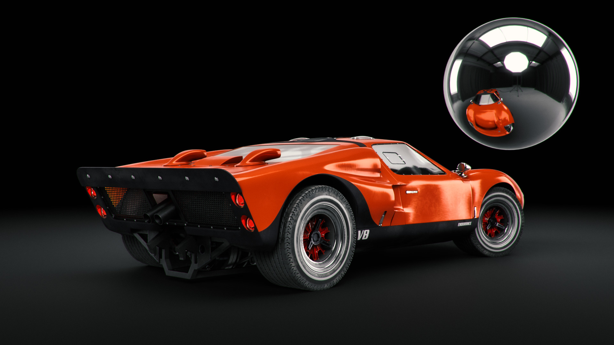

# CGIでの3Dライティングをマスターするためのヒントとテクニック

3Dライティングの概要と、コンピューターで生成されたシーンを完全に変化させたりシーン内のオブジェクトの見え方を変化させるさまざまな照明条件を作成する方法について説明します。

我々は感覚を使って周りの世界を知覚する：我々は聞く、感じる、匂う、見る。 私たちが目で見ることができるのは、光子と呼ばれる素粒子によってもたらされる情報を目が取り込んでいるからです。 この情報は脳で処理され、画像が生成されます。 物体の色、光沢、透光性、金属質として私たちが解釈するものは、すべて光子と物体の表面との相互作用の産物です。

コンピューターで生成された3Dシーン内の光のメカニズムは、レイトレーシングと呼ばれる処理を通じて、光子散乱の自然な原理と同じです。 光線はシェイプに跳ね返り、マテリアルと相互作用し、最終画像でのオブジェクトの外観を効果的に定義します。 ライトは、3Dシーンに存在するあらゆる要素の立体感を浮き出させます。

一部のマテリアルは、他のマテリアルよりも光源条件に敏感です。 例えば金属を考えてみましょう。クロムのオブジェクトは、基本的に周囲のすべてを反射します。 ライトを移動して明るくしたり大きくしたりすると、すべての情報がクロムの表面に直接鏡のようなディテールで表示されるため、ライトの状態が他の状態と完全に異なって見える場合があります。

## 3Dライトを使用した効果的な3Dレンダリングの作成方法

3Dレンダリングを作成するプロセスがまったく同じになることはありませんが、最も一般的な手順を次に示します。

1. オブジェクトの作成または取得
1. シーンアセンブリ
1. シーンのフレーミング
1. **照明**
1. マテリアルの作成または割り当て
1. レンダリング中

照明の段階に入ったら、マテリアルを操作する前に照明を設定するのが理想的です。 これを行うには、中間色のグレーのマットマテリアルをシーン全体に割り当てます。 これにより、ライトがシーン内のオブジェクトのシルエットに与える影響をより明確に確認し、理解することができます。 マテリアルが完成したら、照明をさらに調整する必要がある場合があります。

照明は、一度に1つずつ操作することをお勧めします。 アクティブなライトだけをシーンに表示し、その他のライトは一時的にオフにします。 これにより、特定のライトがシーンにどのように影響するかを確認し、そのプロパティ（位置、方向、強さなど）を操作して変更できます。

もう1つの便利な方法は、光沢のある金属マテリアル（クロムまたはミラー）で球体を作成することです。 この「ミラーボール」は、周りのシーン全体を効果的に反射するので、ライトの位置、方向、サイズを簡単に決定できます。 環境光の場合、ミラーボールに反射が見え、空間での方向の設定に役立ちます。

## Adobeのライトの種類 [!DNL Dimension]

### 環境ライト

環境光は正距円筒図法（球状）の画像で、シーン全体を包み込んでいます。 その名前が示すように、このライトは、環境全体をエミュレートする役割を持ち、これには光源も含まれ、環境全体に格納されます。

で新しいシーンを作成するとき [[!DNL Dimension]](https://www.adobe.com/products/dimension.html)デフォルトの環境光が自動的に作成されます。 このため、シーン内のすべての要素を実際にすぐに見ることができます。 Adobe [!DNL Dimension] スターターアセットには、いくつかの環境光が含まれており、これらをすぐに試してみることができます。 さらに [Adobe [!DNL Stock]](https://stock.adobe.com/search?filters[content_type:3d]=1&amp;filters[3d_type_id][0]=2&amp;load_type=3d+lp) には、厳選された環境光が多数提供されています。

環境光は非常にリアルな結果を生み出し、時間を大幅に節約できます。 手動で同じようなことを実現するには、3Dで環境全体（様々な光源を含む）を実際に作成する必要があります。これは非常に手間のかかる作業です。

環境光を作成するには、3Dシーンからキャプチャする、写真からキャプチャする、パラメトリックシステムを使用するなど、さまざまな方法があります。 環境光が3Dシーンで構成されている場合、処理は簡単です。 出力画像は32ビットにする必要があります。32ビットでは、シーン内のすべてのライトのライト情報がキャプチャされます。 3Dカメラでは、（球面画像を出力するための）正距円筒図法を使用する必要があります。

現実世界の写真を撮影して環境光を作成することもできます。 このワークフローには、360カメラが必要です(例： [Ricoh Theta Z1](https://theta360.com/en/about/theta/z1.html))を参照してください。 次に、カメラは露光量ブラケティングまたは同じ環境の複数のショットに使用され、一定の範囲の異なる露光値（露光量不足から露光量過多まで）で撮影されます。 これらのショットは、32ビット画像を作成するために使用され、通常はHDR（ハイダイナミックレンジの略称）と呼ばれます。 このような画像を構成する1つの方法として、Photoshopの「HDRに統合」機能があります。 埋め込まれた露光量範囲が、強度プロパティになります。

いずれの場合も、光源（およびその強度）はこれらの画像に「焼き付け」られ、使用されると光を放出します [!DNL Dimension].

これらの方法では、必要な照明、反射、ディテールをすべてキャプチャしましたが、3Dアプリでは3D空間でこれらの編集を引き続き行えるので、照明の回転を調整したり、全体の強度やカラーを変更したりできます。

### 指向性ライト

360度から光を放つ環境光に加えて、一方向からのみ光を放つ指向性ライトもあります。 フラッシュライトや、明確に定義された光源から発せられる他のタイプのライトをエミュレートするために使用され、円や正方形の形にすることができます。

指向性ライトを使用すると、照明の設定を完全に制御できます。 これらのライトを使用してシーンをライティングする方法は、従来の写真撮影の場合と同じです。各ライトを個別に制御できるので、独自の仮想的な写真照明を作成できます。 最も一般的に使用される照明設定の1つは、3点照明システムです。

[!DNL Dimension] には、「ライトをポイントに向ける」という便利なアクションがあり、3Dオブジェクトをクリックしてドラッグするだけで、回転と高さを制御できます。 これにより、光線の方向を動的に変更できます。 これらのパラメーターは手動で調整することもできます。

指向性ライトのカラーと強度を変更したり、光源の形状を調整したりできます（円形または長方形にしたり、伸ばしたり、大きくしたりします）。 最後に、光源のエッジをソフトにします。

![Adobeの指向性ライトの形状を変更する [!DNL Dimension]](assets/Mastering3dlighting_12.gif)

光源をオブジェクトよりも小さくすると、照らされたオブジェクトを光線が通り抜けないので、影がシャープになり、輪郭がより鮮明になります。 光源が大きいほど影が柔らかくなります。この場合、光線はオブジェクトのすべての側面から来ており（下の図では赤で示されています）、多数の影が作成されます。 これらのシャドウは、反対方向から照射される光線によってソフトになります。

### 太陽と空

太陽光は特別なタイプの指向性ライトです。 設定のプロセスは通常の指向性ライトにとても似ていますが、このライトでは、高さに応じてカラーが自動的に変更されます。水平線に近い（高さの値が低い）場合、夕日をシミュレートするために徐々に暖かみが加わります。 プリセットを使用してカラーを変更することもできます。 一方、曇り具合はシャドウの柔らかさに影響します。

![Adobeの3D自動車モデルで太陽光の照明プロパティを操作する [!DNL Dimension]](assets/Mastering3dlighting_15.gif)

環境光を使って空を再現できます。また、空の特徴を生かした環境光も使用できます。 次に、太陽光の位置を合わせる必要があります( [!DNL Dimension])は、環境光で撮影した太陽を使用して行います。 これは、球体を作成し、その球体にメタルのマテリアルを割り当てることで簡単におこなうことができます。これにより、環境の反射がリアルタイムで得られるので、「ライトをポイントに向ける」を使用して、太陽光と太陽の位置合わせることができます。

曇り空の特徴を生かした環境光を使用する場合は、曇り具合のプロパティを使用して、これらの条件により近い状態にできます。

![Adobeの3D自動車モデルにおける空の環境照明の曇りのプロパティの操作 [!DNL Dimension]](assets/Mastering3dlighting_17.gif)

太陽光と空の環境光を組み合わせたら、グローバル回転プロパティを使用してこれらを同時に回転できます。

### オブジェクトベースのライト

マテリアルの発光プロパティをオンにすると、オブジェクトを光源にすることができます。 これにより、電球、ネオンライト、ソフトボックス、あらゆる種類の画面やディスプレイなどのオブジェクトを作成できます。

このタイプの照明を使用する主な利点は、照度の減衰です。これにより、非常に自然な結果が得られます。 これは、製品のビジュアル化や他のスタジオベースのシーンで非常に便利です。

変形ツールを使用して、発光オブジェクトを拡大または縮小することで、シャドウの柔らかさを制御できます。 大きくすると、光の強さも強くなります。

以前に説明したタイプのライトとは異なり、これらのライトでは、単色に加えてテクスチャも使用できます。 テクスチャはマテリアルのベースカラーにアタッチでき、光の強さは発光スライダーで制御します。

## 効果的な3D照明の例

### 製品の照明

プロダクトショットの照明を設定するには、多くの撮影技法があります。 ここでは、最も一般的に使用される設定の1つである3点ライトシステムを使用します。

この設定は、次の3つのライトで構成されます。

1. **キーライト：** プライマリソースとして使用します。ほぼカメラの方向から光が当たります

   

1. **リムライト：** キーとは反対側の方向から見て、被写体のシルエットを見せるために使用します。

   

1. **補助光：** 比較的弱い光で、暗い部分を補う役割をします。これは、前の2つのライトが届かない部分に使用されます。

   

で3点ライトを作成するには、2つの方法があります [!DNL Dimension]  – ディレクショナルライトを使用（シーンに個別に追加するか、3点ライトプリセットを使用）、または発光オブジェクトを介して。

### クリエイティブな照明

クリエイティブな照明は、物理的な精度が主な目標ではない場合に使用します。 これにはあらゆる種類の抽象シーンや超現実シーンが含まれ、私たちの想像力を際限なく発揮することができます。

上の例のアイデアは、キャンディ、パステルカラー、滑らかな表面といった夢のような環境を表現することでした。 照明システムは、3枚の発光プレート（側面に2枚、下から光るメイン）で構成されています。 発光プレートはすべて非現実的に大きく、非常に滑らかなシャドウとハイライトを生み出します。 光源が色付けされ、その色がシーン内のオブジェクトに割り当てられたマテリアルに転送されます。

シーンの被写体（パイプ）は、壁のジオメトリで完全に囲まれています。 これにより、光線が前後に跳ね返り、面白い混ざり方になります。 寒色と暖色のトーンを対比させると、美しいコントラストが生まれることがよくあります（このテクニックはポートレート写真で使用されることがあります）。

### 内部可視化

3D内部のビジュアライゼーションを作成するには、一定の規則に従います。これにより、ほとんどの場合、良好な結果が保証されます。 この場合、自然光のみを考慮します（ランプのような人工光源は考慮しません）。

まず第一に、このようなシーンは閉じた環境にある必要があります。 実際の生活と同様に、室内には壁、床、天井、窓が必要です。 これにより、光が窓を通り抜け、（レイトレーシングと呼ばれるプロセスを通して）周囲に反射します。 この動作により、非常に自然な照明が生成されます（例えば、コーナーなどの閉塞領域は暗くなります）。

シーンはほぼ完全に建築ジオメトリに囲まれているので、照明はほとんど見えず、環境光からの反射はほとんどありません。 ただし、この例では、実際に独自の環境を構築しています。つまり、屋内自体が環境となります。 そのため、ライトはオブジェクトと周囲の壁で反射し、シーン内のオブジェクトに作用します。 オブジェクトは、お互いと周囲の壁のみを反射します。 ただし、空の特徴を持つ環境光を追加することをお勧めします。 これにより、拡散ブルーの塗りが追加されます。

このライトを設定する最も簡単な方法は、発光マテリアルを含む平面を使用することです。 この例では、3つの平面があり、内部のすべての開口部をカバーしています。

光の強さは、平面のマテリアル上の発光プロパティによって制御されます。 カラーやテクスチャを追加して、面白いシャドウを投影することもできます。 発光マテリアルを使用すると、光の強さの減衰も提供されます。これは、室内の照明にとって非常に重要です。

### 屋外照明

屋外照明の作成はかなり簡単で、太陽と空ライトシステムを使用することになります（上図を参照）。 太陽光と空ベースの環境光を正しく合わせ、方向と曇り具合の値の両方に注意することが重要です。

この場合、シーン自体が大きな役割を果たします。 魅力的な結果を得るには、シーン内のオブジェクトを光と相互作用する触媒として使用します。 上に示した森のレンダリングでは、オブジェクト（様々な植物、丸太、木）が互いに近くに配置されています。

つまり、オブジェクト間で光が跳ね返るので、複雑なレイトレーシングの相互作用が多く発生します。 日陰のスポットは（予想通りに）暗く見えますが、露出した領域は明るいままです。

![Adobeでのグローバルローテーションの使用 [!DNL Dimension] 3Dシーンで太陽と空ライトシステムの方向を再設定するには](assets/Mastering3dlighting_34.gif)

この概要で、様々な状況で3Dライトをマスターすることの重要性を説明したいと思います。 より説得力のある結果を生み出す準備が整っているはずです。

素敵な照明を使用しましょう。 ダウンロード [最新リリース](https://creativecloud.adobe.com/apps/download/Dimension) 今日のDimensionの。
