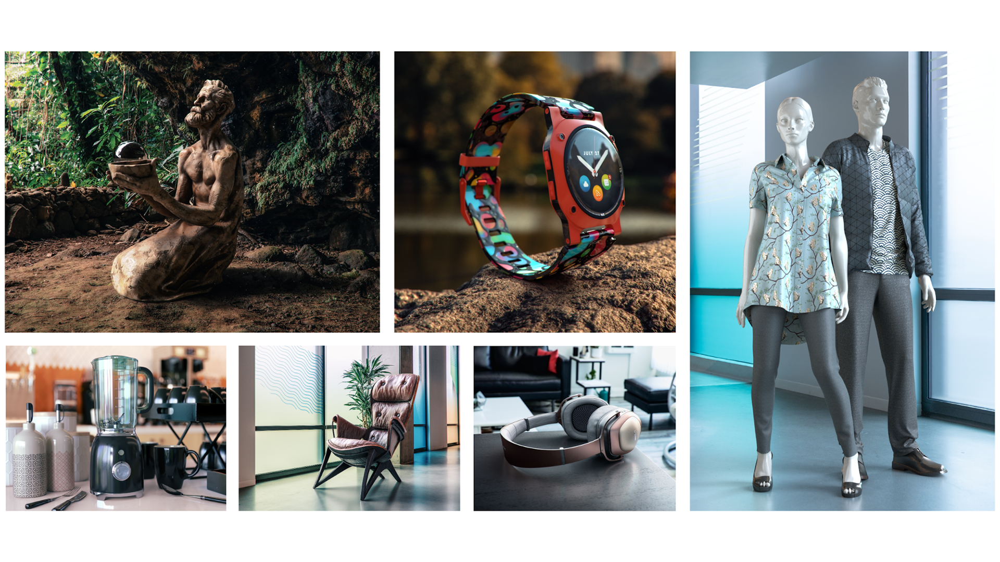

# Adobe 3DおよびVRチュートリアル

高品質のモデル、マテリアル、照明を使用して、魅力的なコンテンツを3Dでより迅速に作成します。 [!DNL Dimension] ブランドのビジュアライゼーション、イラスト、製品のモックアップ、パッケージデザインなどのクリエイティブな作品を簡単に作成できます。 画像を選択して、チュートリアルを表示します。

<table>
<tr>
 <td>
   
    

   <a href="substance-3d-stager.md"><strong>3Dデザインとレンダリング</strong></a>
    

    <em>コンテンツの読み込み、シーンの配置、マテリアルとテクスチャの適用、画像ベースの照明と物理的な照明の調整、様々な解像度のカメラの保存、フォトリアリスティックな画像のレンダリングを行います</em>
     
  </td>
  <td>
   
    

   <a href="assets/CreateRealistic3DMockupswithAdobeStockandDimension.pdf"><strong>Adobeでリアルな3Dモックアップを作成 [!DNL Stock] および [!DNL Dimension] (PDF)</strong></a>
    

    <em>Adobeを使用して2Dデザインを3Dモデルに簡単に組み合わせる [!DNL Stock] Adobeに配置されたグラフィック [!DNL Dimension]</em>
     
  </td>
  <td>
   
    

   <a href="assets/VisualizeTextileDesignsorPatternson3DObjectswithAdobeDimension.pdf"><strong>3DオブジェクトのテキスタイルデザインまたはパターンをAdobeで視覚化する [!DNL Dimension] (PDF)</strong></a>
    

    <em>完成した製品を、わずか数分で極めてリアルに再現できます</em>
     
  </td>
  <td>
   
    

   <a href="../cce/assets/VisualizeyourProductinaRealisticEnvironment.pdf"><strong>製品をリアルな環境(PDF)で視覚化</strong></a>
    

    <em>実際の環境で製品がどのように見えるかを確認したい場合、Adobe [!DNL Dimension] アプリに移動します</em>
     
  </td>
</tr>
<tr>
  <td>
   
    

   <a href="mastering3dlighting.md"><strong>CGIでの3Dライティングをマスターするためのヒントとテクニック</strong></a>
    

    <em>3Dライティングの概要と、コンピューターで生成されたシーンを完全に変化させたりシーン内のオブジェクトの見え方を変化させるさまざまな照明条件を作成する方法について説明します。</em>
     
  </td>
  <td>
   
    

   <a href="photorealistic.md"><strong>3Dレンダリングと合成を使用したフォトリアルなバーチャルフォトの作成</strong></a>
    

    <em>Adobeでの3D画像の合成とレンダリングを使用して、現実と見分けがつかないフォトリアルなバーチャルフォトを作成する方法を説明します [!DNL Dimension]</em>
     
  </td>
  <td>
   
    

   <a href="3ddimensionstock.md"><strong>3Dモデルのカスタマイズとブランディング [!DNL Dimension] およびAdobe [!DNL Stock]</strong></a>
    

    <em>3Dモデルのカスタマイズとブランディング [!DNL Dimension] マテリアル、環境プロパティ、照明、写真を使用して、あらゆるデザインプロジェクトでフォトリアリスティックな画像を作成</em>
     
  </td>
  <td>
    
    

     
  </td>
</tr>
</table>