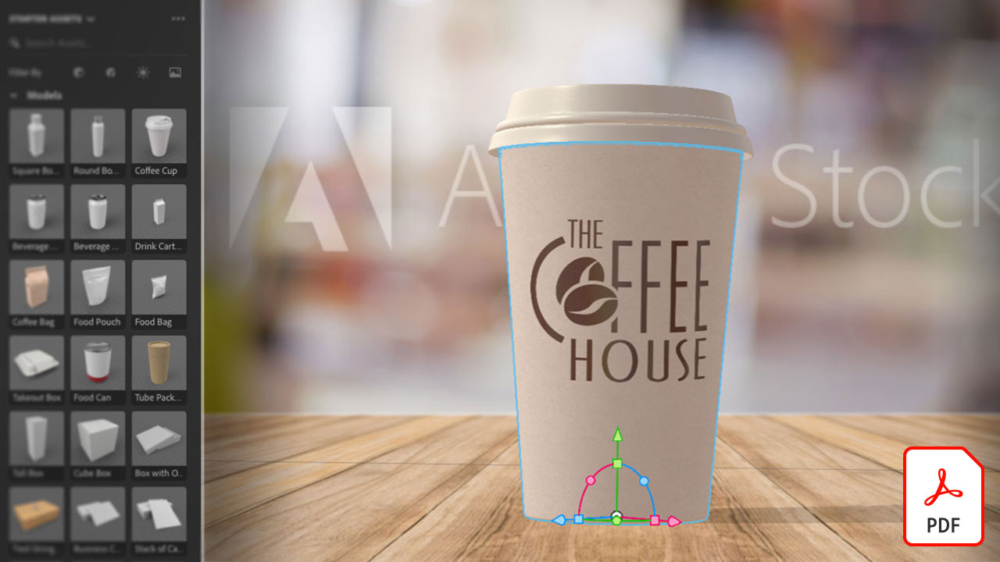
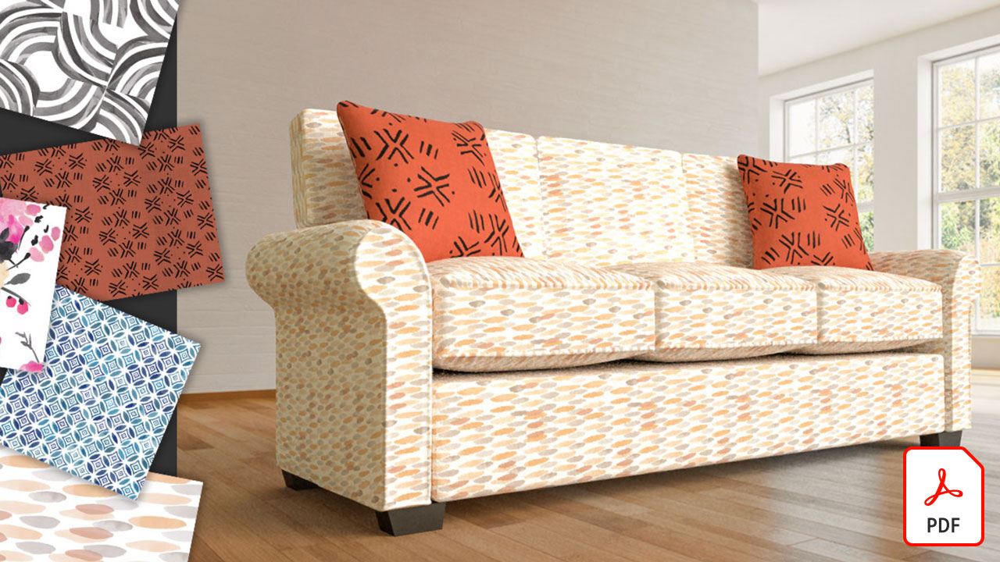

# Adobe3D &amp; VR チュートリアル

魅力的な 3D のコンテンツを高品質のモデル、マテリアル、ライトを使用して作成できます。 [!DNL Dimension] では、ブランドの視覚化、イラスト、製品モックアップ、パッケージデザイン、その他のクリエイティブ作品を簡単に制作できます。

## クリックして 3D &amp; VRAdobeチュートリアルを表示

<table>
<tr>
 <td>
   
    

   <a href="assets/CreateRealistic3DMockupswithAdobeStockandDimension.pdf"><strong>リアルな 3D モックアップをAdobe [!DNL Stock] および [!DNL Dimension] (PDF)</strong></a>
    

    <em>Adobe [!DNL Stock] グラフィックをAdobe [!DNL Dimension]</em>
     
  </td>
  <td>
   
    

   <a href="assets/VisualizeTextileDesignsorPatternson3DObjectswithAdobeDimension.pdf"><strong>3D オブジェクトのテキスタイルデザインまたはパターンを視覚化するAdobe [!DNL Dimension] (PDF)</strong></a>
    

    <em>完成した作品を数分で極めてリアルに表現できます</em>
     
  </td>
  <td>
   
    

   <a href="../cce/assets/VisualizeyourProductinaRealisticEnvironment.pdf"><strong>製品をリアルな環境で視覚化する (PDF)</strong></a>
    

    <em>実際の製品の外観を確認するには、Adobe [!DNL Dimension] は頼りになるアプリです</em>
     
  </td>
</tr>
   <tr>
 <td>
   
    

   <a href="mastering3dlighting.md"><strong>CGI での 3D ライティングをマスターするためのヒントとテクニック</strong></a>
    

    <em>3D ライティングと、コンピューターで生成されたシーンを完全に変える様々なライト条件の作成方法、およびシーン内のオブジェクトの外観について説明します</em>
     
  </td>
  <td>
   
    

   <a href="photorealistic.md"><strong>3D レンダリングと合成を使用したフォトリアルな仮想写真の作成</strong></a>
    

    <em>Adobeで 3D 画像の合成とレンダリングを行い、フォトリアリスティックなバーチャルフォトグラフィを作成する方法を説明します [!DNL Dimension]</em>
     
  </td>
  <td>
   
    

   <a href="3ddimensionstock.md"><strong>3D モデルのカスタマイズとブランディング [!DNL Dimension] とAdobe [!DNL Stock]</strong></a>
    

    <em>3D モデルのカスタマイズとブランド化 [!DNL Dimension] マテリアル、環境プロパティ、照明、写真を使用して、あらゆるデザインプロジェクト用にフォトリアルな画像を作成します</em>
     
  </td>
</tr>
</table>
