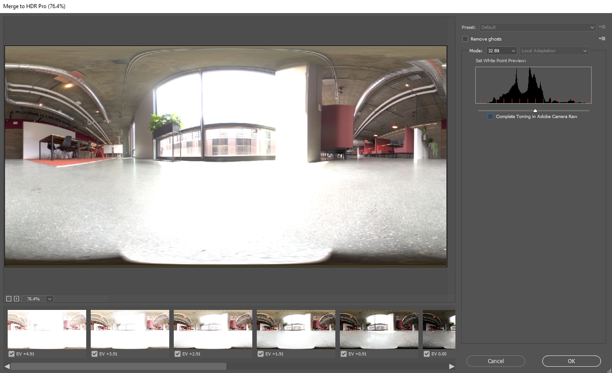
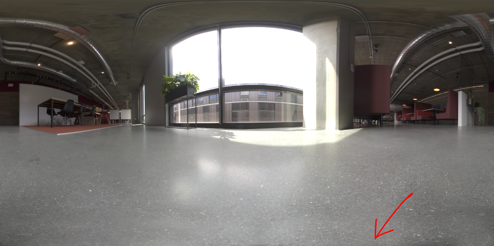

# 3Dレンダリングと合成を使用したフォトリアリスティックなバーチャル写真の作成

![Adobeでデザインされた写真リアルなバーチャル写真を取り上げた例のコラージュ  [!DNL Dimension]](assets/Photorealistic_1.png)

上の画像を見ると、見るものすべてが本物だと思われるのは許される。 しかし、フォトリアリスティック3Dイメージのレンダリングの技術的な進歩に伴い、実際のイメージと仮想イメージを決定するのは、これまで以上に難しくなります。 この場合、イメージは、リアル、写真、レンダリングされた3Dコンテンツを組み合わせたもので、企業が投資する3Dデザインとまったく同じです。

3Dモデルをイメージやビデオに「合成」するこの手法は、新しいものではなく、実際にはVFXの初期（1980年代にさかのぼる）に起源が戻ります。 新しくて面白いのは、この技術が[Adobe [!DNL Dimension]](https://www.adobe.com/products/dimension.html)ユーザにとって強力なツールとなり、写真家にとって興味深い新しいワークフローとなったことです。

## Adobe [!DNL Dimension]で合成画像を作成する技術

![Adobeコンポジットでの金属球モデルの平面の編 [!DNL Dimension] 集](assets/Photorealistic_3.png)

Adobe [!DNL Dimension]では、Adobe Sensie powered match image機能を使用して、2Dと3Dの要素をアプリ内で直接シームレスに組み合わせることができます。 この方法で要素を合成する主な利点は、完全に実現された3Dシーンを、現実からキャプチャ可能な背景イメージに置き換えて、リアルな外観のイメージを作成するプロセスを大幅に短縮することです。

![Adobeの「イメージの一致」機能は、バッ [!DNL Dimension] クグラウンドイメージを分析し、そのイメージのキャプチャに使用されたカメラの焦点距離と位置を推定します](assets/Photorealistic_4.gif)

イメージの一致機能は、背景イメージを分析し、キャプチャに使用したカメラの焦点距離と位置を推定します。 次に、[!DNL Dimension]シーンに3Dカメラが作成され、背景イメージと同じパース内で3D要素をレンダリングして、一緒に合成できます。

しかしカメラの枠の中に収まっていない全ては？  イメージ内のすべての外観を定義するため、イメージが重要な問題に取り込まれる環境全体。 イメージ内のオブジェクトは、周囲の世界の光を反射しています。この光は、カメラの背後にあるものもすべて含みます。 したがって、レイヤ3D要素をイメージの背景と実際にブレンドするには、イメージが取り込まれた環境で照明を完全に反映する必要があります。

Match Imageは、背景イメージが取り込まれた照明環境を「幻視」しようとします。 素晴らしい結果を短い順序で生成する優れた作業を行いますが、環境を背景イメージと共にキャプチャすると、よりリアルな結果が得られます。 これは、Adobe先生の機能を独自に鍛える方法です。

360° HDRパノラマ画像の世界を入力します。 これらのイメージは、3Dグラフィックスで長い間使用され、フルワールドの照明環境の照明効果を高めました。 これまで、高度な知識や特殊な機器を使用してそれらを取り込むプロセスが複雑でした。 360°のカメラが登場し、これらの画像を作成することがこれまで以上に可能になりました。

Ricoh Seta、Gopro MAX、Insta 360などのカメラは、360パノラマをキャプチャできます。 Ricoh Shetaには、キャプチャプロセスの主要な部分である自動露出ブラケティングが組み込まれています。 これにより、HDRのキャプチャに要する時間と労力が減り、写真家に近づけやすくなります。

## 写実的な合成イメージを作成するプロセス

### [!DNL Capture]

合成用に環境のキャプチャを開始するには、2つの主要な要素が必要です。高画質の背景画像と、撮影された環境の360° HDRパノラマ。

このタイプのコンテンツを効果的にキャプチャする際の最も重要な側面の1つは、写真家の既存のスキルとツールを活用することです。 美しい背景イメージを作成するには、コンポジションの目が必要で、細部に注意が必要です。 また、3D要素をに合成する際に役立つものを作成するには、背景イメージに特別な考え方が必要です。

### 場所の選択

状況と照明の両方に関して興味のある場所を探します。 状況を考慮すると、シーンの潜在的な使用を想像すると役立ちます。 例えば、3D車に空道のビューを追加する場合に、コーヒーショップのテーブルのビューを[食品のパッケージ](https://www.adobe.com/products/dimension/packaging-design-mockup.html)を表示する場合に、空道のビューを使用することができます。

背景画像をキャプチャする場合は、3D要素が合成されることに注意してください。 これらのオブジェクトのスペースを残すには、フォーカスのある空き領域が必要です。 3Dコンテンツが最終コンポジションの主な焦点となる場合が多いため、背景が目立たないことが重要です。

同様に、イメージ内の照明の状況も重要です。合成された3Dコンテンツに大きな影響を与えます。 ライトは肩越しまたは側面からショットに入る必要があります。これは、3Dオブジェクトがシーンに配置されるときにキーライトとして機能するため、最適な結果が得られます。 ビューにフォーカスの要素がない場合は、ライトに向かって撮影したい場合がありますが、この場合は常にバックライトされるコンテンツが生成されることに注意してください。 シーンに一時的なスタンドインオブジェクトを追加すると、照明を合成して評価するのに便利です。

## HDRパノのキャプチャ

### カメラの配置

背景のキャプチャに焦点を合わせる領域の中央に、360°のカメラを配置します。 背景がより広いシーンを示し、モノポッドでカメラを地面から上げる場合に最適です。さもなくば、カメラを地面に直接設定できます。

### 色

環境の撮影に使用するカメラと背景の撮影に使用するカメラの間でカラーを維持することは、イメージを一緒に使用するため非常に重要です。 ここでは、両方のカメラの色温度を5000kに設定し、両方のカメラを使用してカラーチャートを撮影し、後でさらに調整します。

### 角括弧付き露出値

360°のカメラでHDR環境を作成するには、複数のEVをキャプチャしてHDRイメージに組み込む必要があります。 EVの量は標準化されていませんが、通常は、露出範囲の高い方の端を、シャドウに情報がない点に、露出範囲の低い方の端を、ハイライトに情報がない点に設定します。

360°のカメラには、カメラによって様々な露出をバッチ処理できる自動ブラケティング機能が備わっているのが理想的です。 理想的な設定は、ノイズを避けるために使用できる最小のISO値と、シャープネスに高いアパーチャ値を使用することです。 露出値は、シャッタースピードを使用して変更し、停止で分割できます。半分にしたり倍にしたりする

次に、IBLを屋外で撮影する際に使用するEVの例を示します。

01 - F 5.6、ISO 80、シャッタースピード1/25000、WB 5000 K

02 - F 5.6、ISO 80、シャッタスピード1/12500、WB 5000 K

03 - F 5.6、ISO 80、シャッタスピード1/6400、WB 5000 K

...

16 - F 5.6、ISO 80、シャッタスピード1、WB 5000 K

360°を使用してRAW画像を出力できる場合、EVはJPEGのような8ビット画像より多くの情報を保持するため、2～4ストップ単位で分割できます。

EVにカラー調整を行った後、個々のファイルに一時的に書き出し、Photoshopで合成することができます。 ファイルの種類はソースに依存する必要がありますが、どちらの場合もJPEGのような圧縮形式を使用しないでください。 Photoshopでは、「ファイル」>「自動化」>「HDR Proにマージ…」を使用し、書き出したEVをすべて選択します。

「Mode」が32ビットに設定されていることを確認します。 「Remove Ghosts」を使用すると、EV間で変更された詳細を削除できますが、必要でない場合は使用しないでください。 ヒストグラムの下のスライダは、プレビュー露出にのみ影響するので無視します。 「Adobe Camera Rawでのトーニングの完了」のチェックを外し、「OK」を押します。

その結果、3Dでシーンを照らすのに使用できるHDRイメージが作成されます。

最後の手順は、イメージの最後に見えるシャドウと三脚を削除し、イメージのデフォルトの露出を調整してシーンを正しく照らすことです。 詳細の削除は、Photoshopのクローンツールを使用して行うことができます。 HDR IBLの露出値は3Dオブジェクトのライティング値なので、露出の調整は[!DNL Dimension]の背景と一緒に行う必要があります。

### 背景のキャプチャ

環境をキャプチャした後、選択したカメラを使用して背景をキャプチャできるようになりました。 クォリティが高く解像度が高いほど、品質が向上します。 これは、写真家が持つ構図の目と共に、この過程の主な利点である。 上記の画像は、キャノン5D MK IVで撮影された。

背景を使用したフレーミングやコンポジションには、多くの余裕があります。 カメラは、被写界深度の変化に対して高いアパーチャまたは低いアパーチャを有し、長い焦点距離または短い焦点距離を使用し、上下の角度を持つことができる。 カメラは、360カメラで環境をキャプチャした中心点に向けられている必要があります。

キャプチャが完了したら、イメージをポスト処理して、できる限り環境の色に合わせる必要があります。 カラーと露出は、できる限りニュートラルで自然なものにする必要があります。 3D要素をAdobe [!DNL Dimension]で合成した後に、スタイル化された外観を適用する必要があります。

## 合成イメージを[!DNL Dimension]に組み立てます

これらの要素を集めて完成させると、Adobe [!DNL Dimension]のシーンに組み立てることができます。 これは、背景をシーンにドラッグし、背景に適用するのと同じくらい簡単です。次に、HDRパノを環境ライトイメージスロットに追加します。

背景イメージをキャンバスの空の領域にドラッグアンドドロップするか、シーンパネル内でEnvironmentを選択し、背景入力にイメージを追加します。

![バーチャル写真の背景画像は、Adobeのプロパティメニューから選択できます  [!DNL Dimension]](assets/Photorealistic_20.png)

[環境ライト]を選択し、[イメージ]入力に追加して、HDRパノを追加します。

![環境光源は、Adobeの[シーン]メニューから、仮想写真の背景イメージに追加できます  [!DNL Dimension]](assets/Photorealistic_21.png)

その後、背景に「イメージを合わせる」を使用して、解像度とアスペクト、およびカメラのパースペクティブを合わせることができます。 背景イメージから環境を生成する代わりに、キャプチャしたHDRパノイメージを使用してシーンをライトするので、「ライトを作成」オプションをオフにしておくことができます。

![Adobeの「イメージを合わせる」機能を使 [!DNL Dimension] 用して、HDRパノラマの環境ライトを使用して3D金属球のイメージをレンダリングする](assets/Photorealistic_22.png)

これで、シーンに追加されたオブジェクトは、イメージが撮影された環境に照らされるので、リアルにバックグラウンドに合成されます。

背景に対するHDRパノの向きと露出を迅速に評価するため、[!DNL Dimension]のフリーアセットパネルから取得した金属マテリアルを持つ球プリミティブをシーンに配置できます。 環境ライトの回転を配置して、反射が正しく見えるようにします。 HDRパノからの照明が球体をオーバーまたはアンダー露光する場合は、HDRパノの露出を増減して補正する必要があります。

背景に対するHDRパノの向きと露出を迅速に評価するため、[!DNL Dimension]のフリーアセットパネルから取得した金属マテリアルを持つ球プリミティブをシーンに配置できます。 環境ライトの回転を配置して、反射が正しく見えるようにします。 HDRパノからの照明が球体をオーバーまたはアンダー露光する場合は、HDRパノの露出を増減して補正する必要があります。

## 結果は次のとおりです。写実的な合成画像

![Adobeのバーチャル製品写真用の3D合成とレンダリングの時間の経過  [!DNL Dimension]](assets/Photorealistic_24.gif)

シーンが完成すると、エンドユーザのワークフローは簡単になります。 自分のモデルや[Adobe [!DNL Stock] 3D](https://stock.adobe.com/3d-assets)コンテンツを直接画像にドラッグ&amp;ドロップするだけで、写真を撮ったときと同じようにレンダリングできます。 これにより、非常に現実的な広告コンテンツを作成する新しい手段が開かれ、多くの異なるコンテキスト内の設計に対して反復処理を行う機能が開かれます。

最終的な結果は、現実と3Dを納得のいく形で組み合わせ、エンドユーザーは最小限の労力で写実的なイメージを作成するという目標を達成できるようになります。 ワークフローのデモ用に作成した[ [!DNL Dimension] シーン](https://assets.adobe.com/public/3926726a-2a17-43d4-4937-6d84a4d29338)を使って、試してみてください。

[今日の最新リリースをダ](https://creativecloud.adobe.com/apps/download/dimension) ウンロ [!DNL Dimension] ードし、写実的な画像の作成を開始します。
