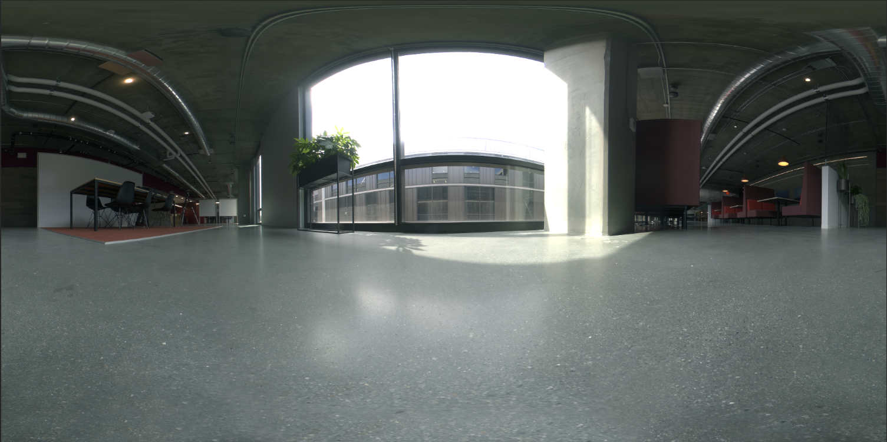

# 3Dレンダリングと合成を使用したフォトリアルなバーチャルフォトの作成

![Adobeで作成されたフォトリアルなバーチャルフォトの作例コラージュ [!DNL Dimension]](assets/Photorealistic_1.png)

上の画像を見ると、すべてが本物だと思うのも無理はありません。 フォトリアルな3D画像のレンダリングにおける技術的な進歩に伴い、何が現実で何が仮想であるかを判断するのは、これまで以上に困難になっています。 この場合、画像は現実の写真とレンダリングされた3Dコンテンツの組み合わせであり、まさにこれが企業が投資している3Dデザインのタイプです。

このレイヤー化の手法、つまり3Dモデルを画像やビデオに「合成」する手法は、新しいものではありません。実際、その起源はVFXの初期（1980年代まで）にまで遡ります。 新しくエキサイティングなのは、この手法が強力なツールになったということです [Adobe [!DNL Dimension]](https://www.adobe.com/products/dimension.html) ユーザーと、写真家のための魅力的な新しいワークフロー。

## Adobeで合成画像を作成する技術 [!DNL Dimension]

![Adobe内の金属球モデルの平面を編集する [!DNL Dimension] 合成](assets/Photorealistic_3.png)

Adobe [!DNL Dimension] Adobe Senseiを活用した「画像から環境を設定」機能を使用すると、2Dと3Dの要素を直接アプリ内でシームレスに組み合わせることができます。 この方法で要素を合成する主な利点は、リアルな見映えの画像を作成するプロセスが強化されることです。現実と変わらない3Dシーンを、現実世界で撮影可能な背景画像で置き換えることができます。

![Adobeの「画像から環境を設定」機能 [!DNL Dimension] 背景画像を分析し、撮影に使用されたカメラの焦点距離と位置を推定します](assets/Photorealistic_4.gif)

「画像から環境を設定」機能は、背景画像を分析し、撮影に使用されたカメラの焦点距離と位置を推定します。 3Dカメラが [!DNL Dimension] 背景画像と同じ遠近法で3D要素をレンダリングして、一緒に合成できるシーン。

しかし、カメラのフレーム内にキャプチャされていないすべてのことはどうでしょうか？  画像が撮影される環境全体が非常に重要です。これは、画像内のすべての要素の見え方を定義するためです。 画像内のオブジェクトは、周囲の光を反射します。カメラの背後の光もすべて含まれます。 レイヤー化された3D要素を画像の背景と正しく溶け込ませるには、画像が撮影された環境の照明を完全に反映させる必要があります。

「画像から環境を設定」は、背景画像が撮影された照明環境の「幻覚」を再現しようとします。 これは、優れた結果を短時間で得られる素晴らしい処理ですが、背景と一緒に環境をキャプチャすると、よりリアルな結果が得られます。 これは、Adobe Sensei機能を独自にトレーニングするために使用される方法でもあります。

360° HDRパノラマ画像の世界に入ります。 これらの画像は、フルワールドの照明環境の照明効果を迅速に処理するために、3Dグラフィックで長い間使用されています。 以前は、カメラを撮影するプロセスは、高度な知識と特殊な機器が必要であったため、非常に複雑でした。 360°カメラの登場により、このような画像の作成がこれまで以上に可能になりました。

Ricoh Theta、Gopro MAX、Insta 360などのカメラでは、360度のパノラマを撮影できます。 Ricoh Thetaには、撮影プロセスの重要な要素である自動露光量ブラケット機能が組み込まれています。 これにより、HDRの撮影に要する時間と労力が削減され、写真家が使いやすくなります。

## フォトリアルな合成画像を作成するプロセス

### [!DNL Capture]

合成の環境のキャプチャを開始するには、1つまたは複数の高画質の背景画像と撮影環境の360° HDRパノラマという2つの主要な要素が必要です。

このタイプのコンテンツを効果的にキャプチャする上で最も重要な側面の1つは、写真家の既存のスキルとツールを活用することです。 美しい背景画像を作成するには、構図を見る目と細部への注意が必要です。 また、背景画像では、3D要素の合成に役立つ要素を作成するために、特別な考え方が必要です。

### 場所の選択

状況や照明が適していると思われる場所を探します。 状況を考える際には、シーンの用途を想像することが役に立ちます。 例えば、何もない道の景色は、3Dの車を追加するのに使用できるでしょう。また、コーヒーショップのテーブルの景色は、以下のことに使用できるでしょう [パッケージの表示](https://www.adobe.com/products/dimension/packaging-design-mockup.html) 食品の。

背景画像を撮影する場合は、3D要素がその画像に合成されることに留意することが重要です。 これらのオブジェクトを配置するスペースを残すために、焦点が合っている空の領域が必要です。 3Dコンテンツが最終的な構図の主な焦点になることが多いので、背景自体が過度に目立たないことが重要です。

合成された3Dコンテンツに大きな影響を与えるので、画像内の照明の状況も同様に重要です。 照明は、肩越しまたは側面からショットに入る必要があります。この方法では、3Dオブジェクトがシーンに配置されるときにキーライトとして機能するので、最良の結果が得られます。 ビューにフォーカス要素がない場合は、逆光で撮影したくなるかもしれませんが、コンテンツが常に逆光になることに注意してください。 シーンに代役オブジェクトを一時的に追加すると、照明の構成や評価に役立ちます。

## HDRパノラマのキャプチャ

### カメラの配置

背景の撮影で焦点を合わせる領域のほぼ中央に360°カメラを配置します。 広いシーンを見せる背景の場合は、モノポッドを使用してカメラを地面から持ち上げるのが最適でしょう。そうでない場合は、カメラを地面に直接置くのが良いでしょう。

### カラー

環境撮影に使用するカメラと背景撮影に使用するカメラの間でカラーを維持することは、画像が一緒に使用されるため非常に重要です。 ここでは、両方のカメラの色温度を5000kに設定し、後でさらに調整するために、両方のカメラを使用してカラーチャートの写真を撮りました。

### 露光量ブラケット

360°カメラでHDR環境を作成するには、複数のEVを撮影し、後でHDR画像に組み合わせる必要があります。 EV量は標準化されていませんが、一般に、露光量範囲の上端をシャドウに情報がなくなるポイントに設定し、露光量範囲の下端をハイライトに情報がなくなるポイントに設定します。

360°カメラには、様々な露光量をカメラで一括撮影できる自動ブラケット機能が備わっているのが理想的です。 最適な設定は、ノイズを回避できる最小のISO値を使用し、シャープにするために高い絞り値を使用することです。 次に、シャッタースピードを使用して露光量を変更し、1段ずつ細かく分割します。露光量を半分にするか2倍にします。

次に、IBLを屋外で撮影するために使用するEVの例を示します。

01 - F 5.6、ISO 80、シャッタースピード1/25000、WB 5000 K

02 - F 5.6、ISO 80、シャッタースピード1/12500、WB 5000 K

03 - F 5.6、ISO 80、シャッタースピード1/6400、WB 5000 K

...

16 - F 5.6、ISO 80、シャッタースピード1、WB 5000 K

使用する360°がRAW画像を出力できる場合、EVはJPEGなどの8ビット画像よりも多くの情報を保持するため、2 ～ 4段の増分単位で分割できます。

EVにカラー調整を行った後は、一時的に個別のファイルに書き出して、Photoshopで結合できます。 ファイルタイプはソースに依存しますが、いずれの場合もJPEGのような圧縮フォーマットを使用しないでください。 Photoshopでファイル/自動処理/HDR Proに統合を選択し、書き出されたEVをすべて選択します。

「モード」が32ビットに設定されていることを確認してください。 「ゴーストを除去」を使用すると、EV間で変化したディテールを除去できますが、不要な場合は使用しないでください。 ヒストグラムの下のスライダーは、プレビューの露光量にのみ影響するので、無視します。 「Adobe Camera Rawでのトーニングを完了」をオフにし、「OK」を押します。

その結果、3Dでシーンに光を当てるために使用できるHDR画像が作成されます。

最後に、画像の床面に見える影と三脚を除去し、シーンに正しく照明を当てるために画像のデフォルトの露光量を調整します。 ディテールの除去は、Photoshopのクローンツールを使用して行うことができます。 露出の調整は、の背景と組み合わせて行う必要があります。 [!DNL Dimension]HDR IBLの露光量の値は3Dオブジェクトの照明値であるため、

### 背景の撮影

環境をキャプチャしたら、お好みのカメラを使用して背景を撮影できます。 画質と解像度が高いほど良い結果が得られます。 これは、このプロセスの主な利点です。もちろん、写真家が持つ構図を見る目も重要です。 上の画像は、キヤノン5D MK IVで撮影したものです。

背景のフレーミングや構図には多くの自由度があります。 カメラは、絞りを高くしたり低くしたりして被写界深度を変化させることができます。長い焦点距離や短い焦点距離を使用したり、上下に角度を付けることができます。 主な要件は、360度カメラで環境を撮影したときの中心点にカメラを向けることです。

撮影が完了したら、画像を後処理して、できるだけ環境の色に合わせる必要があります。 カラーと露光量は、できるだけニュートラルで自然である必要があります。 3D要素をAdobeを使用して画像と合成した後で、スタイル設定された外観を適用する必要があります [!DNL Dimension].

## 合成画像を組み込む [!DNL Dimension]

これらの要素を集めて完成させたら、Adobeのシーンに組み込むことができます [!DNL Dimension]. これは、背景をシーンにドラッグするだけで簡単です。シーンで背景に適用されます。次に、HDRパノラマを環境光の画像スロットに追加します。

背景画像をカンバスの空の領域にドラッグ&amp;ドロップするか、シーンパネル内の「環境」を選択して、背景入力に画像を追加します。

![バーチャルフォトの背景画像は、Adobeのプロパティメニューから選択できます [!DNL Dimension]](assets/Photorealistic_20.png)

環境光を選択し、画像入力に追加して、HDRパノラマを追加します。

![環境光源は、Adobeのシーンメニューからバーチャルフォトの背景画像に追加できます [!DNL Dimension]](assets/Photorealistic_21.png)

その後、背景で「画像から環境を設定」を使用して、解像度、縦横比およびカメラのパースに合わせることができます。 背景画像から環境を生成する代わりに、キャプチャしたHDRパノラマ画像を使用してシーンに光を当てることができます。したがって、「ライトを作成」オプションはオフのままにすることができます。

![Adobeの「画像から環境を設定」機能の使用 [!DNL Dimension] hdrパノラマからの環境光を使用して3Dの金属球画像をレンダリングするには](assets/Photorealistic_22.png)

これで、シーンに追加されたオブジェクトは、画像が撮影された環境によって光が照らされるので、リアルに背景に合成されます。

背景に対するHDRパノラマの向きと露光量を迅速に評価するために、の無料アセットパネルから取り出した、メタルマテリアルの球体プリミティブです [!DNL Dimension]をシーンに配置できます。 環境光の回転を、反射が正しく見えるように配置できます。 HDRパノラマからの照明で球体が露光量過多または露光量不足になる場合、HDRパノラマの露光量を増減させて補正する必要があります。

背景に対するHDRパノラマの向きと露光量を迅速に評価するために、の無料アセットパネルから取り出した、メタルマテリアルの球体プリミティブです [!DNL Dimension]をシーンに配置できます。 環境光の回転を、反射が正しく見えるように配置できます。 HDRパノラマからの照明で球体が露光量過多または露光量不足になる場合、HDRパノラマの露光量を増減させて補正する必要があります。

## 最終結果：フォトリアルな合成画像

![Adobe中のバーチャルプロダクト写真の3D合成とレンダリングのタイムラプス [!DNL Dimension]](assets/Photorealistic_24.gif)

シーンが完成したら、エンドユーザーのワークフローは簡単です。 独自のモデルまたはアプリケーションをドラッグ&amp;ドロップするだけです [Adobe [!DNL Stock] 3D](https://stock.adobe.com/3d-assets) コンテンツを画像に直接取り込み、写真を撮影したときと同じようにレンダリングします。 これにより、非常にリアルな広告コンテンツを作成したり、様々なコンテキスト内でデザインを繰り返し使用する機能を使用したりするための新しい道が開けます。

最終的には、リアリティと3Dが非常に効果的にブレンドされ、エンドユーザーは、最小限の労力でフォトリアルな画像を作成するという目標を達成することができます。 ぜひお試しください [自由 [!DNL Dimension] シーン](https://assets.adobe.com/public/3926726a-2a17-43d4-4937-6d84a4d29338) このワークフローのデモ用に作成しました。

[最新リリースのダウンロード](https://creativecloud.adobe.com/apps/download/dimension) の [!DNL Dimension] 今すぐフォトリアルな画像の作成を開始しましょう。
