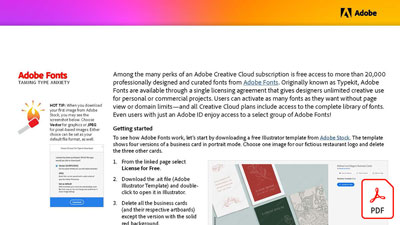

# 飼い慣らされたタイプの不安

Adobe Creative Cloudのサブスクリプションには、数多くの特典があります。その中から、プロがデザインし、厳選した 2 万種類を超えるAdobe Fontsのフォントに無料でアクセスできます。 Adobe Fontsは元々 Typekit という名称でしたが、デザイナーが個人または商用のプロジェクトでクリエイティブを無制限に使用できる単一のライセンス契約を通じて利用できます。

**以下の画像を選択して、Taming タイプの不安をダウンロードします (PDF)。**

