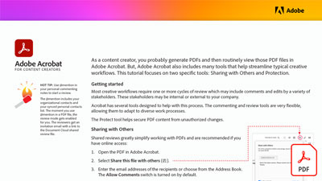

# コンテンツクリエイター向けAcrobat

コンテンツ作成者は、通常、PDFを生成し、AcrobatでそれらのPDFファイルを表示します。 ただし、Acrobatには、一般的なクリエイティブワークフローを合理化するのに役立つツールも多数用意されています。

<table style="table-layout:auto">
<tr>
 <td>
   
    

   <a href="assets/AcrobatforContentCreators.pdf" target="_blank"><strong>コンテンツクリエイター向けAcrobat(PDF)</strong></a>
    

    <em>クリエイティブワークフローの効率化に役立つAcrobatツールについて説明します</em>
     
  </td>
</tr>
</table>