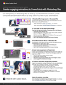

# グラフィック形式のアルファベットスープのデコード

JPG、PNG、SVG、GIF、EPSファイルは、デザインで一般的に使用されます。Webページ用のファイルもあれば、プレゼンテーション、文書、クリエイティブなプロジェクト用のファイルもあります。 でも、どういう意味で、どちらを選べばいいのでしょう？ この15分間の実際のワークショップをご覧ください。 Photoshopで透明効果を適用する方法を簡単に説明します。Photoshopでは、さまざまなグラフィックの書き出しと最適化の設定を確認しながら、プレゼンテーションのスキルを新しいレベルに引き上げることができます。 デザイナー/開発者のChris Converse氏と共に、Photoshopから書き出したカスタマイズされたグラフィックを使用して、PowerPointで魅力的なアニメーションを作成します。

>[!VIDEO](https://video.tv.adobe.com/v/333805?hidetitle=true)

  

[**クイックリファレンスPDFガイドのダウンロード**](../quick-reference/Decodingthealphabetsoupofgraphicformats.pdf)

