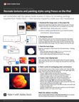

# iPad(およびiPhone)でFrescoをお試しください

この15分間のハンズオンワークショップでは、Adobe Frescoを使ってデジタルドローイングとペイントの新しい世界を体験することができます。 レイヤーとクリッピングマスクを使用して、ペイントとテクスチャをベースシェイプに一致させる方法を簡単に学習します。 デザイナー兼デベロッパーのChris Converseと協力し、FrescoとAdobe Stockを使用して静止画イラストの一部を再作成します。

>[!VIDEO](https://video.tv.adobe.com/v/3410422?hidetitle=true&captions=jpn)

  

[**クイックリファレンスPDFガイドをダウンロード**](../quick-reference/Frescoworkshop.pdf)

