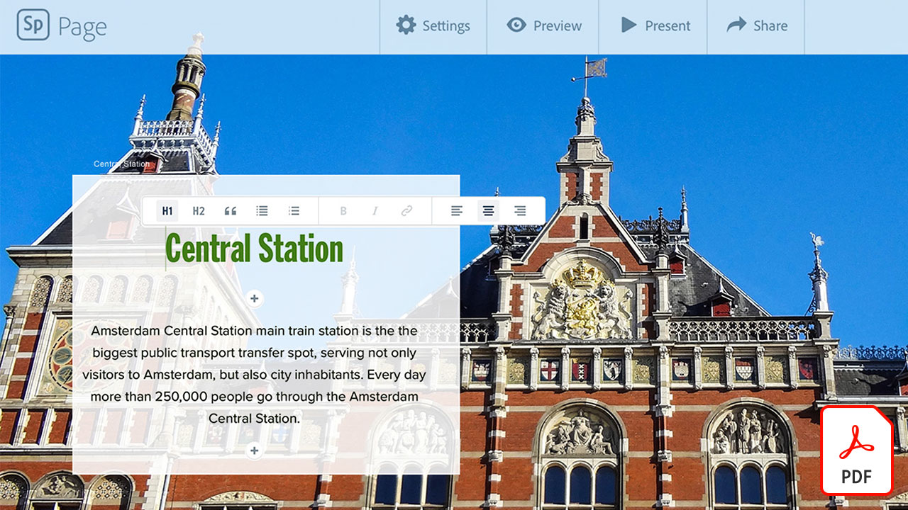
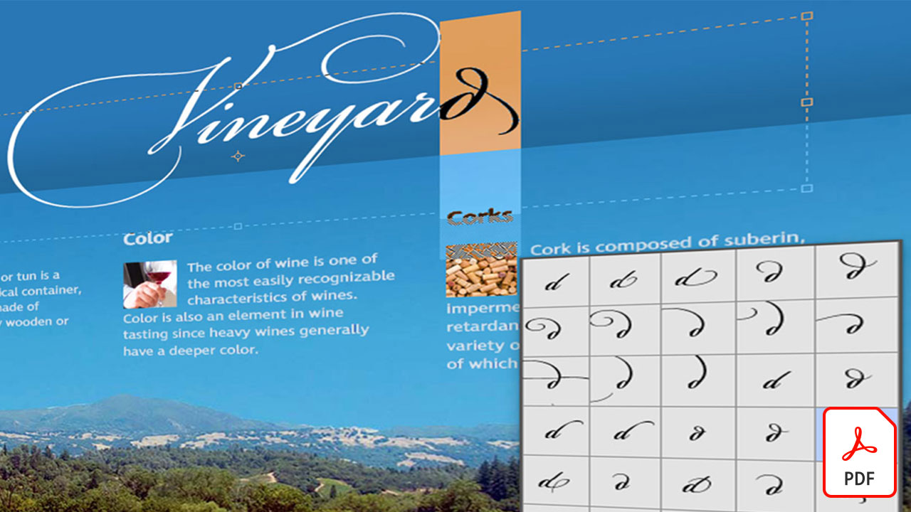

# Creative Cloudエンタープライズ版チュートリアル

企業のクリエイターは、分散したチームと共同作業し、拡張性の高いプロセスを確立して、企業のシステムとガイドラインに準拠する必要があります。 このチュートリアルでは、エンタープライズの観点からCreative Cloudの新機能を学ぶのに役立ちます。

## クリックして製品チュートリアルを表示

### Creative Cloud エンタープライズ版

<table style="table-layout:fixed">
<tr>
 <td>
   
    

   <a href="assets/FromHandLetteringtoIllustratorviaCreativeCloud.pdf"><strong>ハンドレタリングからIllustratorまでCreative Cloudで実現 (PDF)</strong></a>
    

    <em>Adobeのモバイルおよびデスクトップアプリでは、エンタープライズ向けのCreative Cloudのパワーを使用して、どこからでも、あらゆるデバイスでキャプチャ、変換、作成することができます</em>
     
  </td>
  <td>
   
    

   <a href="assets/FromLightroomWebtoInDesignviaCreativeCloud.pdf"><strong>Lightroom Web からInDesignへのCreative Cloud経由 (PDF)</strong></a>
    

    <em>カメラファイルとライブラリを使って、創造性をカメラから最終Creative Cloudに持ち込みます</em>
     
  </td>
  <td>
    
    

     
  </td>
</tr>
</table>

### Spark

<table style="table-layout:fixed">
<tr>
 <td>
   
    

   <a href="assets/AddingaGlideshowtoyourSparkPageAdobeBlog.pdf"><strong>スライドショーのSpark Pageへの追加 (PDF)</strong></a>
    

    <em>Adobe Spark Pageには、web ストーリーに命を吹き込む、すばらしい使いやすいレイアウトコンポーネントがいくつか用意されています</em>
     
  </td>
  <td>
   
    

   <a href="assets/CreatingYourBrandinAdobeSpark.pdf"><strong>Adobe Sparkでのブランドの作成 (PDF)</strong></a>
    

    <em>Adobe Sparkでブランドを簡単に定義</em>
     
  </td>
  <td>
   
    

   <a href="assets/MeetYourNewProductionArtistAdobeSparkPost.pdf"><strong>新しい制作アーティストの紹介：Adobe Spark Post(PDF)</strong></a>
    

    <em>Adobe Sparkでは、レイアウトの作成、カラーの定義、アートワークの読み込み、コンポジション内での要素の配置に関するヒントを得ることができます</em>
     
  </td>
</tr>
</table>

### Photoshop

<table style="table-layout:fixed">
<tr>
   <td>
    
    

    <a href="alphabetsoup.md"><strong>グラフィック形式のアルファベットのスープのデコード</strong></a>
    

    <em>JPG、PNG、SVG、GIF、EPSの各ファイルは、すべてデザインでよく使用されます。Web ページ用のファイルもあれば、プレゼンテーション、出版物、クリエイティブプロジェクト用のファイルもあります。 しかし、それはどういう意味ですか？どちらを選ぶべきですか？</em>
     
  </td>
  <td>
    
    

    <a href="compositepsipad.md"><strong>Adobe [!DNL Stock] およびPhotoshop for iPad</strong></a>
    

    <em>指先ひとつでPhotoshopを活用 リエンジニアリングされたタッチベースのインターフェイスを使用して、お気に入りのCreative Cloudアプリケーションをまったく新しい方法で使用する方法について学習します</em>
     
  </td>
  <td>
    
    

    <a href="cinemagraphps.md"><strong>Photoshopでのシネマグラフの作成</strong></a>
    

    <em>このワークショップ用ビデオチュートリアルでは、Adobeのビデオを組み合わせて、生きた写真を作成します [!DNL Stock] Photoshop</em>
     
  </td>
</tr>
<tr>
   <td>
    
    

    <a href="assets/AddRemarkableLightingtoaPhotowithPhotoshopandAfterEffects.pdf"><strong>PhotoshopとAfter Effects(PDF)</strong></a>
    

    <em>Adobe After Effectsの光彩効果を使用して、写真をドラマチックに演出する方法を説明します</em>
     
   </td>
   <td>
    
    

    <a href="assets/CreateCinemagraphsinaSnapwithPhotoshopandAdobeStock.pdf"><strong>PhotoshopとAdobe [!DNL Stock] (PDF)</strong></a>
    

    <em>検索時にループするシームレスなビデオをAdobe [!DNL Stock] Photoshopで人目を引くシネマグラフをすばやく組み立てるには</em>
     
  </td>
   <td>
    
    

    <a href="assets/CreatingaLivingPhotographwithPhotoshopPart1.pdf"><strong>Photoshopで生きた写真を制作 — パート 1(PDF)</strong></a>
    

    <em>Adobe Photoshopを使えば、短い動画を生きた写真にすばやく変換し、あらゆるソーシャルプラットフォームで見る人を魅了することができます</em>
     
  </td>
</tr>
<tr>
   <td>
    
    

    <a href="assets/CreatingaLivingPhotographwithPhotoshopPart2.pdf"><strong>Photoshopで生きた写真を制作 — パート 2(PDF)</strong></a>
    

    <em>写真とビデオを組み合わせると、元の画像のメッセージやトーンを損なうことなく、魅力的な品質の写真を作成できます</em>
     
  </td>
  <td>
    
    

    <a href="assets/PhotoshopAfterEffectsAwesomenessAdobeMAX2018LabRecap.pdf"><strong>Photoshop+After Effects=驚き：Adobe MAX 2018 ラボのまとめ (PDF)</strong></a>
    

    <em>この実践ラボでは、PhotoshopとAfter Effectsを使用して、あらゆるメディアに適した、驚くような画像と効果を作成する方法を学びます</em>
     
  </td>
  <td>
    
    

    <a href="assets/QuicklyBrandYourInstagramPhotoswithAdobePhotoshopActions.pdf"><strong>Adobe Photoshop Actions を使用してInstagramの写真をすばやくブランディング (PDF)</strong></a>
    

    <em>Photoshopのアクションを使用すれば、退屈な作業を省き、時間を大幅に節約できます</em>
     
  </td>
</tr>
<tr>
    <td>
    
    

    <a href="assets/WorkSmarterNotHarderwithPhotoshop.pdf"><strong>Photoshopでスマートに効率的に作業 (PDF)</strong></a>
    

    <em>Photoshopの変更には時間がかかることがありますが、必ずしもそうである必要はありません</em>
     
  </td>
   <td>
    
    

    <a href="assets/AnyoneCanBeCreativewithAdobeCreativeCloud.pdf"><strong>クリエイティブスキルセットにAdobe Photoshopを追加 (PDF)</strong></a>
    

    <em>クリエイティブスキルセットにAdobe Photoshopを追加</em>
     
  </td>
  <td>
    
    

    <a href="assets/GreenScreenisNotJustforVideo.pdf"><strong>グリーンスクリーンはビデオのためだけのものではありません (PDF)</strong></a>
    

    <em>写真スタジオでグリーンスクリーンを使用し、After Effectsを使用してPhotoshopで使用する写真を準備できます</em>
     
  </td>
</tr>  
</table>

### Fresco

<table>
<tr>
 <td>
   
    

   <a href="frescoworkshop.md"><strong>iPad( およびiPhone) のFrescoをお試しください</strong></a>
    

    <em>この 15 分間のハンズオンワークショップで、Adobe Frescoを使ってデジタル描画とペイントの新しい世界を探求しましょう</em>
     
  </td>
  <td>
    
    

     
  </td>
  <td>
    
    

     
  </td>
</tr>
</table>

### Adobe Portfolio

<table  style="table-layout:fixed">
<tr>
   <td>
   
    

   <a href="assets/GettingStartedWithAdobePortfolio.pdf"><strong>Adobe Portfolio入門 (PDF)</strong></a>
    

    <em>作品をAdobe Portfolioと共有すると、作品を効果的に共有し、新しいクリエイターを引き付けることができます</em>
     
  </td>
   <td>
   
    

   <a href="assets/ConnectingLightroomandBehancetoYourAdobePortfolio.pdf"><strong>LightroomとバイハンスのAdobe Portfolioへの接続 (PDF)</strong></a>
    

    <em>バイアンスプロジェクトをポートフォリオのページとして使用する</em>
     
  </td>
  <td>
   
    

   <a href="assets/ShowYourBestWorkwithAdobePortfolio.pdf"><strong>Adobe Portfolioで最高の作品を見せる (PDF)</strong></a>
    

    <em>Adobe Portfolioを使えば、作品をアップロードして整理し、世界中のクライアントと共有することができます</em>
     
  </td>
 </tr>
 </table>

### CC ライブラリ

<table  style="table-layout:fixed">
<tr>
  <td>
   
   

   <a href="ccteamlibraries.md"><strong>グループ版Creative Cloudライブラリの作成</strong></a>
    

    <em>グループ版のアセットライブラリを使用して、グループまたはチーム内でCreative Cloudを共有する方法を説明します</em>
     
  </td>
  <td>
   
   

   <a href="sharecclibraries.md"><strong>ブランディングアセットをグループ版Creative Cloudライブラリと共有</strong></a>
    

    <em>グループ版のブランドライブラリを使用して、グループまたはグループのブランディングアセットを作成、使用、共有するCreative Cloudについて説明します</em>
     
  </td>
  <td>
   
    

   <a href="assets/CreateAddandShareYourBrandAssetswithCreativeCloudLibraries.pdf"><strong>ブランドアセットを作成、追加、共有するためのCreative Cloudライブラリ (PDF)</strong></a>
    

    <em>Creative Cloudライブラリにはブランドシステムが組み込まれており、デザイナーはクリエイティブチーム間でブランドアセットを共有できます</em>
     
  </td>
</tr>
<tr>
  <td>
   
    

   <a href="assets/ShareTextStylesFromIllustratorwithCreativeCloudLibraries.pdf"><strong>IllustratorのテキストスタイルをCreative Cloudライブラリと共有 (PDF)</strong></a>
    

    <em>Illustratorでスマートに効率的に作業</em>
     
  </td>
  <td>
    
    

     
  </td>
  <td>
    
    

     
  </td>
</tr>
</table>

### フォント

<table  style="table-layout:fixed">
<tr>
  <td>
   
    

   <a href="assets/CreatingBeautifulTypographywithCreativeCloud.pdf"><strong>美しいタイポグラフィをCreative Cloudで作成 (PDF)</strong></a>
    

    <em>お気に入りのデザインツールにある最先端のタイポグラフィコントロールを活用する方法について説明します</em>
     
  </td>
   <td>
   
    

   <a href="assets/DiscoveringFontswithCreativeCloud.pdf"><strong>フォント検索とCreative Cloud(PDF)</strong></a>
    

    <em>プロジェクトに適したフォントを見つけるのが大変な場合があります。 様々なCreative Cloudアプリやサービスで、適切なフォントを見つけることが楽しくてインスピレーションを与えます</em>
     
  </td>
  <td>
   
    

   <a href="assets/UnleashHiddenGemsinOpenTypefonts.pdf"><strong>フォントフォントの隠れたOpenTypeを解き放つ (PDF)</strong></a>
    

    <em>OpenType形式では、最大 65,536 個のグリフを含めることができます</em>
     
  </td>
</tr>
</table>

### InDesign

<table  style="table-layout:fixed">
<tr>
  <td>
   
    

   <a href="assets/CreatingInteractivePDFsfromInDesign.pdf"><strong>インタラクティブPDFのInDesignからの作成 (PDF)</strong></a>
    

    <em>InDesignには、ドキュメントのコンテンツの書式設定、スタイル設定、管理、トラックに役立つ多くの機能が含まれています</em>
     
  </td>
   <td>
   
    

   <a href="assets/EasilyGatherandIncorporateDesignFeedbackwithAdobeAcrobatandInDesign.pdf"><strong>Adobe AcrobatとInDesign(PDF)</strong></a>
    

    <em>関係者は、Acrobatを使用して詳細なコメントや注釈を追加し、それらのマークアップをAdobe InDesignにすばやく戻して、レイアウトのコンテキストで表示できます</em>
     
  </td>
  <td>
   
    

   <a href="assets/StyleWebContentwithInDesign.pdf"><strong>Adobe InDesign CCで Web コンテンツのスタイルを設定 (PDF)</strong></a>
    

    <em>InDesignの機能を利用してHTMLや Web グラフィックを出力できます。</em>
     
  </td>
</tr>
<tr>
   <td>
   
    

   <a href="assets/InteractivePDFBookmarksandLinkedTOCsfromInDesign.pdf"><strong>対話型PDF:ブックマークとリンクされた目次をInDesignから (PDF)</strong></a>
    

    <em>InDesignの目次の機能を使用して、ブックマークとハイパーリンクの両方を生成する方法について説明します。ブックマークとハイパーリンクは、読者がPDFファイル内の情報をすばやく見つけるのに役立ちます</em>
     
  </td>
   <td>
   
    

   <a href="assets/InteractivePDFGraphicalHyperlinksandNestedMasterPagesinInDesign.pdf"><strong>対話型PDF:グラフィックのハイパーリンクとマスターページのネストInDesign(PDF)</strong></a>
    

    <em>マスターページにハイパーリンクを適用すると、すべてのページでナビゲーションシステムをすばやく管理できます</em>
     
  </td>
  <td>
    
    

     
  </td>
</tr>
</table>

### Illustrator

<table  style="table-layout:fixed">
<tr>
   <td>
   
    

   <a href="assets/GettoKnowGraphicStylesinIllustrator.pdf"><strong>Illustratorのグラフィックスタイル (PDF)</strong></a>
    

    <em>Illustratorでは、テキストのスタイル設定とほぼ同じ方法でアートワークのスタイル設定ができます</em>
     
  </td>
   <td>
   
    

   <a href="assets/WorkSmarterNotHarderwithIllustrator.pdf"><strong>Adobe Illustrator CCでスマートに効率的に作業 (PDF)</strong></a>
    

    <em>Illustratorでベクター描画を高速化</em>
     
  </td>
  <td>
   
    

   <a href="assets/IllustratorSymbolsandLayersequalsPerfectStructureforResponsiveSVG.pdf"><strong>Illustrator Symbols + Layers =レスポンシブなSVGを (PDF)</strong></a>
    

    <em>Illustratorは、SVGのシンボル、グループ、ID、正確なベクター定義を作成する機能など、アートワーク形式を比類なくサポートしています</em>
     
  </td>
</tr>
</table>

### [!DNL Dimension]

<table  style="table-layout:fixed">
<tr>
   <td>
   
    

   <a href="assets/VisualizeyourProductinaRealisticEnvironment.pdf"><strong>製品をリアルな環境で視覚化する (PDF)</strong></a>
    

    <em>実際の製品の外観を確認するには、Adobe [!DNL Dimension] は頼りになるアプリです</em>
     
  </td>
  <td>
    
    

     
  </td>
  <td>
    
    

     
  </td>
</tr>
</table>
