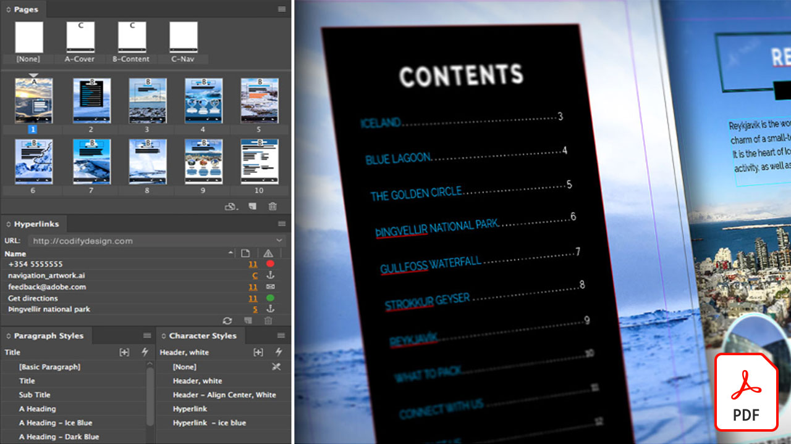
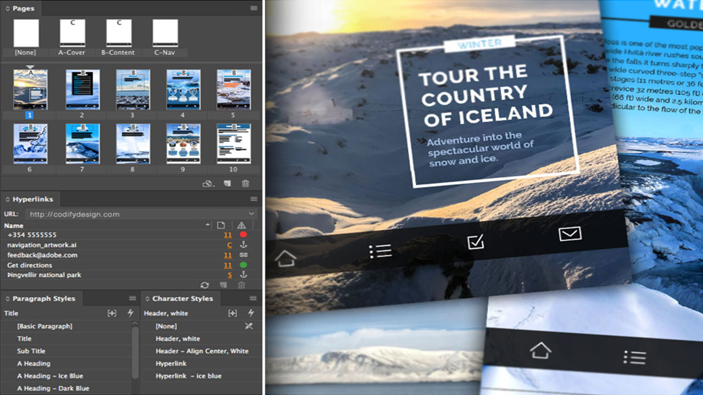
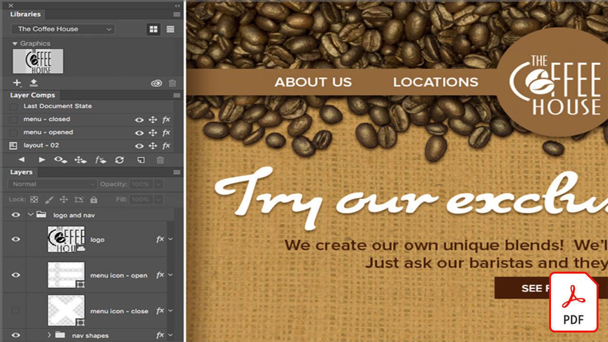

# エンタープライズ版チュートリアルのCreative Cloud

企業のクリエイターは、分散したチームとの共同作業、拡張性の高いプロセスの確立、企業のシステムやガイドラインへの準拠を行う必要があります。 これらのチュートリアルは、Creative Cloudの新しい機能を企業の視点から学ぶのに役立ちます。

## クリックして、製品チュートリアルを表示します（アルファベット順）。

### Adobe Acrobat

<table style="table-layout:fixed">
<tr>
 <td>
   
    

   <a href="acrobat-content-creators.md"><strong>コンテンツ作成者のAcrobat</strong></a>
    

    <em>クリエイティブワークフローを合理化するためのAcrobatツールについて説明します</em>
     
  </td>
  <td>
    
    

     
  </td>
  <td>
    
    

     
  </td>
  <td>
    
    

     
  </td>
</tr>
</table>

### Adobe Express(旧Adobe Spark)

<table style="table-layout:fixed">
<tr>
 <td>
   
    

   <a href="adobe-express-content-that-stands-out.md"><strong>Adobe Express：際立つコンテンツ</strong></a>
    

    <em> Adobe Expressで美しいグラフィック、webページ、ビデオストーリーを数分で作成</em>
     
  </td>
  <td>
   
    

   <a href="assets/CreatingYourBrandinAdobeSpark.pdf"><strong>Adobe Sparkでのブランド作成(PDF)</strong></a>
    

    <em>Adobe Sparkを使用すると、ブランドを簡単に定義できます</em>
     
  </td>
  <td>
   
    

   <a href="assets/AddingaGlideshowtoyourSparkPageAdobeBlog.pdf"><strong>Spark Pageへのグライドショーの追加(PDF)</strong></a>
    

    <em>Adobe Sparkには、webストーリーに命を吹き込むための使いやすい素晴らしいレイアウトコンポーネントが用意されています</em>
     
  </td>
  <td>
   
    

   <a href="assets/CreatingYourBrandinAdobeSpark.pdf"><strong>Adobe Sparkでのブランド作成(PDF)</strong></a>
    

    <em>Adobe Sparkを使用すると、ブランドを簡単に定義できます</em>
     
  </td>
  <td>
   
    

   <a href="assets/MeetYourNewProductionArtistAdobeSparkPost.pdf"><strong>新しいプロダクションアーティストとの出会い：Adobe Spark Post(PDF)</strong></a>
    

    <em>Adobe Sparkは、レイアウトの作成、カラーの定義、アートワークの読み込み、コンポジション内での要素の配置を行う際に、ユーザーから学びます</em>
     
  </td>
</tr>
</table>

### Adobe Portfolio

<table  style="table-layout:fixed">
<tr>
   <td>
   
    

   <a href="assets/GettingStartedWithAdobePortfolio.pdf"><strong>Adobe Portfolio(PDF)の概要</strong></a>
    

    <em>Adobe Portfolioで最高の作品を共有することは、作品を共有し、新しいクリエイティブな才能を引き付けるための効果的な方法です</em>
     
  </td>
  <td>
   
    

   <a href="assets/ConnectingLightroomandBehancetoYourAdobePortfolio.pdf"><strong>Adobe Portfolio(PDF)へのLightroomとビハンスの接続</strong></a>
    

    <em>ポートフォリオ内のページとしてBíhanceプロジェクトを使用する</em>
     
  </td>
  <td>
   
    

   <a href="assets/ShowYourBestWorkwithAdobePortfolio.pdf"><strong>Adobe Portfolio (PDF)で最高の作品を公開</strong></a>
    

    <em>Adobe Portfolioを使用すると、世界中の潜在的なスタッフやクライアントと作品をアップロード、整理、共有できます</em>
     
  </td>
  <td>
    
    

     
  </td>
 </tr>
 </table>

### CC ライブラリ

<table  style="table-layout:fixed">
<tr>
  <td>
   
   

   <a href="cc-workflows-cc-libraries.md"><strong>CCライブラリによるCCワークフローの改善</strong></a>
    

    <em>Creative Cloudライブラリを使用してデザイン要素を整理し、設計者やチームがプロジェクトの一貫性を維持する方法について説明します</em>
     
  </td>
  <td>
   
   

   <a href="ccteamlibraries.md"><strong>グループ用のCreative Cloudライブラリの作成</strong></a>
    

    <em>グループ版のCreative Cloudライブラリを使用して、グループまたはグループ内でアセットを共有する方法について説明します</em>
     
  </td>
  <td>
   
   

   <a href="sharecclibraries.md"><strong>グループ版Creative Cloudライブラリでのブランディングアセットの共有</strong></a>
    

    <em>グループ版のCreative Cloudライブラリを使用して、グループまたはグループのブランディングアセットを作成、使用、共有する方法について説明します</em>
     
  </td>
  <td>
   
    

   <a href="assets/CreateAddandShareYourBrandAssetswithCreativeCloudLibraries.pdf"><strong>Creative Cloudライブラリ(PDF)でブランドアセットを作成、追加、共有します</strong></a>
    

    <em>Creative Cloudライブラリにはブランドシステムが組み込まれているため、デザイナーはクリエイティブチーム間でブランドアセットを共有できます</em>
     
  </td>
  </tr>
  <tr>
  <td>
   
    

   <a href="assets/ShareTextStylesFromIllustratorwithCreativeCloudLibraries.pdf"><strong>IllustratorのテキストスタイルをCreative Cloudライブラリと共有する(PDF)</strong></a>
    

    <em>Illustratorで、よりスムーズに、よりスマートに</em>
     
  </td>
  <td>
    
    

     
  </td>
  <td>
    
    

     
  </td>
  <td>
    
    

     
  </td>
</tr>
</table>

### Creative Cloud エンタープライズ版

<table style="table-layout:fixed">
<tr>
 <td>
   
    

   <a href="collaboration-the-future-of-creativity.md"><strong>コラボレーション：未来の創造性</strong></a>
    

    <em>Adobe Creative Cloudサブスクリプションには、Adobe Fontsが提供する2万種類以上のプロフェッショナルなデザインと厳選のフォントが無料で利用できます</em>
     
  </td>
  <td>
   
    

   <a href="assets/FromHandLetteringtoIllustratorviaCreativeCloud.pdf"><strong>手書きレタリングから、Creative Cloud(PDF)を介してIllustratorへ</strong></a>
    

    <em>Adobeのモバイルアプリおよびデスクトップアプリは、Creative Cloudのパワーを活用して、場所を問わず、あらゆるデバイスからキャプチャ、変換、制作を行うことができます</em>
     
  </td>
  <td>
   
    

   <a href="assets/FromLightroomWebtoInDesignviaCreativeCloud.pdf"><strong>Lightroom WebからCreative Cloud経由でInDesignへ(PDF)</strong></a>
    

    <em>Creative Cloudのファイルやライブラリを使用して、クリエイティブな作業をカメラから最終的なデザインに持ち込むことができます</em>
     
  </td>
</tr>
</table>

### [!DNL Dimension]

<table  style="table-layout:fixed">
<tr>
   <td>
   
    

   <a href="assets/VisualizeyourProductinaRealisticEnvironment.pdf"><strong>製品をリアルな環境(PDF)で視覚化</strong></a>
    

    <em>実際の環境で製品がどのように見えるかを確認したい場合は、Adobe [!DNL Dimension] アプリに移動します</em>
     
  </td>
  <td>
    
    

     
  </td>
  <td>
    
    

     
  </td>
  <td>
    
    

     
  </td>
</tr>
</table>

### Fresco

<table>
<tr>
 <td>
   
    

   <a href="frescoworkshop.md"><strong>iPad(およびiPhone)でFrescoをお試しください</strong></a>
    

    <em>この15分間のハンズオンワークショップでは、Adobe Frescoを使ってデジタルドローイングとペイントの新しい世界を体験することができます</em>
     
  </td>
  <td>
    
    

     
  </td>
  <td>
    
    

     
  </td>
  <td>
    
    

     
  </td>
</tr>
</table>

### フォント

<table  style="table-layout:fixed">
<tr>
<td>
   
    

   <a href="taming-type-anxiety.md"><strong>飼い慣らしの不安</strong></a>
    

    <em>Creative Cloudで2万種類以上ものプロフェッショナルなデザインのフォントにアクセスして使用する方法を説明します</em>
     
  </td>
  <td>
   
    

   <a href="assets/CreatingBeautifulTypographywithCreativeCloud.pdf"><strong>Creative Cloudを使用した美しいタイポグラフィの作成(PDF)</strong></a>
    

    <em>お気に入りのデザインツールに含まれている最先端のタイポグラフィコントロールを活用する方法を説明します</em>
     
  </td>
   <td>
   
    

   <a href="assets/DiscoveringFontswithCreativeCloud.pdf"><strong>Creative Cloudのあるフォントの検出(PDF)</strong></a>
    

    <em>プロジェクトに適したフォントを見つけることは、時に圧倒的に感じられます。 様々なCreative Cloudアプリとサービスを使用して、最適なフォントを見つけるのは楽しく、刺激的です</em>
     
  </td>
  <td>
   
    

   <a href="assets/UnleashHiddenGemsinOpenTypefonts.pdf"><strong>OpenTypeフォントの隠れた機能を解き放つ(PDF)</strong></a>
    

    <em>OpenTypeフォーマットでは、65,536文字までのグリフを含めることができます</em>
     
  </td>
</table>

### Illustrator

<table  style="table-layout:fixed">
<tr>
   <td>
   
    

   <a href="assets/GettoKnowGraphicStylesinIllustrator.pdf"><strong>Illustrator(PDF)のグラフィックスタイルを理解する</strong></a>
    

    <em>Illustratorでは、テキストのスタイルと同じようにアートワークのスタイルを設定できます</em>
     
  </td>
   <td>
   
    

   <a href="assets/WorkSmarterNotHarderwithIllustrator.pdf"><strong>Adobe Illustrator CC(PDF)を使用して、よりスマートに、より難しくなく作業できます</strong></a>
    

    <em>Illustratorでベクター描画を高速化する</em>
     
  </td>
  <td>
   
    

   <a href="assets/IllustratorSymbolsandLayersequalsPerfectStructureforResponsiveSVG.pdf"><strong>Illustrator Symbols +レイヤー=レスポンシブSVGに最適な構造 (PDF)</strong></a>
    

    <em>Illustratorでは、SVGのシンボル、グループ、ID、正確なベクターを作成する機能など、アートワークの書式設定が大幅にサポートされています</em>
     
  </td>
  <td>
    
    

     
  </td>
</tr>
</table>

### InDesign

<table  style="table-layout:fixed">
<tr>
  <td>
   
    

   <a href="assets/CreatingInteractivePDFsfromInDesign.pdf"><strong>InDesignからのインタラクティブPDFの作成(PDF)</strong></a>
    

    <em>InDesignには、文書のコンテンツのフォーマット、スタイル設定、管理および追跡に役立つ多くの機能が含まれています</em>
     
  </td>
   <td>
   
    

   <a href="assets/EasilyGatherandIncorporateDesignFeedbackwithAdobeAcrobatandInDesign.pdf"><strong>Adobe AcrobatとInDesign(PDF)で、デザインフィードバックを簡単に収集して組み込むことができます。</strong></a>
    

    <em>関係者は、Acrobatを使用して詳細なコメントや注釈を追加し、それらのマークアップをすばやくAdobe InDesignに戻して、レイアウトのコンテキストで表示できます</em>
     
  </td>
  <td>
   
    

   <a href="assets/StyleWebContentwithInDesign.pdf"><strong>Adobe InDesign CC(PDF)を使用したwebコンテンツのスタイル設定</strong></a>
    

    <em>InDesignの力をHTMLやWebグラフィックの出力に活用できることをご存知でしたか？</em>
     
  </td>
  <td>
   
    

   <a href="assets/InteractivePDFBookmarksandLinkedTOCsfromInDesign.pdf"><strong>インタラクティブPDF：ブックマークとInDesignからリンクされた目次(PDF)</strong></a>
    

    <em>InDesignの目次機能を使用して、読者がPDFファイル内の情報をすばやく見つけるのに役立つしおりとハイパーリンクの両方を生成する方法について説明します</em>
     
  </td>
</tr>
<tr>
  <td>
   
    

   <a href="assets/InteractivePDFGraphicalHyperlinksandNestedMasterPagesinInDesign.pdf"><strong>インタラクティブPDF:InDesign内のグラフィカルハイパーリンクとネストされたマスターページ(PDF)</strong></a>
    

    <em>マスターページにハイパーリンクを適用すると、すべてのページでナビゲーションシステムをすばやく管理できます</em>
     
  </td>
  <td>
    
    

     
  </td>
  <td>
    
    

     
  </td>
  <td>
    
    

     
  </td>
</tr>
</table>

### Photoshop

<table style="table-layout:fixed">
<tr>
  <td>
    
    

    <a href="alphabetsoup.md"><strong>グラフィック形式のアルファベットのスープのデコード</strong></a>
    

    <em>JPG、PNG、SVG、GIF、EPSの各ファイルは、すべてデザインで一般的に使用されます。webページ用のファイルもあれば、プレゼンテーション、出版物、クリエイティブプロジェクト用のファイルもあります。 しかし、彼らは何を意味し、あなたはどちらを選ぶべきですか？</em>
     
  </td>
  <td>
    
    

    <a href="compositepsipad.md"><strong>Adobeを使用した固有のコンポジットの作成 [!DNL Stock] iPadのPhotoshop</strong></a>
    

    <em>Photoshopのパワーを手軽に利用できます。 刷新されたタッチベースのインターフェイスを使用して、お気に入りのCreative Cloudアプリケーションの1つを全く新しい方法で使用する方法を学習します</em>
     
  </td>
  <td>
    
    

    <a href="cinemagraphps.md"><strong>Photoshopを使用したシネマグラフの作成</strong></a>
    

    <em>このステップバイステップのワークショップビデオチュートリアルでは、Adobeのビデオを組み合わせて生きた写真を作成します [!DNL Stock] Photoshopの巧みなマスクテクニック</em>
     
  </td>
  <td>
    
    

    <a href="assets/AddRemarkableLightingtoaPhotowithPhotoshopandAfterEffects.pdf"><strong>PhotoshopとAfter Effects(PDF)を使用して、素晴らしい照明を写真に加える</strong></a>
    

    <em>Adobe After Effectsのライトバーストエフェクトを使用して、写真を大幅に強調する方法を説明します</em>
     
  </td>
</tr>
<tr>
  <td>
    
    

    <a href="assets/CreateCinemagraphsinaSnapwithPhotoshopandAdobeStock.pdf"><strong>PhotoshopとAdobeを使用して、すばやくシネマグラフを作成します [!DNL Stock] (PDF)</strong></a>
    

    <em>Adobe上でシームレスにループするビデオの検索 [!DNL Stock] Photoshopで人目を引く映画をすばやく組み立てるために</em>
     
  </td>
  <td>
    
    

    <a href="assets/CreatingaLivingPhotographwithPhotoshopPart1.pdf"><strong>Photoshopで活き活きとした写真を – Part 1 (PDF)</strong></a>
    

    <em>Adobe Photoshopを使用すると、短いビデオをすばやく生き生きとした写真に変換し、あらゆるソーシャルプラットフォームで視聴者を魅了できます</em>
     
  </td>
  <td>
    
    

    <a href="assets/CreatingaLivingPhotographwithPhotoshopPart2.pdf"><strong>Photoshopで活き活きとした写真を – Part 2 (PDF)</strong></a>
    

    <em>写真とビデオを組み合わせることは、元の画像のメッセージやトーンを損なうことなく魅力的な品質を写真に追加するための効果的な方法です</em>
     
  </td>
  <td>
    
    

    <a href="assets/PhotoshopAfterEffectsAwesomenessAdobeMAX2018LabRecap.pdf"><strong>Photoshop + After Effects = Awesomeness:Adobe MAX 2018 Lab Recap(PDF)</strong></a>
    

    <em>PhotoshopとAfter Effectsを組み合わせた、ステップバイステップの実践的なラボで、あらゆるメディアでの使用に適した、美しい画像や効果を作成しましょう</em>
     
  </td>
</tr>
<tr>
  <td>
    
    

    <a href="assets/QuicklyBrandYourInstagramPhotoswithAdobePhotoshopActions.pdf"><strong>Adobe Photoshopアクションを使用したInstagramフォトのブランド化(PDF)</strong></a>
    

    <em>Photoshopのアクションを使用して退屈を解消し、時間を大幅に節約します。</em>
     
  </td>
  <td>
    
    

    <a href="assets/WorkSmarterNotHarderwithPhotoshop.pdf"><strong>Photoshop(PDF)を使用して、よりスマートに、より難しくなく作業</strong></a>
    

    <em>Photoshopの変更には時間がかかることがありますが、変更は必要ありません</em>
     
  </td>
  <td>
    
    

    <a href="assets/AnyoneCanBeCreativewithAdobeCreativeCloud.pdf"><strong>クリエイティブなスキルセットに少しAdobe Photoshopを加える(PDF)</strong></a>
    

    <em>クリエイティブなスキルセットに少しAdobe Photoshopを加えましょう</em>
     
  </td>
  <td>
    
    

    <a href="assets/GreenScreenisNotJustforVideo.pdf"><strong>緑の画面はビデオ専用ではない(PDF)</strong></a>
    

    <em>フォトスタジオでグリーンスクリーンを使用し、After Effectsを使用してPhotoshopでの写真使用を準備できます</em>
     
  </td>
</tr>  
</table>
