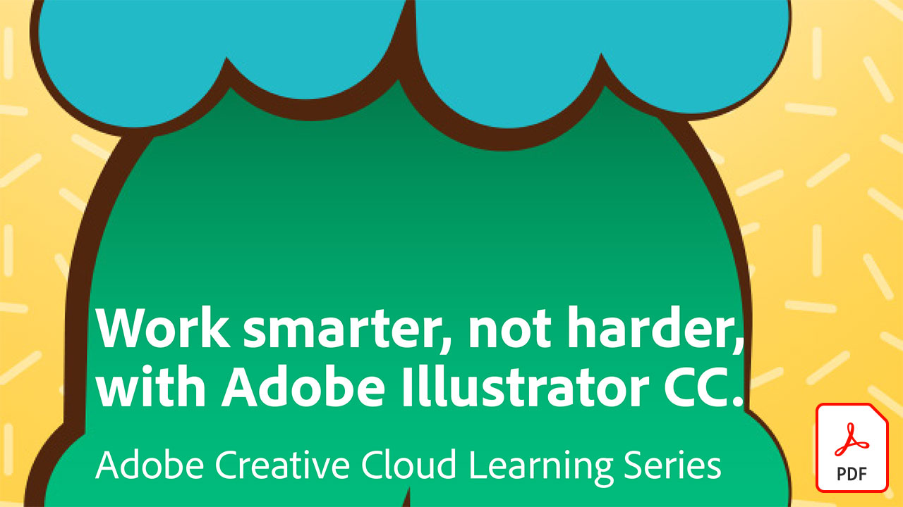

# エンタープライズ版チュートリアルのCreative Cloud

企業のクリエイターは、分散したチームとの共同作業、拡張性の高いプロセスの確立、企業のシステムやガイドラインへの準拠を行う必要があります。 これらのチュートリアルは、Creative Cloudの新しい機能を企業の視点から学ぶのに役立ちます。

## 表示する製品（アルファベット順にリストされている）チュートリアルを選択

### Adobe Acrobat

<table style="table-layout:fixed">
<tr>
 <td>
   
    

   <a href="acrobat-content-creators.md"><strong>コンテンツ作成者のAcrobat</strong></a>
    

    <em>クリエイティブなワークフローを合理化するのに役立つAcrobatツールについて説明します</em>
     
  </td>
  <td>
    
    

     
  </td>
  <td>
    
    

     
  </td>
  <td>
    
    

     
  </td>
</tr>
</table>

### Adobe Portfolio

<table  style="table-layout:fixed">
<tr>
   <td>
   
    

   <a href="assets/GettingStartedWithAdobePortfolio.pdf"><strong>Adobe Portfolio (PDF)の概要</strong></a>
    

    <em>Adobe Portfolioで最高の作品を共有することは、作品を共有し、新しいクリエイティブな才能を引き付けるための効果的な方法です</em>
     
  </td>
  <td>
   
    

   <a href="assets/ConnectingLightroomandBehancetoYourAdobePortfolio.pdf"><strong>LightroomとビハンスをAdobe Portfolio (PDF)に接続しています</strong></a>
    

    <em>ポートフォリオのページとしてBôhanceプロジェクトを使用する</em>
     
  </td>
  <td>
   
    

   <a href="assets/ShowYourBestWorkwithAdobePortfolio.pdf"><strong>Adobe Portfolio (PDF)で最高の作品を公開</strong></a>
    

    <em>Adobe Portfolioを使用すると、世界中の潜在的なスタッフやクライアントと作品をアップロード、整理、共有できます</em>
     
  </td>
  <td>
    
    

     
  </td>
 </tr>
 </table>

### CC ライブラリ

<table  style="table-layout:fixed">
<tr>
  <td>
   
   

   <a href="cc-workflows-cc-libraries.md"><strong>CC LibrariesでCCワークフローを改善する</strong></a>
    

    <em>Creative Cloudライブラリを使用してデザイン要素を1つにまとめ、デザイナーやチームがプロジェクトの一貫性を維持する方法を説明します</em>
     
  </td>
  <td>
   
   

   <a href="ccteamlibraries.md"><strong>グループ用のCreative Cloudライブラリを作成しています</strong></a>
    

    <em>Creative Cloudライブラリグループ版を使用して、グループ内またはグループ内でアセットを共有する方法を説明します</em>
     
  </td>
  <td>
   
   

   <a href="sharecclibraries.md"><strong>Creative Cloudライブラリグループ版とブランディングアセットを共有する</strong></a>
    

    <em>Creative Cloudライブラリグループ版を使用して、グループまたはチームのブランディングアセットを作成、使用、共有する方法を説明します</em>
     
  </td>
  <td>
   
    

   <a href="assets/CreateAddandShareYourBrandAssetswithCreativeCloudLibraries.pdf"><strong>Creative Cloudライブラリ(PDF)でブランドアセットを作成、追加、共有する</strong></a>
    

    <em>Creative Cloudライブラリには、デザイナーがクリエイティブチーム間でブランドアセットを共有できるようにするビルトインのブランドシステムが用意されています</em>
     
  </td>
  </tr>
  <tr>
  <td>
   
    

   <a href="assets/ShareTextStylesFromIllustratorwithCreativeCloudLibraries.pdf"><strong>Creative Cloudライブラリ(PDF)とIllustratorのテキストスタイルを共有する</strong></a>
    

    <em>Illustratorでよりスマートに作業を</em>
     
  </td>
  <td>
    
    

     
  </td>
  <td>
    
    

     
  </td>
  <td>
    
    

     
  </td>
</tr>
</table>

### Creative Cloud エンタープライズ版

<table style="table-layout:fixed">
<tr>
 <td>
   
    

   <a href="collaboration-the-future-of-creativity.md"><strong>共同作業：未来の創造性</strong></a>
    

    <em>Adobe Creative Cloudサブスクリプションには、Adobe Fontsが提供する2万種類以上のプロがデザインし、厳選したフォントが無料で利用できます</em>
     
  </td>
  <td>
   
    

   <a href="assets/FromHandLetteringtoIllustratorviaCreativeCloud.pdf"><strong>手書きのレタリングからCreative Cloud (PDF)を介してIllustratorへ</strong></a>
    

    <em>AdobeのモバイルアプリやデスクトップアプリでCreative Cloudの機能を使用すると、場所を問わず、あらゆるデバイスでキャプチャ、変換、制作を行うことができます</em>
     
  </td>
  <td>
   
    

   <a href="assets/FromLightroomWebtoInDesignviaCreativeCloud.pdf"><strong>Creative Cloud (PDF)を介してLightroom WebからInDesignへ</strong></a>
    

    <em>Creative Cloudのファイルやライブラリを使用して、創造性をカメラから最終的なデザインに発揮しましょう</em>
     
  </td>
  <td>
    
    

     
  </td>
</tr>
</table>

### [!DNL Dimension]

<table  style="table-layout:fixed">
<tr>
   <td>
   
    

   <a href="assets/VisualizeyourProductinaRealisticEnvironment.pdf"><strong>リアルな環境(PDF)で商品を視覚化する</strong></a>
    

    <em>実際の商品の外観を確認する場合は、Adobe [!DNL Dimension]が頼りになるアプリです</em>
     
  </td>
  <td>
    
    

     
  </td>
  <td>
    
    

     
  </td>
  <td>
    
    

     
  </td>
</tr>
</table>

### Fresco

<table>
<tr>
 <td>
   
    

   <a href="frescoworkshop.md"><strong>iPad (およびiPhone)でFrescoをお試しください</strong></a>
    

    <em>この15分間のハンズオンワークショップで、Adobe Frescoを使ってデジタルドローイングとペイントの新しい世界をすべてご覧ください</em>
     
  </td>
  <td>
    
    

     
  </td>
  <td>
    
    

     
  </td>
  <td>
    
    

     
  </td>
</tr>
</table>

### フォント

<table  style="table-layout:fixed">
<tr>
<td>
   
    

   <a href="taming-type-anxiety.md"><strong>飼い慣らしの不安</strong></a>
    

    <em>Creative Cloudで20,000種類以上のプロフェッショナルなデザインのフォントにアクセスして使用する方法を説明します</em>
     
  </td>
  <td>
   
    

   <a href="assets/CreatingBeautifulTypographywithCreativeCloud.pdf"><strong>Creative Cloud (PDF)を使って美しいタイポグラフィを作成しています</strong></a>
    

    <em>お気に入りのデザインツールにある最先端のタイポグラフィコントロールを活用する方法を学びます</em>
     
  </td>
   <td>
   
    

   <a href="assets/DiscoveringFontswithCreativeCloud.pdf"><strong>Creative Cloudのあるフォントを発見しています(PDF)</strong></a>
    

    <em>プロジェクトに適したフォントを見つけることは、時には手に負えないように感じられることがあります。 様々なCreative Cloudアプリやサービスを使用して、適切なフォントを見つけることは楽しく、刺激的になりました</em>
     
  </td>
  <td>
   
    

   <a href="assets/UnleashHiddenGemsinOpenTypefonts.pdf"><strong>OpenTypeフォント(PDF)の隠れた機能を解き放つ</strong></a>
    

    <em>OpenType書式を使用すると、フォントに最大65,536文字のグリフを含めることができます</em>
     
  </td>
</table>

### Illustrator

<table  style="table-layout:fixed">
<tr>
   <td>
   
    

   <a href="assets/GettoKnowGraphicStylesinIllustrator.pdf"><strong>Illustrator (PDF)のグラフィックスタイルを理解する</strong></a>
    

    <em>Illustratorでは、テキストのスタイルを設定するのと同じようにアートワークのスタイルを設定できます</em>
     
  </td>
   <td>
   
    

   <a href="assets/WorkSmarterNotHarderwithIllustrator.pdf"><strong>Adobe Illustrator CC (PDF)を使用して、よりスマートに、より難しくなく作業する</strong></a>
    

    <em>Illustratorでベクター描画を高速化する</em>
     
  </td>
  <td>
   
    

   <a href="assets/IllustratorSymbolsandLayersequalsPerfectStructureforResponsiveSVG.pdf"><strong>Illustrator Symbols +レイヤー=レスポンシブなSVGに最適な構造 (PDF)</strong></a>
    

    <em>Illustratorでは、SVGの書式設定が大幅にサポートされています。これには、アートワークのシンボル、グループ、ID、および正確なベクター定義を作成する機能が含まれます</em>
     
  </td>
  <td>
    
    

     
  </td>
</tr>
</table>

### InDesign

<table  style="table-layout:fixed">
<tr>
  <td>
   
    

   <a href="assets/CreatingInteractivePDFsfromInDesign.pdf"><strong>InDesign (PDF)から対話型PDFを作成しています</strong></a>
    

    <em>InDesignには、文書のコンテンツのフォーマット、スタイル設定、管理、追跡に役立つ多くの機能が含まれています</em>
     
  </td>
   <td>
   
    

   <a href="assets/EasilyGatherandIncorporateDesignFeedbackwithAdobeAcrobatandInDesign.pdf"><strong>Adobe AcrobatとInDesign(PDF)を使用して、デザインに関するフィードバックを簡単に収集して組み込むことができます</strong></a>
    

    <em>関係者は、Acrobatを使用して詳細なコメントや注釈を追加できます。その後、それらのコメントをすばやくAdobe InDesignに戻して、レイアウトのコンテキストで表示できます</em>
     
  </td>
  <td>
   
    

   <a href="assets/StyleWebContentwithInDesign.pdf"><strong>Adobe InDesign CC (PDF)でWebコンテンツのスタイルを設定する</strong></a>
    

    <em>InDesignの力をHTMLやWebグラフィックの出力に活用できることをご存知でしたか？</em>
     
  </td>
  <td>
   
    

   <a href="assets/InteractivePDFBookmarksandLinkedTOCsfromInDesign.pdf"><strong>対話型PDF:ブックマークとInDesign (PDF)からのリンクされた目次</strong></a>
    

    <em>InDesignの目次機能を使用して、読者がPDFファイル内の情報をすばやく見つけるのに役立つしおりとハイパーリンクの両方を生成する方法を説明します</em>
     
  </td>
</tr>
<tr>
  <td>
   
    

   <a href="assets/InteractivePDFGraphicalHyperlinksandNestedMasterPagesinInDesign.pdf"><strong>対話型PDF: InDesign (PDF)のグラフィカルハイパーリンクとネストされたマスタページ</strong></a>
    

    <em>マスターページにハイパーリンクを適用すると、すべてのページでナビゲーションシステムをすばやく管理できます</em>
     
  </td>
  <td>
    
    

     
  </td>
  <td>
    
    

     
  </td>
  <td>
    
    

     
  </td>
</tr>
</table>

### Photoshop

<table style="table-layout:fixed">
<tr>
  <td>
    
    

    <a href="alphabetsoup.md"><strong>グラフィック形式のアルファベットスープをデコードしています</strong></a>
    

    <em>JPG、PNG、SVG、GIF、EPSの各ファイルは、すべてデザインで一般的に使用されます。webページ用に使用されるものもあれば、プレゼンテーション、出版物、クリエイティブなプロジェクト用に使用されるものもあります。 しかし、それらの意味と選択する対象を選択してください。</em>
     
  </td>
  <td>
    
    

    <a href="compositepsipad.md"><strong>iPadのAdobe [!DNL Stock]とPhotoshopを使用して一意の合成を作成します</strong></a>
    

    <em>Photoshopの機能を活用しましょう。 刷新されたタッチベースのインターフェイスを使用して、お気に入りのCreative Cloudアプリケーションの1つを全く新しい方法で使用する方法を学習します</em>
     
  </td>
  <td>
    
    

    <a href="cinemagraphps.md"><strong>Photoshopで映画を作成しています</strong></a>
    

    <em>このステップバイステップのワークショップビデオチュートリアルでは、PhotoshopでAdobe [!DNL Stock]のビデオと巧みなマスクテクニックを組み合わせて、生き生きとした写真を作成します</em>
     
  </td>
  <td>
    
    

    <a href="assets/AddRemarkableLightingtoaPhotowithPhotoshopandAfterEffects.pdf"><strong>PhotoshopとAfter Effects (PDF)を使って、素晴らしい照明を写真に加える</strong></a>
    

    <em>Adobe After Effectsのライトバーストエフェクトを使用して、写真をドラマチックに強調する方法を説明します</em>
     
  </td>
</tr>
<tr>
  <td>
    
    

    <a href="assets/CreateCinemagraphsinaSnapwithPhotoshopandAdobeStock.pdf"><strong>PhotoshopとAdobe [!DNL Stock] (PDF)</strong></a>を使用して簡単にシネマグラフを作成します
    

    <em>Adobe [!DNL Stock]でシームレスにループするビデオを検索して、Photoshopで人目を引くシネマグラフをすばやく組み立てます</em>
     
  </td>
  <td>
    
    

    <a href="assets/CreatingaLivingPhotographwithPhotoshopPart1.pdf"><strong>Photoshopで活きた写真を作成 – 第1部(PDF)</strong></a>
    

    <em>Adobe Photoshopを使用すると、短いビデオを様々なソーシャルメディアで魅力的な生きた写真にすばやく変換できます</em>
     
  </td>
  <td>
    
    

    <a href="assets/CreatingaLivingPhotographwithPhotoshopPart2.pdf"><strong>Photoshopを使って活き活きとした写真を作成する – 第2部(PDF)</strong></a>
    

    <em>写真とビデオを組み合わせることは、元の画像のメッセージやトーンを損なうことなく、魅力的な品質を写真に追加するための効果的な方法です</em>
     
  </td>
  <td>
    
    

    <a href="assets/PhotoshopAfterEffectsAwesomenessAdobeMAX2018LabRecap.pdf"><strong>Photoshop + After Effects = Awesomeness: Adobe MAX 2018ラボのまとめ(PDF)</strong></a>
    

    <em>このステップバイステップの実践的なラボでは、PhotoshopとAfter Effectsを組み合わせて、あらゆるメディアでの使用に適した、落ち着いた印象の画像や効果を作り出します</em>
     
  </td>
</tr>
<tr>
  <td>
    
    

    <a href="assets/QuicklyBrandYourInstagramPhotoswithAdobePhotoshopActions.pdf"><strong>Adobe Photoshopアクション(PDF)を使用して、Instagramの写真をすばやくブランディングする</strong></a>
    

    <em>Photoshopの操作を使用して退屈を解消し、時間を大幅に節約する</em>
     
  </td>
  <td>
    
    

    <a href="assets/WorkSmarterNotHarderwithPhotoshop.pdf"><strong>Photoshop (PDF)を使用して、よりスマートに、より難しくなく作業する</strong></a>
    

    <em>Photoshopでの変更には時間がかかることがありますが、</em>である必要はありません
     
  </td>
  <td>
    
    

    <a href="assets/AnyoneCanBeCreativewithAdobeCreativeCloud.pdf"><strong>クリエイティブなスキルセット(PDF)にAdobe Photoshopを少し追加してください</strong></a>
    

    <em>クリエイティブなスキルセットに少しAdobe Photoshopを加える</em>
     
  </td>
  <td>
    
    

    <a href="assets/GreenScreenisNotJustforVideo.pdf"><strong>グリーンスクリーンはビデオ(PDF)専用ではありません</strong></a>
    

    <em>フォトスタジオでグリーンスクリーンを使用し、After Effectsを使用してPhotoshopでの写真使用を準備できます</em>
     
  </td>
</tr>  
</table>
