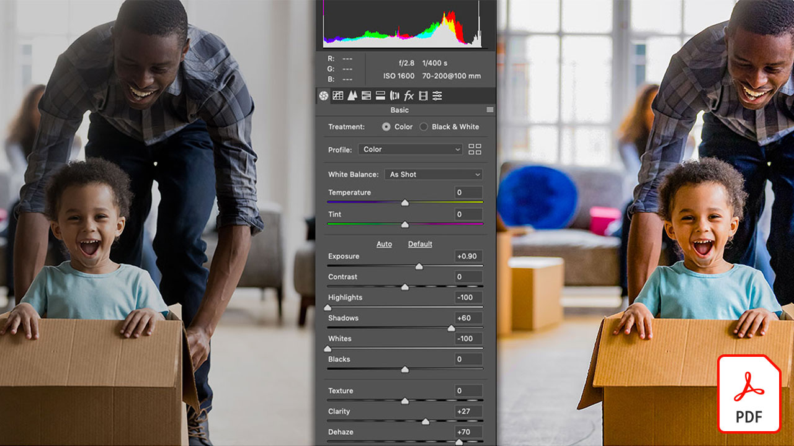

# エンタープライズチュートリアル用のCreative Cloud

エンタープライズクリエイティブとして、分散したチームとの共同作業、拡張性の高いプロセスの確立、企業のシステムとガイドラインへの準拠が必要です。 このチュートリアルは、企業の観点から、Creative Cloudの新機能を学ぶのに役立ちます。

## クリックして製品のチュートリアルを表示

### Creative Cloud エンタープライズ版

<table style="table-layout:fixed">
<tr>
 <td>
   
    

   <a href="assets/FromHandLetteringtoIllustratorviaCreativeCloud.pdf"><strong>Creative Cloud(PDF)を使用したIllustratorへの手書き入力</strong></a>
    

    <em>エンタープライズ向けのCreative Cloudの機能を使用すると、Adobeモバイルおよびデスクトップアプリケーションを使用して、どのデバイスからでもキャプチャ、変換、作成を行うことができます</em>
     
  </td>
  <td>
   
    

   <a href="assets/FromLightroomWebtoInDesignviaCreativeCloud.pdf"><strong>Lightroom WebからInDesignへ、Creative Cloud (PDF)を通じて</strong></a>
    

    <em>Creative Cloudのファイルとライブラリを使用して、カメラから最終デザインまで、創造性を発揮します。</em>
     
  </td>
  <td>
    
    

     
  </td>
</tr>
</table>

### Spark

<table style="table-layout:fixed">
<tr>
 <td>
   
    

   <a href="assets/AddingaGlideshowtoyourSparkPageAdobeBlog.pdf"><strong>Sparkページへのglideshowの追加(PDF)</strong></a>
    

    <em>Adobe Spark Pageには、Webストーリーを生き生きと再現する、使いやすい驚くべきレイアウトコンポーネントが用意されています。</em>
     
  </td>
  <td>
   
    

   <a href="assets/CreatingYourBrandinAdobeSpark.pdf"><strong>Adobe Sparkでのブランドの作成(PDF)</strong></a>
    

    <em>Adobe Sparkを使用すると、ブランドを簡単に定義できます。</em>
     
  </td>
  <td>
   
    

   <a href="assets/MeetYourNewProductionArtistAdobeSparkPost.pdf"><strong>新しい制作アーティストの紹介：Adobe Spark Post(PDF)</strong></a>
    

    <em>Adobe Sparkは、レイアウトの作成、カラーの定義、アートワークの読み込み、コンポジション内の要素の配置を行う際に学習します</em>
     
  </td>
</tr>
</table>

### Photoshop

<table style="table-layout:fixed">
<tr>
   <td>
    
    

    <a href="alphabetsoup.md"><strong>グラフィック形式のアルファベットスープのデコード</strong></a>
    

    <em>JPG、PNG、SVG、GIF、EPSファイルは、デザインで一般的に使用されます。Webページ用のファイルもあれば、プレゼンテーション、文書、クリエイティブなプロジェクト用のファイルもあります。でも、どういう意味で、どちらを選ぶべきか？</em>
     
  </td>
  <td>
    
    

    <a href="compositepsipad.md"><strong>Adobe [!DNL Stock]およびPhotoshop for iPadを使用して、独自のコンポジットを作成する</strong></a>
    

    <em>Photoshopのパワーをすぐに使えるようにします。タッチベースのインターフェイスを再設計し、お気に入りのCreative Cloudアプリケーションを新しい方法で使い方を学びます。</em>
     
  </td>
  <td>
    
    

    <a href="cinemagraphps.md"><strong>PhotoshopでのCinemagrapの作成</strong></a>
    

    <em>このワークショップビデオチュートリアルでは、Adobe [!DNL Stock]のビデオとPhotoshopの巧妙なマスキング技術を組み合わせて、生き写真を作成します</em>
     
  </td>
</tr>
<tr>
   <td>
    
    

    <a href="assets/AddRemarkableLightingtoaPhotowithPhotoshopandAfterEffects.pdf"><strong>PhotoshopとAfter Effects (PDF)を使用して、写真に目覚しい照明を追加する</strong></a>
    

    <em>Adobe After Effectsでライトバーストエフェクトを使用して写真を劇的に強調する方法を学習します</em>
     
   </td>
   <td>
    
    

    <a href="assets/CreateCinemagraphsinaSnapwithPhotoshopandAdobeStock.pdf"><strong>PhotoshopとAdobe [!DNL Stock] (PDF)を使用したスナップでのCinemagrapの作成</strong></a>
    

    <em>Adobe [!DNL Stock]でシームレスにビデオをループし、Photoshopで目を引く映画を素早く組み立てることができます。</em>
     
  </td>
   <td>
    
    

    <a href="assets/CreatingaLivingPhotographwithPhotoshopPart1.pdf"><strong>Photoshopを使用した写真の作成 – 第1部(PDF)</strong></a>
    

    <em>Adobe Photoshopでは、短いビデオを生き写しに変えて、あらゆるソーシャルプラットフォームで観客を魅了することができます</em>
     
  </td>
</tr>
<tr>
   <td>
    
    

    <a href="assets/CreatingaLivingPhotographwithPhotoshopPart2.pdf"><strong>Photoshopを使用した生き写真の作成 – 第2部(PDF)</strong></a>
    

    <em>写真とビデオを組み合わせると、元の画像のメッセージや色調を損なうことなく、写真に魅力的な品質を追加できます。</em>
     
  </td>
  <td>
    
    

    <a href="assets/PhotoshopAfterEffectsAwesomenessAdobeMAX2018LabRecap.pdf"><strong>Photoshop + After Effects =目盛り：Adobe MAX 2018 Lab Recap(PDF)</strong></a>
    

    <em>この実践的な、段階的なラボでは、PhotoshopとAfter Effectsを組み合わせて、任意のメディアでの使用に適した顎を落とす画像とエフェクトを作成します。</em>
     
  </td>
  <td>
    
    

    <a href="assets/QuicklyBrandYourInstagramPhotoswithAdobePhotoshopActions.pdf"><strong>Adobe Photoshop Actions(PDF)を使用してInstagramの写真をすばやくブランド化</strong></a>
    

    <em>Photoshopのアクションを使用して、退屈な作業を排除し、時間を大幅に節約します。</em>
     
  </td>
</tr>
<tr>
    <td>
    
    

    <a href="assets/WorkSmarterNotHarderwithPhotoshop.pdf"><strong>Photoshop(PDF)を使用した、よりスマートな作業、より高度な作業</strong></a>
    

    <em>Photoshopでの変更には時間がかかる場合がありますが、必要な変更はありません</em>
     
  </td>
   <td>
    
    

    <a href="assets/AnyoneCanBeCreativewithAdobeCreativeCloud.pdf"><strong>Adobe Photoshopをクリエイティブなスキルセットに追加(PDF)</strong></a>
    

    <em>Adobe Photoshopをクリエイティブなスキルセットに追加</em>
     
  </td>
  <td>
    
    

    <a href="assets/GreenScreenisNotJustforVideo.pdf"><strong>緑の画面はビデオ用ではない(PDF)</strong></a>
    

    <em>フォトスタジオで緑のスクリーンを使用し、After Effectsを使用してPhotoshopでのフォトの使用を準備できます</em>
     
  </td>
</tr>  
</table>

### Fresco

<table>
<tr>
 <td>
   
    

   <a href="frescoworkshop.md"><strong>iPad （とiPhone）のFrescoで試してみてください。</strong></a>
    

    <em>この15分間の実際のワークショップで、Adobe Frescoを使用したデジタル描画と絵画の全く新しい世界を体験できます。</em>
     
  </td>
  <td>
    
    

     
  </td>
  <td>
    
    

     
  </td>
</tr>
</table>

### Adobe Portfolio

<table  style="table-layout:fixed">
<tr>
   <td>
   
    

   <a href="assets/GettingStartedWithAdobePortfolio.pdf"><strong>Adobe Portfolio入門(PDF)</strong></a>
    

    <em>Adobe Portfolioで最高の作業を共有することは、お客様の成功を共有し、新しい創造力を引き付ける効果的な方法です。</em>
     
  </td>
   <td>
   
    

   <a href="assets/ConnectingLightroomandBehancetoYourAdobePortfolio.pdf"><strong>LightroomとBhanceをAdobeポートフォリオに接続する(PDF)</strong></a>
    

    <em>ポートフォリオのページとしてBamhi hanceプロジェクトを使用する</em>
     
  </td>
  <td>
   
    

   <a href="assets/ShowYourBestWorkwithAdobePortfolio.pdf"><strong>Adobe Portfolio (PDF)で最高の作品を表示</strong></a>
    

    <em>Adobe Portfolioを使用すると、世界中のスタッフやクライアントとの作業をアップロード、整理、共有できます。</em>
     
  </td>
 </tr>
 </table>

### CCライブラリ

<table  style="table-layout:fixed">
<tr>
  <td>
   
   

   <a href="ccteamlibraries.md"><strong>チーム向けのCreative Cloud Libraryの作成</strong></a>
    

    <em>チーム用のCreative Cloud Libraryを使用して、グループまたはチーム内で資産を共有する方法を説明します</em>
     
  </td>
  <td>
   
   

   <a href="sharecclibraries.md"><strong>チーム向けのクリエイティブクラウドライブラリとブランド資産を共有</strong></a>
    

    <em>チーム向けのCreative Cloud Libraryを使用して、グループまたはチーム向けのブランド資産を作成、使用、共有する方法を説明します。</em>
     
  </td>
  <td>
   
    

   <a href="assets/CreateAddandShareYourBrandAssetswithCreativeCloudLibraries.pdf"><strong>ブランド資産の作成、追加、共有をCreative Cloud Library (PDF)で行う</strong></a>
    

    <em>Creative Cloud Librariesは、デザイナーがクリエイティブなチーム間でブランド資産を共有できる、組み込みのブランドシステムを提供します</em>
     
  </td>
</tr>
<tr>
  <td>
   
    

   <a href="assets/ShareTextStylesFromIllustratorwithCreativeCloudLibraries.pdf"><strong>IllustratorのテキストスタイルをCreative Cloud Library (PDF)で共有</strong></a>
    

    <em>Illustratorでは、よりスマートに作業が容易</em>
     
  </td>
  <td>
    
    

     
  </td>
  <td>
    
    

     
  </td>
</tr>
</table>

### フォント

<table  style="table-layout:fixed">
<tr>
  <td>
   
    

   <a href="assets/CreatingBeautifulTypographywithCreativeCloud.pdf"><strong>クリエイティブクラウド(PDF)を使用した美しい印刷の作成</strong></a>
    

    <em>お気に入りのデザインツールに含まれる最新の印刷コントロールを活用する方法を学習します。</em>
     
  </td>
   <td>
   
    

   <a href="assets/DiscoveringFontswithCreativeCloud.pdf"><strong>Creative Cloudを使用したフォントの検出(PDF)</strong></a>
    

    <em>プロジェクトに適したフォントを見つけるのは、時々圧倒的に見える。さまざまなCreative Cloudアプリとサービスで、適切なフォントを見つけるのが楽しく、刺激的です。</em>
     
  </td>
  <td>
   
    

   <a href="assets/UnleashHiddenGemsinOpenTypefonts.pdf"><strong>OpenTypeフォントでの隠しGemの解放(PDF)</strong></a>
    

    <em>OpenType形式では、フォントに最大65,536字を含めることができます</em>
     
  </td>
</tr>
</table>

### InDesign

<table  style="table-layout:fixed">
<tr>
  <td>
   
    

   <a href="assets/CreatingInteractivePDFsfromInDesign.pdf"><strong>InDesignからのインタラクティブPDFの作成(PDF)</strong></a>
    

    <em>InDesignには、ドキュメント内のコンテンツの書式設定、スタイル設定、管理、追跡に役立つ多くの機能が含まれています</em>
     
  </td>
   <td>
   
    

   <a href="assets/EasilyGatherandIncorporateDesignFeedbackwithAdobeAcrobatandInDesign.pdf"><strong>Adobe AcrobatおよびInDesign(PDF)を使用したデザインフィードバックの収集と組み込みが簡単</strong></a>
    

    <em>関係者は、Acrobatを使用して詳細なコメントや注釈を追加し、その注釈をAdobe InDesignにすばやく戻して、レイアウトのコンテキストで表示できます</em>
     
  </td>
  <td>
   
    

   <a href="assets/StyleWebContentwithInDesign.pdf"><strong>Adobe InDesign CC(PDF)を使用したWebコンテンツのスタイル設定</strong></a>
    

    <em>InDesignの機能を利用してHTMLやWebグラフィックを出力できることをご存知でしたか？</em>
     
  </td>
</tr>
<tr>
   <td>
   
    

   <a href="assets/InteractivePDFBookmarksandLinkedTOCsfromInDesign.pdf"><strong>対話型PDF:InDesignのブックマークとリンク目次(PDF)</strong></a>
    

    <em>InDesignの目次機能を使用して、PDFファイル内の情報をすばやく見つけるのに役立つブックマークとハイパーリンクの両方を生成する方法を説明します</em>
     
  </td>
   <td>
   
    

   <a href="assets/InteractivePDFGraphicalHyperlinksandNestedMasterPagesinInDesign.pdf"><strong>対話型PDF:InDesignでのグラフィックハイパーリンクと入れ子になったマスタページ(PDF)</strong></a>
    

    <em>マスタページにハイパーリンクを適用すると、すべてのページでナビゲーションシステムをすばやく管理できます</em>
     
  </td>
  <td>
    
    

     
  </td>
</tr>
</table>

### Illustrator

<table  style="table-layout:fixed">
<tr>
   <td>
   
    

   <a href="assets/GettoKnowGraphicStylesinIllustrator.pdf"><strong>Illustratorでのグラフィックスタイルの詳細(PDF)</strong></a>
    

    <em>Illustratorでは、テキストのスタイルと同じ方法でアートワークのスタイルを設定できます</em>
     
  </td>
   <td>
   
    

   <a href="assets/WorkSmarterNotHarderwithIllustrator.pdf"><strong>Adobe Illustrator CC (PDF)を使用して、作業をスマートに、作業を難しくしない</strong></a>
    

    <em>Illustratorでのベクトル描画の高速化</em>
     
  </td>
  <td>
   
    

   <a href="assets/IllustratorSymbolsandLayersequalsPerfectStructureforResponsiveSVG.pdf"><strong>Illustratorシンボル+レイヤー=応答性の高いSVGに最適な構造(PDF)</strong></a>
    

    <em>Illustratorは、シンボル、グループ、ID、アートワークの正確なベクトル定義を作成する機能など、SVG形式に対する比類のないサポートを提供します</em>
     
  </td>
</tr>
</table>

### [!DNL Dimension]

<table  style="table-layout:fixed">
<tr>
   <td>
   
    

   <a href="assets/VisualizeyourProductinaRealisticEnvironment.pdf"><strong>リアルな環境での製品の視覚化(PDF)</strong></a>
    

    <em>製品の外観を実際に見たい場合は、Adobe [!DNL Dimension]がご利用のアプリです</em>
     
  </td>
  <td>
    
    

     
  </td>
  <td>
    
    

     
  </td>
</tr>
</table>
