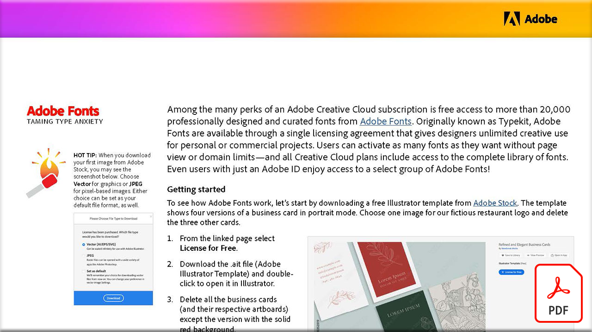

# 飼い慣らし型不安

Adobe Creative Cloudサブスクリプションには、Adobe Fontsが提供する2万種類以上のプロフェッショナルなデザインと厳選のフォントが用意されています。 Adobe Fontsは、従来Typekitとして知られていましたが、1つのライセンス契約を通じて、デザイナーによるパーソナルプロジェクトや商用プロジェクトでの無制限のクリエイティブな利用を可能にします。

このPDFチュートリアルを表示またはダウンロードするには、以下の画像を選択してください。

[{&quot;width=680&quot;}](assets/Adobe-Fonts-Taming-Font-Anxiety.pdf){target="blank"}
