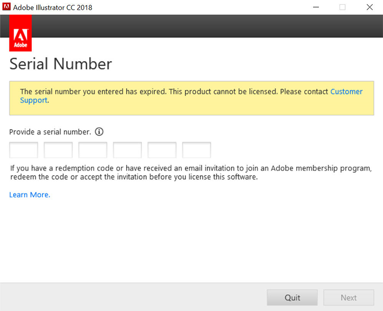

# エンタープライズ版およびAcrobat版のシリアル番号の有効期限に関するCreative Cloudについて

従来、Adobeでは、エンタープライズタームライセンス契約(ETLA)のお客様に対して、アプリケーション(Creative Suite、エンタープライズ版Creative Cloud、Acrobat XI、Acrobat DCなど)にシリアル番号を発行していました。 これらのシリアル番号には有効期限があります。 有効期限を過ぎると、製品は動作しなくなります。シリアル番号の有効期限が切れる前に移行を計画することが重要です。 このページでは、エンドユーザーが引き続きAdobeのアプリケーションとサービスにアクセスできるようにするために必要な手順の概要を説明します。

## シリアル番号の有効期限の確認

### シリアル番号の検索

ETLA契約に関連付けられたシリアル番号ライセンスは、[AdobeライセンスWebサイト](https://licensing.adobe.com/) (LWS)から入手できます。 次の手順に従って、表示およびダウンロードします。

1. Adobe IDとパスワードを使用して、[Adobeライセンスwebサイト](https://licensing.adobe.com/) (LWS)にサインインします。
1. **ライセンス/シリアル番号を取得**&#x200B;を選択します。
1. **エンドユーザーID**&#x200B;または&#x200B;**デプロイ先ID**&#x200B;を入力してください。
1. （オプション）結果をフィルター処理するには、**製品名**、**製品バージョン**、または&#x200B;**プラットフォーム**&#x200B;を選択します。
1. 「検索」をクリックします。
1. 製品名とシリアル番号が表示されます。
1. （オプション）「EXPORT TO CSV」を選択して、シリアル番号のリストをダウンロードします。

### 有効期限の確認

[AdobeExpiryCheck](https://helpx.adobe.com/jp/enterprise/kb/volume-license-expiration-check.html)は、コンピューター上のAdobe製品の有効期限が既に切れているか、まもなく期限切れになるシリアル番号を使用しているかどうかをIT管理者が確認するためのコマンドラインユーティリティです。 このツールには、製品ライセンス識別子(LEID)、暗号化されたシリアル番号、有効期限などの情報が表示されます。 この[ページ](https://helpx.adobe.com/jp/enterprise/kb/volume-license-expiration-check.html)には、MacまたはWindowsコンピューターにツールをダウンロードして使用する手順が記載されています。

## シリアル番号の有効期限が切れる前と後のエンドユーザーのエクスペリエンスについて

AcrobatおよびCreative Cloud法人版アプリでは、期限切れの60日前から、（アプリ内の）メッセージの表示が開始されます。 シリアル番号の期限が切れると、製品の動作が停止し、ユーザーに処理を行うように求めるメッセージが表示されます。

### エンタープライズエクスペリエンスのCreative Cloud

次の情報は、エンドユーザーエクスペリエンスの概要を示しています。 以下に短いビデオを示し、エンドユーザーのエクスペリエンスを確認します。

>[!VIDEO](https://video.tv.adobe.com/v/3441276?hidetitle=true&captions=jpn)

**有効期限の前**

シリアル番号の有効期限が切れる60日前から、すべてのエンタープライズアプリのCreative Cloudに製品内ダイアログボックスが表示されます。 このメッセージは、有効期限の30日前まで毎週表示され、有効期限の日付が&#x200B;*ライセンスの有効期限が切れるまで毎日表示されます。 このAdobe製品は、2020年11月29日に期限切れになるライセンスを使用しています。 引き続きアクセスするには、管理者にお問い合わせください*。

**有効期限の後**

シリアル番号の期限が切れると、ユーザーはエンタープライズアプリのCreative Cloudにアクセスできなくなります。 有効期限が切れた後に最初に起動すると、ダイアログボックスが表示され、*入力したシリアル番号の有効期限が切れています。 この製品はライセンスを取得できません。 カスタマーサポート*&#x200B;にお問い合わせください。

その後、アプリを起動しようとすると、エンドユーザーは&#x200B;**今すぐログイン**&#x200B;するように求められ、その後、独自のAdobe IDを作成して体験版モードに入るよう求められます。 ただし、エンドユーザーが作成した新しいAdobe IDは、組織のライセンスに関連付けられず、ユーザーの混乱を引き起こします。 ビジネスの中断や不必要な混乱を避けるために、シリアル番号の有効期限が切れる前にユーザーを指定ユーザーライセンスに移行してください。

### Acrobat experience

次の情報は、エンドユーザーエクスペリエンスの概要を示しています。 以下に短いビデオを示し、エンドユーザーのエクスペリエンスを確認します。

>[!VIDEO](https://video.tv.adobe.com/v/331749?hidetitle=true)

**有効期限の前**

シリアル番号の有効期限が切れる60日前から、Acrobatはエンドユーザーに製品内ポップアップメッセージを表示します。 有効期限の7日前まで、これは週1回表示されます。 その後、*お客様のAdobe Acrobatライセンスは2020年30月11日に期限切れとなります。 Acrobatを引き続き使用するには、管理者にお問い合わせください。*

**有効期限の後**

シリアル番号の期限が切れると、Acrobatにアクセスできなくなります。 有効期限が切れた後に最初に起動すると、ダイアログボックスが表示され、*入力したシリアル番号の有効期限が切れています。 この製品はライセンスを取得できません。 カスタマーサポートにお問い合わせください。*

その後Acrobatを起動しようとすると、エンドユーザーは&#x200B;**今すぐログイン**&#x200B;するように求められ、その後、独自のAdobe IDを作成して体験版モードに入ることができます。 ただし、エンドユーザーが作成した新しいAdobe IDは、組織のライセンスに関連付けられず、ユーザーの混乱を引き起こします。

のAcrobat Sign

のAcrobat Sign

## サポートが必要な場合はお問い合わせください

[AdobeExpiryCheck](https://helpx.adobe.com/jp/enterprise/kb/volume-license-expiration-check.html)ツールの使用について質問がある場合、またはシリアル番号のデプロイメントから指定ユーザーへの移行にサポートが必要な場合は、いくつかのオプションがあります。
* Adobeエンタープライズオンボーディングチームに電子メールを送信 – **entonb@adobe.com**
* [Admin Console](https://adminconsole.adobe.com/support)でサポートチケットを開く
* Adobeアカウントチームにご連絡ください
