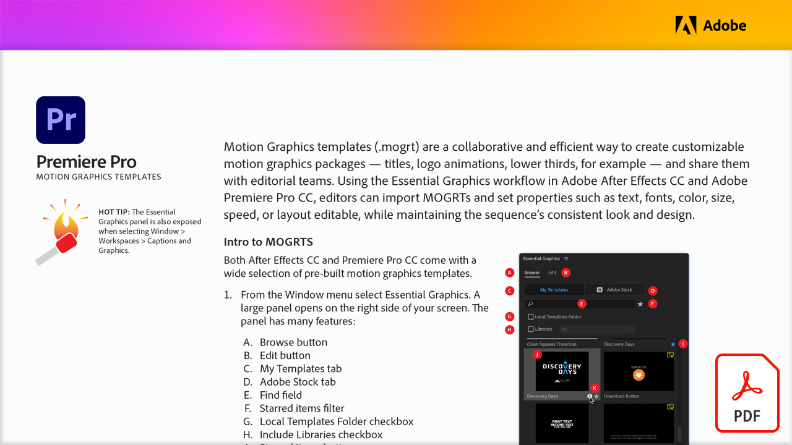

# プロフェッショナルなモーショングラフィックステンプレート

モーショングラフィックステンプレート (.mogrt) は、共同作業を行う効率的な方法です。タイトルやロゴのアニメーション、ローワーサードなど、カスタマイズ可能なモーショングラフィックスパッケージを作成し、編集チームと共有できます。 Adobe After Effects CCとAdobe Premiere Pro CCのエッセンシャルグラフィックスワークフローを使用して、編集者は MOGRT を読み込み、シーケンスの一貫した外観とデザインを維持しながら、テキスト、フォント、カラー、サイズ、速度、編集可能なレイアウトなどのプロパティを設定できます。

以下の画像を選択して、このチュートリアルを表示するか、ダウンロードしてください。PDFについては、こちらを参照してください。

[{&quot;width=680&quot;}](assets/Adobe-Premiere-Pro-Motion-Graphics-Templates.pdf){target=&quot;blank&quot;}
