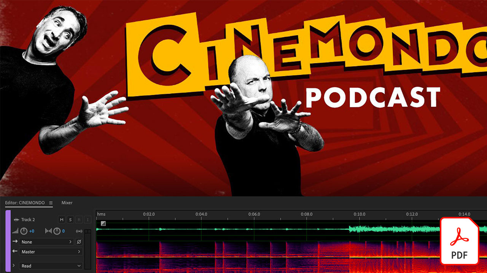
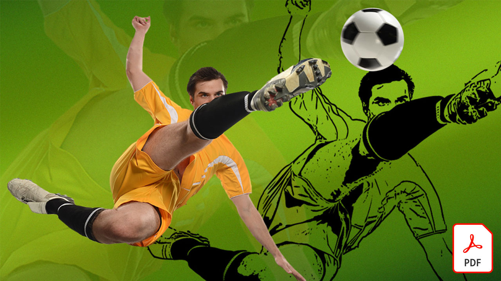

# ビデオクイックリファレンスガイド

ビデオ編集、モーショングラフィックス、ビジュアルエフェクト、アニメーションなどのAdobeソフトウェアとアプリを使用して、アイデアを実現します。 画像を選択してダウンロードするか、クイックリファレンスガイドのPDFを表示します。

## Adobe Audition

<table>
<tr>
   <td>
      
      

      <a href="assets/QuicklyRemoveUnwantedAudioContentwiththeSpotHealingBrushinAdobeAudition.pdf" target="_blank"><strong>Adobe Audition(PDF)のスポット修復ブラシを使用して、不要なオーディオコンテンツを素早く削除します</strong></a>
      

      <em>Adobe Photoshopのスポット修復ブラシを使用すると、Adobe Auditionの音声ファイルから不要な音を除去できます。</em>
       
  </td>
  <td>
    
    

     
  </td>
  <td>
    
    

     
  </td>
  <td>
    
    

     
  </td>
</tr>
</table>

## Adobe Express(旧Adobe Spark)

<table>
<tr>
<td>
   
    

   <a href="assets/ShowcaseyourSparkVideoinyourSparkPage.pdf" target="_blank"><strong>Spark Page(PDF)でSpark Videoを披露する</strong></a>
    

    <em>Adobe Spark Pageでは、Spark Videoで作成したビデオを含む、様々なソースからビデオを読み込むことができます。</em>
     
  </td>
  <td>
    
    

     
  </td>
  <td>
    
    

     
  </td>
  <td>
    
    

     
  </td>
</tr>
</table>

## After Effects

<table>
<tr>
 <td>
   
    

   <a href="assets/AfterEffectsforPhotography.pdf" target="_blank"><strong>フォトグラフィーのAfter Effects(PDF)</strong></a>
    

    <em>After Effectsの素晴らしい効果を使用して、写真を補正する方法を説明します</em>
     
  </td>
  <td>
   
    

   <a href="assets/CinemagraphsTheMesmerizingPlaceBetweenaPhotoandaVideo.pdf" target="_blank"><strong>映画：写真とビデオの間の魅惑的な場所(PDF)</strong></a>
    

    <em>写真とビデオの間に存在する、人目を引くハイブリッドな映画「シネマグラフ」について詳しく説明します</em>
     
  </td>
  <td>
   
    

   <a href="assets/CreateanIllustrationfromanAdobeStockPhotowithAfterEffects.pdf" target="_blank"><strong>Adobeからイラストを作成する [!DNL Stock] After Effectsを使用した写真(PDF)</strong></a>
    

    <em>After Effectsで、色相・彩度とレベル補正をカートゥーン効果と組み合わせて、Adobeからユニークなスタイルのイラストを作成します [!DNL Stock] 写真</em>
     
  </td>
   <td>
   
    

   <a href="assets/CreateBeautifulKaleidoscopePatternswithAfterEffects.pdf" target="_blank"><strong>After EffectsのPDFで美しい万華鏡のパターンを作成)</strong></a>
    

    <em>Adobe After EffectsでCC Kaleidaエフェクトを使用すると、あらゆる画像から無限の数のパターンとテクスチャを作成できます</em>
     
  </td>
</tr>
<tr>
<td>
   
    

   <a href="assets/CreateIntricateTransparencyinyourPhotographswithKeyinginAfterEffects.pdf" target="_blank"><strong>After Effectsのキーイングを使用して写真に複雑な透明部分を作成(PDF)</strong></a>
    

    <em>キーイングはビデオに非常に多く使用されます。また、デザインプロジェクトで写真が必要な場合に大きな助けになります</em>
     
  </td>
 <td>
   
    

   <a href="assets/CreateAnimatedTitlesUsingMotionGraphicsTemplatesinAdobePremiereRush.pdf" target="_blank"><strong>Adobe Premiereのモーショングラフィックステンプレートを使用したアニメーションタイトルの作成 [!DNL Rush] (PDF)</strong></a>
    

    <em>プロがデザインしたモーショングラフィックステンプレートを追加して、ストーリーに合わせたり、個人のブランドに合わせたりして、ビデオの見栄えをさらに向上させることができます</em>
     
  </td>
  <td>
      
      

      <a href="assets/DazzlingLightEffectsforPhotographywithAfterEffects.pdf" target="_blank"><strong>After Effects写真撮影用の魅力的なライト効果(PDF)</strong></a>
      

      <em>Adobe After Effectsの照明効果により、写真の見た目が大きく変わる場合があります</em>
       
  </td>
  <td>
      
      

      <a href="assets/EditingVRPhotography360photoswithAfterEffects.pdf" target="_blank"><strong>After Effects(PDF)を使用したVR写真（360度写真）の編集</strong></a>
      

      <em>没入型のインタラクティブなゲームや体験は一般的ではありませんが、360度の写真撮影は既に利用されています</em>
       
  </td>
</tr>
</table>

## Premiere Rush

<table>
<tr>
   <td>
      
      

      <a href="assets/SmoothlyCombineMusicandDialogueorNarrationwithAutoduckinginAdobePremiereRush.pdf" target="_blank"><strong>自動ダッキングを使用して、音楽と会話またはナレーションをスムーズに組み合わせる [!DNL Adobe Premiere Rush] (PDF)</strong></a>
      

      <em>Adobe Premiere [!DNL Rush] 使いやすいアプリで高度なビデオ編集機能を提供し、誰でも数分でプロ品質のビデオを作成できます</em>
       
  </td>
  <td>
    
    

     
  </td>
  <td>
    
    

     
  </td>
  <td>
    
    

     
  </td>
</tr>
</table>
