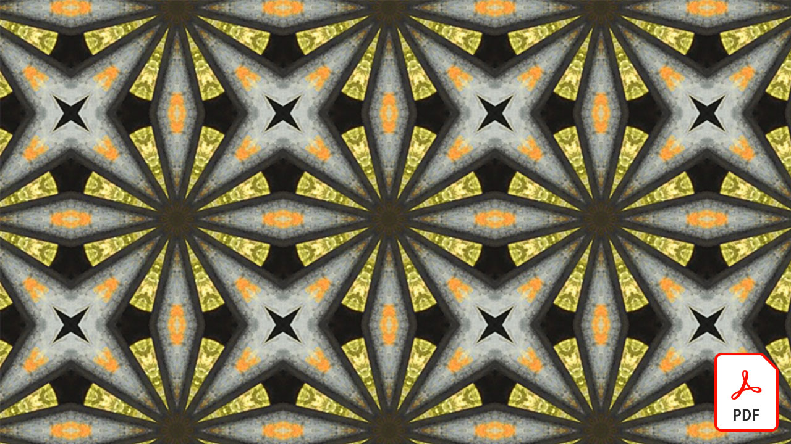

# ビデオのクイックリファレンスガイド

ビデオ編集、モーショングラフィックス、ビジュアルエフェクト、アニメーションなどに対応したAdobeのソフトウェアとアプリで、アイデアに命を吹き込みましょう。 ダウンロードする画像を選択するか、クイックリファレンスガイドのPDFを表示します。

## Adobe Audition

<table>
<tr>
   <td>
      
      

      <a href="assets/QuicklyRemoveUnwantedAudioContentwiththeSpotHealingBrushinAdobeAudition.pdf" target="_blank"><strong>Adobe Audition(PDF) のスポット修復ブラシツールを使用して、不要なオーディオコンテンツをすばやく削除します。</strong></a>
      

      <em>Adobe Photoshopのスポット修復ブラシツールを使用して、Adobe Auditionのオーディオファイルから不要なサウンドを除去できることをご存知でしたか？</em>
       
  </td>
  <td>
    
    

     
  </td>
  <td>
    
    

     
  </td>
  <td>
    
    

     
  </td>
</tr>
</table>

## Adobe Express( 旧Adobe Spark)

<table>
<tr>
<td>
   
    

   <a href="assets/ShowcaseyourSparkVideoinyourSparkPage.pdf" target="_blank"><strong>Spark PageでSpark Videoを公開 (PDF)</strong></a>
    

    <em>Adobe Spark Pageでは、Spark Videoで作成したビデオなど、様々なソースからビデオを読み込むことができます。</em>
     
  </td>
  <td>
    
    

     
  </td>
  <td>
    
    

     
  </td>
  <td>
    
    

     
  </td>
</tr>
</table>

## After Effects

<table>
<tr>
 <td>
   
    

   <a href="assets/AfterEffectsforPhotography.pdf" target="_blank"><strong>写真編集のためのAfter Effects(PDF)</strong></a>
    

    <em>After Effectsの優れた効果を使用して写真を加工する方法について説明します</em>
     
  </td>
  <td>
   
    

   <a href="assets/CinemagraphsTheMesmerizingPlaceBetweenaPhotoandaVideo.pdf" target="_blank"><strong>シネマグラフ：写真とビデオの間の魅力的な場所 (PDF)</strong></a>
    

    <em>写真と動画の間に存在する、人目を引くハイブリッド写真、シネマグラフについて学びましょう</em>
     
  </td>
  <td>
   
    

   <a href="assets/CreateanIllustrationfromanAdobeStockPhotowithAfterEffects.pdf" target="_blank"><strong>イラストを作成するAdobe [!DNL Stock] After Effectsの写真 (PDF)</strong></a>
    

    <em>After Effectsで色相・彩度とレベル補正をカートゥーンエフェクトと組み合わせて、Adobeからユニークなイラストを作成します [!DNL Stock] 写真</em>
     
  </td>
   <td>
   
    

   <a href="assets/CreateBeautifulKaleidoscopePatternswithAfterEffects.pdf" target="_blank"><strong>美しい万華鏡パターンを作成する (After EffectsPDF)</strong></a>
    

    <em>Adobe After Effectsの CC Kaleida エフェクトを使用すれば、あらゆる画像から無限の数のパターンとテクスチャを作成できます</em>
     
  </td>
</tr>
<tr>
<td>
   
    

   <a href="assets/CreateIntricateTransparencyinyourPhotographswithKeyinginAfterEffects.pdf" target="_blank"><strong>After Effectsのキーイングを使用した写真の複雑な透明部分の作成 (PDF)</strong></a>
    

    <em>キーイングはビデオでかなり頻繁に使用されますが、デザインプロジェクトで写真が必要な場合にも大きな助けになります</em>
     
  </td>
 <td>
   
    

   <a href="assets/CreateAnimatedTitlesUsingMotionGraphicsTemplatesinAdobePremiereRush.pdf" target="_blank"><strong>Adobe Premiereのモーショングラフィックステンプレートを使用したアニメーションタイトルの作成 [!DNL Rush] (PDF)</strong></a>
    

    <em>ストーリーや個人ブランドに合わせてプロがデザインしたモーショングラフィックステンプレートを追加することで、ビデオの完成度をさらに高めることができます</em>
     
  </td>
  <td>
      
      

      <a href="assets/DazzlingLightEffectsforPhotographywithAfterEffects.pdf" target="_blank"><strong>After Effectsを使用した写真用の眩しい光の効果 (PDF)</strong></a>
      

      <em>Adobe After Effectsの照明効果を使用すると、写真の外観を劇的に変えることができます</em>
       
  </td>
  <td>
      
      

      <a href="assets/EditingVRPhotography360photoswithAfterEffects.pdf" target="_blank"><strong>After Effects(PDF) による VR 写真の編集（360 度写真）</strong></a>
      

      <em>より没入型のインタラクティブなゲームや体験は、あまり一般的ではありませんが、360 度の写真はすでにここにあります</em>
       
  </td>
</tr>
</table>

## Premiere Rush

<table>
<tr>
   <td>
      
      

      <a href="assets/SmoothlyCombineMusicandDialogueorNarrationwithAutoduckinginAdobePremiereRush.pdf" target="_blank"><strong>オートダッキング機能により、音楽、会話、ナレーションをスムーズに結合できます。 [!DNL Adobe Premiere Rush] (PDF)</strong></a>
      

      <em>Adobe Premiere [!DNL Rush] 高度なビデオ編集機能が使いやすいアプリで実現。誰でもプロ品質のビデオを数分で作成できます。</em>
       
  </td>
  <td>
    
    

     
  </td>
  <td>
    
    

     
  </td>
  <td>
    
    

     
  </td>
</tr>
</table>
