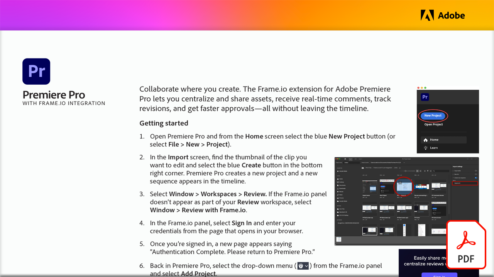

# フレーム.ioを使用したビデオレビュー

制作現場での共同作業 Adobe Premiere Pro向けフレーム.io拡張機能を使用すると、この実践チュートリアルでタイムラインを離れることなく、アセットの一元管理と共有、リアルタイムのコメントの受け取り、リビジョンの追跡、迅速な承認を行う方法について説明します。

このPDFチュートリアルを表示またはダウンロードするには、以下の画像を選択してください。

{target="blank"}
