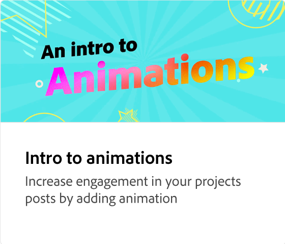
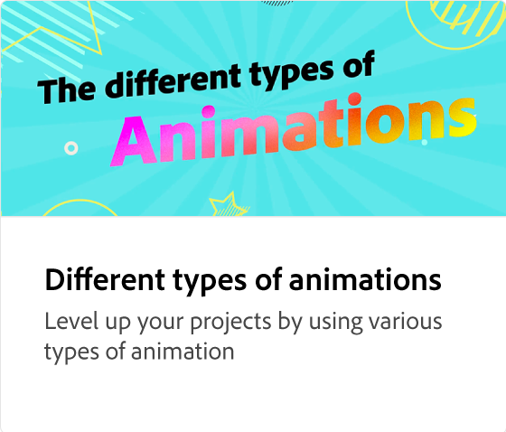
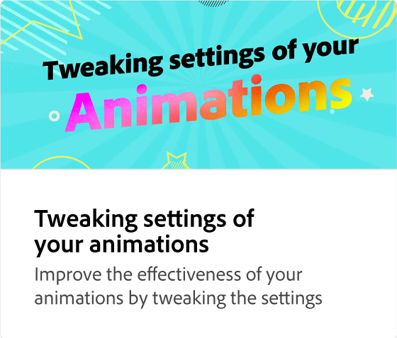
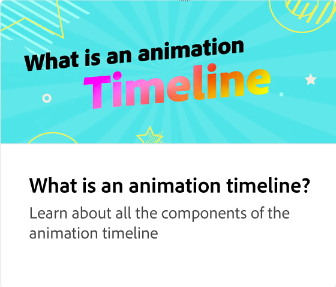
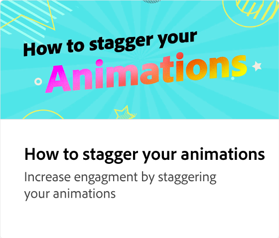
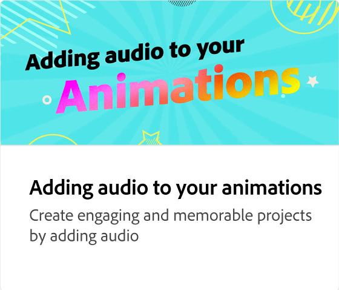
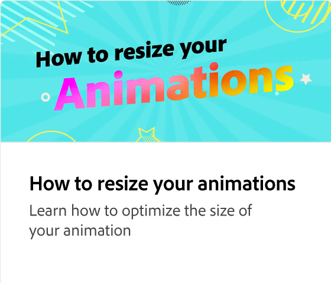
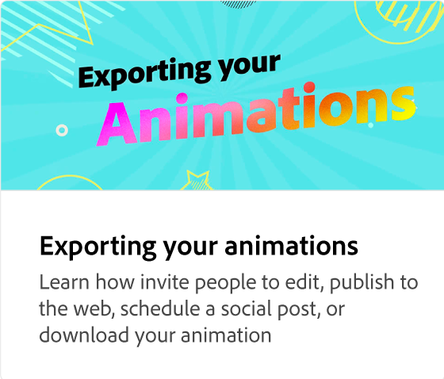

# アニメーションにセクションを追加する

画像や見出しなどの要素をアニメーションに追加して、アニメーションをレベルアップします。 アニメーションを元の状態に保ちながら、シーンの要素を追加、複製、再配置する方法を説明します。

>[!VIDEO](https://video.tv.adobe.com/v/3433921?captions=jpn&quality=12&learn=on&hidetitle=true)

## このシリーズの追加のビデオ

<table style="table-layout:fixed">
<tr>
   <td>
         
   </td>
  <td>
         
   </td>
   <td>
         
   </td>
   <td>
         
   </td>
</tr>
<tr>
    <td>
         
   </td>
   <td>
         
   </td>
   <td>
         
   </td>
   <td>
         
   </td>
</tr>
</table>
