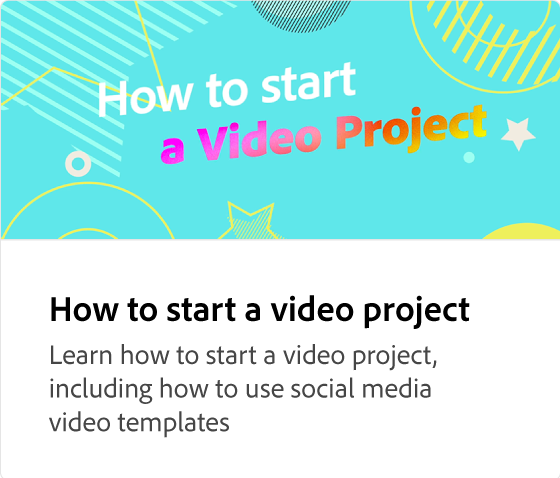

# ビデオクリップの追加方法

ドラッグ&amp;ドロップでビデオをすばやく簡単に作成する方法を説明します。 テンプレートや独自の静的デザインから始めて、ブランド、デザインアセット、Adobe Stockビデオ、ミュージックなどを追加します。

>[!VIDEO](https://video.tv.adobe.com/v/3427071?quality=12&learn=on&hidetitle=true)

## このシリーズの追加のビデオ

<table style="table-layout:fixed">
<tr>
   <td>
         
   </td>
   <td>
         
   </td>
   <td>
         
   </td>
   <td>
         
   </td>
</tr>
<tr>
    <td>
         
   </td>
   <td>
    
    

     
   </td>
   <td>
    
    

     
   </td>
   <td>
    
    

     
   </td>
</tr>
</table>
