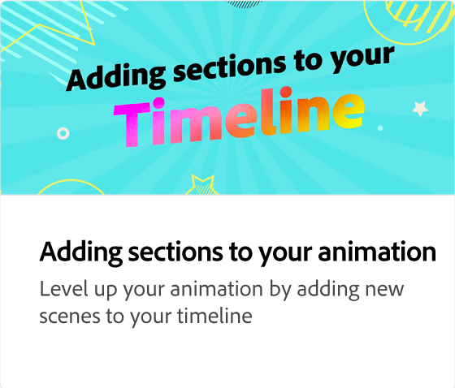

# アニメーションへの音声の追加

Expressで利用できるロイヤリティフリーのストックオーディオファイルなど、オーディオを追加して、魅力的で覚えやすいプロジェクトを作成する方法を説明します。

>[!VIDEO](https://video.tv.adobe.com/v/3426983?quality=12&learn=on&hidetitle=true)

## このシリーズの追加のビデオ

<table style="table-layout:fixed">
<tr>
   <td>
         
   </td>
  <td>
         
   </td>
   <td>
         
   </td>
   <td>
         
   </td>
</tr>
<tr>
    <td>
         
   </td>
   <td>
         
   </td>
   <td>
         
   </td>
   <td>
         
   </td>
</tr>
</table>