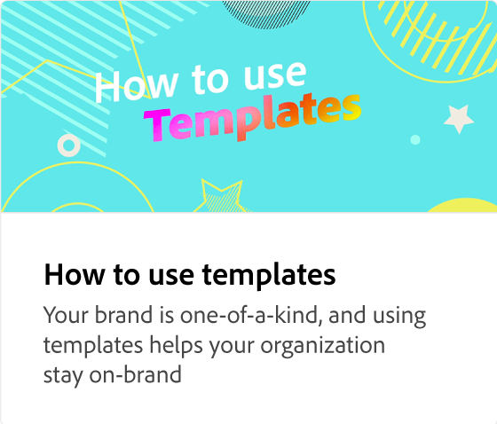

# 効率を最大化：再利用可能なテンプレートを作成

Adobe Expressテンプレートを使用して、ブランドの一貫性、効率性、プロフェッショナリズム、コスト削減を実現する方法を説明します。 このチュートリアルでは、Photoshop、Illustrator、InDesign、PowerPointファイルなど、既存のコンテンツから再利用可能なファイルを作成する方法について説明します。

>[!VIDEO](https://video.tv.adobe.com/v/3433965?quality=12&learn=on&hidetitle=true&captions=jpn)

## このシリーズの追加のビデオ

<table style="table-layout:fixed">
<tr>
    <td>
        
        

            <a href="lock-layers.md"><strong>レイヤーをロックする方法と理由</strong></a>
            

            <em>テンプレートのさまざまな要素をロックすることが重要である理由を説明します</em>
             
    </td>
    <td>
         
         

         <a href="share-templates.md"><strong>テンプレートの保存と共有</strong></a>
         

         <em>テンプレートを保存して、チームのブランドキットまたはライブラリと共有する方法を説明します</em>
          
   </td>
   <td>
         
         

         <a href="use-templates.md"><strong>テンプレートを使用してブランドの一貫性を簡単に確保</strong></a>
         

         <em>組織全体でブランドのコンテンツをすばやく効率的に作成する方法を説明します</em>
          
   </td>
    <td>
      
      

       
    </td>
</tr>
</table>

