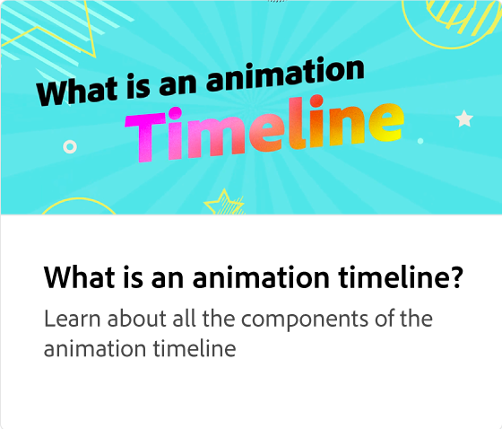

# アニメーションの紹介

ソーシャルメディアの投稿にアニメーションを追加して、エンゲージメントを高める方法について説明します。 アニメーションパネルにアクセスするには、ページ上の任意の要素（画像など）を選択し、様々な種類のアニメーションを適用します。

>[!VIDEO](https://video.tv.adobe.com/v/3436586?quality=12&learn=on&hidetitle=true&captions=jpn)

## このシリーズの追加のビデオ

<table style="table-layout:fixed">
<tr>
   <td>
         
   </td>
   <td>
         
   </td>
   <td>
         
   </td>
   <td>
         
   </td>
</tr>
<tr>
   <td>
         
   </td>
   <td>
         
   </td>
   <td>
         
   </td>
   <td>
         
   </td>
</tr>
</table>
