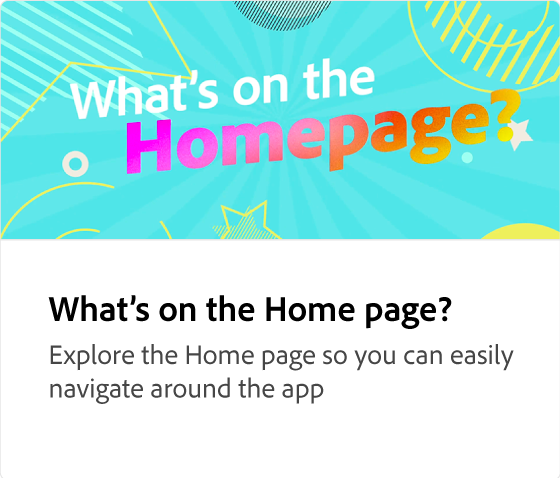

# テンプレート入門

あらゆるソーシャルメディアとマーケティングのニーズに合わせて、プロがデザインした数多くのテンプレートをご覧ください。 テンプレートを使用すると、自分の言葉や写真をリミックスして、カスタマイズされたコンテンツをすばやく作成できます。

>[!VIDEO](https://video.tv.adobe.com/v/3426927?quality=12&learn=on&hidetitle=true)

## このシリーズの追加のビデオ

<table style="table-layout:fixed">
<tr>
 <td>
      
 </td>
 <td>
      
 </td>
 <td>
      
      

       
   </td>
    <td>
      
      

       
   </td>
</tr>
</table>
