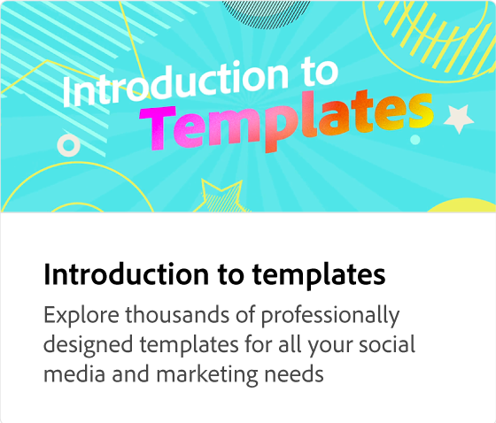
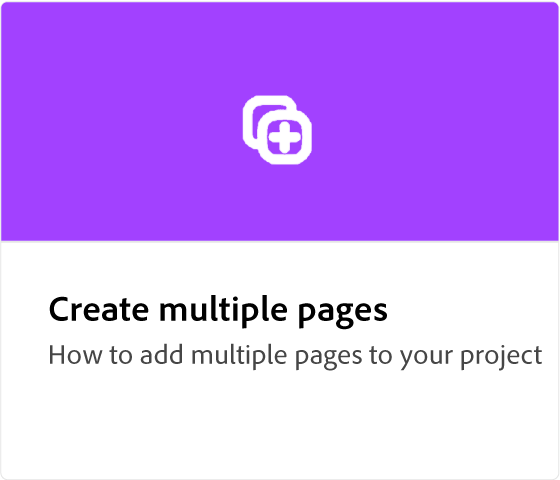

# Adobe [!DNL Express] 使い方チュートリアル

Adobe Fireflyを利用したAI生成で、際立つ素晴らしい作品の制作を開始しましょう。 Adobe Expressのあるチラシ、TikToks、履歴書、リールをデザインします。

## はじめに

<table style="table-layout:fixed">
<tr>
 <td>
      
 </td>
 <td>
      
 </td>
 <td>
      
 </td>
 <td>
      
      

       
   </td>
</tr>
</table>

## 基本的なタスク

<table style="table-layout:fixed">
<tr>
 <td>
      
  </td>
   <td>
      
  </td>
   <td>
      
  </td>
  <td>
      
  </td>
</tr>
<tr>
   <td>
      
  </td>
   <td>
      
  </td>
   <td>
      
  </td>
   <td>
         
   </td>
</tr>
<tr>
   <td>
         
   </td>
   <td>
   
   </td>
   <td>
   
   </td>
   <td>
   
   </td>
</tr>
<tr>
   <td>
      
   </td>
   <td>
      
  </td>
  <td>
      
      

       
   </td>
   <td>
      
      

       
   </td>
</tr>
</table>

## アニメーション

<table style="table-layout:fixed">
<tr>
   <td>
         
   </td>
  <td>
         
   </td>
   <td>
         
   </td>
   <td>
         
   </td>
</tr>
<tr>
   <td>
         
   </td>
   <td>
         
   </td>
   <td>
         
   </td>
   <td>
         
   </td>
</tr>
<tr>
   <td>
         
   </td>
   <td>
      
      

       
   </td>
    <td>
      
      

       
   </td>
    <td>
      
      

       
   </td>
</tr>
</table>

## 高度なタスク

<table style="table-layout:fixed">
<tr>
   <td>
         
   </td>
   <td>
         
   </td>
   <td>
         
   </td>
   <td>
         
   </td>      
</tr>
<tr>
   <td>
      
   </td>
   <td>
      
   </td>
   <td>
      
   </td>
   <td>
      
   </td>
</tr>
<tr>
   <td>
      
   </td>
   <td>
         
   </td>
   <td>
      
  </td>
  <td>
      
  </td>
</tr>
<tr>
   <td>
      
  </td>
  <td>
         
   </td>
   <td>
         
   </td>
   <td>
    
    

     
   </td>
</tr>
</table>

## ビデオ

<table style="table-layout:fixed">
<tr>
   <td>
         
   </td>
  <td>
         
   </td>
   <td>
         
   </td>
   <td>
         
   </td>
</tr>
<tr>
  <td>
         
   </td>
    <td>
         
   </td>
   <td>
    
    

     
   </td>
   <td>
    
    

     
   </td>
</tr>
</table>

## テンプレート

<table style="table-layout:fixed">
<tr>
   <td>
         
   </td>
   <td>
         
   </td>
   <td>
         
   </td>
   <td>
         
   </td>
</tr>
</table>