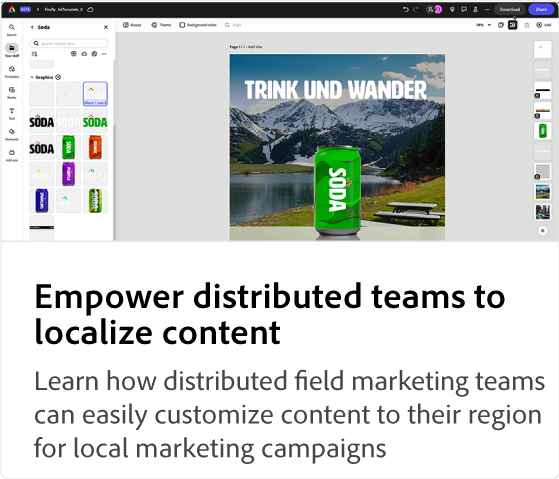

# Adobe [!DNL Express] ユースケースのチュートリアル

組織内の様々なチームがAdobe Expressからどのようなメリットを得られるかを説明します。

## Adobe Expressの使用事例チュートリアル

<table style="table-layout:fixed">
<tr>
   <td>
      
  <td>
      
  </td>
  <td>
      
   </td>     
   <td>
      
   </td>
</tr>
<tr>
   <td>
      
   </td>
   <td>
      
   </td>
   <td>
      
   </td>
   <td>
      
   </td>
</tr>
</table>
