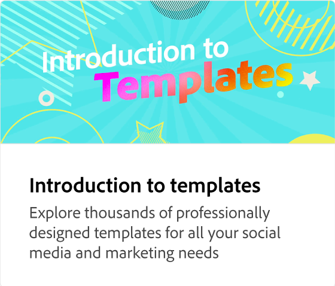

# クイックアクションの概要

クイックアクションを使用すると、時間を節約し、日々のクリエイティブな作業のための基本的な編集ツールを提供できます。 クイックアクションの例としては、ビデオの結合とトリミング、背景の削除、画像とビデオのサイズ変更、ビデオのGIFへの変換、PDFの編集などがあります。

>[!VIDEO](https://video.tv.adobe.com/v/3446299?captions=jpn&quality=12&learn=on&hidetitle=true)

## このシリーズの追加のビデオ

<table style="table-layout:fixed">
<tr>
 <td>
      
 </td>
 <td>
      
 </td>
 <td>
      
      

       
   </td>
   <td>
      
      

       
   </td>
</tr>
</table>
