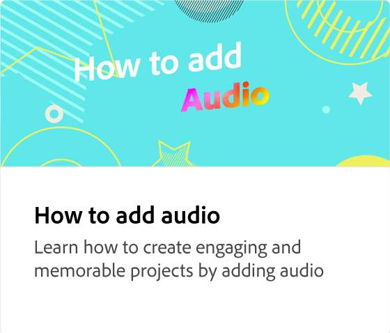

# ビデオタイムラインとは何ですか？

プロジェクト内のビデオ、画像、テキスト、グラフィックなどのビデオオブジェクトを配置および編集するタイムラインについて学習します。 タイムラインは、オブジェクトの表現と、ビデオを構成するオブジェクトの順序です。

>[!VIDEO](https://video.tv.adobe.com/v/3427090?quality=12&learn=on&hidetitle=true)

## このシリーズの追加のビデオ

<table style="table-layout:fixed">
<tr>
   <td>
         
   </td>
  <td>
         
   </td>
   <td>
         
   </td>
   <td>
         
   </td>
</tr>
<tr>
    <td>
         
   </td>
   <td>
    
    

     
   </td>
   <td>
    
    

     
   </td>
   <td>
    
    

     
   </td>
</tr>
</table>
