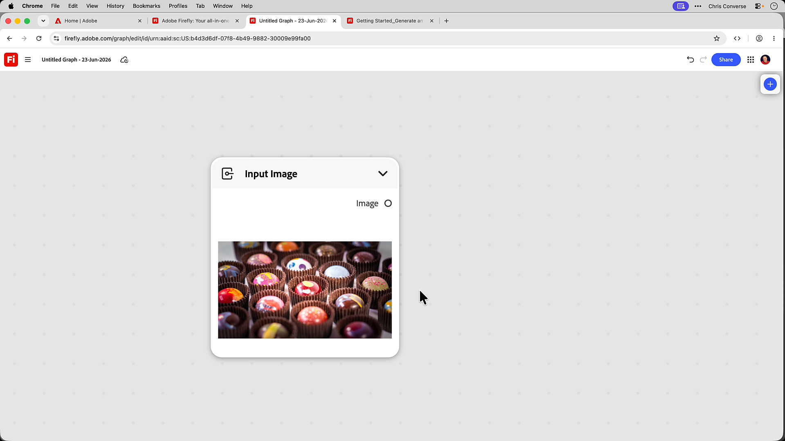

# &#x200B;3. 最初のグラフを作成

ノード、接続、およびテンプレートの内容がわかったら、最初のワークフローを構築する準備が整います。

1. Fireflyを開いて、左側のメニューから&#x200B;**グラフ**&#x200B;を選択します。
1. **新しいグラフの作成**&#x200B;を選択します。
1. 空白のキャンバスを右クリックして、**+新しいノード**&#x200B;を選択します。
1. 左側のメニューで&#x200B;**入力**&#x200B;を選択し、**入力画像**&#x200B;を選択します。
   
このノードを使用すると、グラフィックを読み込むことができます。
1. 画像をノードにドラッグ&amp;ドロップします。
   
1. 空白のカンバスを右クリックして、**+新しいノード**&#x200B;を選択し、ダイアログで&#x200B;**グラデーションマスク**&#x200B;を選択します。
1. 空白のカンバスを右クリックして、**+新しいノード**&#x200B;を選択し、ダイアログで「**マスクを適用**」を選択します。

## 次のステップ

テンプレートから作成する場合 [4に移動します。 独自の概要を反映するようにテンプレート](https://experienceleague.adobe.com/ja/docs/creative-cloud-enterprise-learn/cce-learning-hub/fireflyoverview/firefly-graph/customize-template)をカスタマイズします。
