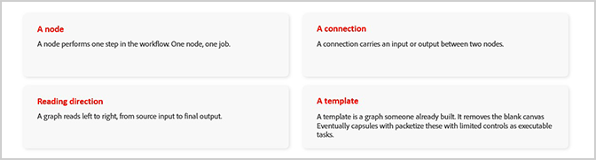

# &#x200B;2. Fireflyグラフのキーコンセプト

Fireflyグラフの使用を開始する際に役立つ重要な概念について説明します。

{align="center"}

## 節

ノードは、ワークフロー内で1つのステップ（1つのノード、1つのジョブ）を実行します。 ノードでは、画像の生成、マスクの適用、カラーのシフトなど、クリエイティブなアクションを1回実行できます。

## 接続

コネクションは、2つのノード間で入力または出力を伝送します。 グラフは、ソース入力から最終出力まで、左から右に読み取られます。

## テンプレート

テンプレートとは、誰かが既に構築したグラフです。 テンプレートから開始すると、空白のキャンバスが削除され、独自の概要に適応するための作業を開始できるようになります。

## ビルドする前に問題が発生する理由

グラフはデザインに柔軟に対応できます。 柔軟性があるため、*構築を開始する*&#x200B;前に、必要な結果とワークフローについて具体的に説明する価値があります。

## 次のステップ

何かを構築する準備はできましたか？ [3に移動します。 手順を追ったウォークスルー用に最初のグラフ](https://experienceleague.adobe.com/ja/docs/creative-cloud-enterprise-learn/cce-learning-hub/fireflyoverview/firefly-graph/create-your-first-graph)を作成します。

[Fireflyグラフの使い方](https://experienceleague.adobe.com/ja/docs/creative-cloud-enterprise-learn/cce-learning-hub/fireflyoverview/firefly-graph/overview-firefly-graph)に戻ります。
