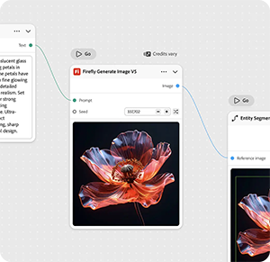

# &#x200B;2. ホタルグラフのキーコンセプト

ホタルグラフの基本的な概念について説明します。

## 節

ノードは、ワークフロー内で1つのステップ（1つのノード、1つのジョブ）を実行します。 ノードでは、画像の生成、マスクの適用、カラーのシフトなど、クリエイティブなアクションを1回実行できます。

{align="center"}

## ポート

ノード上の接続ポイント。 出力ポートはノードからデータを渡し、入力ポートはデータを受信します。 ポートの接続は、ワークフローにおけるデータの流れです。

{align="center"}

## Widget

テキストフィールド、ドロップダウン、スライダーなどのノードのインタラクティブコントロールでは、エディターで直接設定を構成できます。

{align="center"}

## 接続

コネクションは、2つのノード間で入力または出力を伝送します。 グラフは、ソース入力から最終出力まで、左から右に読み取ります。

{align="center"}

## グラフ

エディターで構築する完全なワークフロー。 グラフは、最終出力を生成するためにカンバス上に配置されたノードとコネクションで構成されます。

{align="center"}

## 次のステップ

何かを構築する準備はできましたか？ [3に移動します。 手順を追ったウォークスルーのために最初のグラフ](https://experienceleague.adobe.com/ja/docs/creative-cloud-enterprise-learn/cce-learning-hub/fireflyoverview/firefly-graph/create-your-first-graph)を作成します。

[ホタルグラフの使用](https://experienceleague.adobe.com/ja/docs/creative-cloud-enterprise-learn/cce-learning-hub/fireflyoverview/firefly-graph/overview-firefly-graph)に戻ります。
