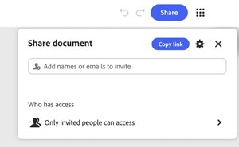
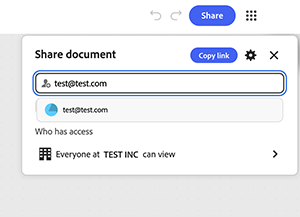

# &#x200B;5. グラフを共有

グラフを他のユーザーと共有する方法について説明します。 グラフを共有すると、出力だけでなく、ライブワークフローも共有されます。 編集アクセス権を持つユーザーであれば誰でも、そのファイルを再実行して変更し、他のユーザーに渡すことができます。 リンクレベルのアクセスを使用して組織内を広く可視化し、直接アクセスを必要とするユーザーに対して特定の役割を持つ名前付き招待を使用します。

1. グラフの右上隅にある&#x200B;**共有**&#x200B;を選択します。

   ダイアログが開き、名前や電子メールを追加するフィールドと、現在アクセスできるユーザーの概要が表示されます。 デフォルトでは、招待されたユーザーのみがグラフにアクセスできます。

   

1. 歯車アイコンを選択して&#x200B;**設定**&#x200B;を開き、**[組織]の全員が閲覧できます**&#x200B;を選択すると、社内の誰もがリンクを使用してグラフを開くことができます。

   

   利用できるアクセスレベルは、招待されたユーザー、組織のすべてのユーザー、またはリンクを知っているすべてのユーザーの3つです。

1. **検索で検出可能**&#x200B;をオンにすると、メンバーはリンクを使わなくてもグラフを見つけることができます。

   

   リンクを使用してグラフを表示できる人を示す確認バナーが表示されます。 リンクを任意の場所に送信する前に、これを確認してください。 これは、次に招待された人だけでなく、そのリンクの今後のすべての受信者に適用されます。

   

1. 招待フィールドに電子メールアドレスを直接入力して、1人のユーザーに一般的なリンク設定とは別のアクセス権を付与します。 フィールドの下に表示される候補からエントリを選択します。

   

1. 名前の横にある役割ドロップダウンを選択して、**エディター**&#x200B;または&#x200B;**閲覧者**&#x200B;を選択します。

   

   編集者は、グラフを編集、ダウンロード、共有できます。 閲覧者は閲覧のみを行うことができます。 グラフ自体を変える必要がない場合は、ロールの幅を狭くします。

1. 受信者がアクセス権を取得する理由を認識できるように、**メッセージ**&#x200B;フィールドにオプションのメモを追加します。 **編集者として招待**&#x200B;を選択するか、役割が選択されている場合は&#x200B;**閲覧者として招待**&#x200B;を選択して送信します。

   

## 次のステップ

テンプレートから開始しますか？ [5に移動します。 独自の概要を反映するようにテンプレート](https://experienceleague.adobe.com/en/docs/creative-cloud-enterprise-learn/cce-learning-hub/fireflyoverview/firefly-graph/customize-template)をカスタマイズします。

[ホタルグラフの使用](https://experienceleague.adobe.com/en/docs/creative-cloud-enterprise-learn/cce-learning-hub/fireflyoverview/firefly-graph/overview-firefly-graph)に戻ります。