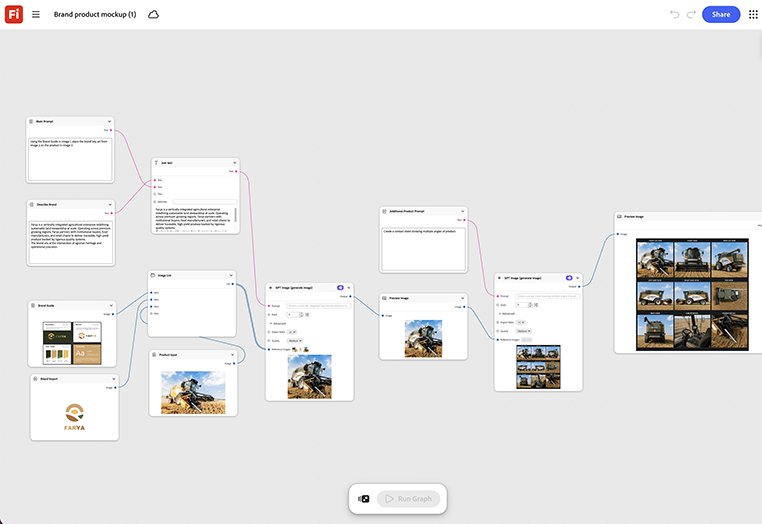

# ブランド製品のモックアップ

製品を様々なシーンで視覚化する方法を説明します。 製品のレンダリングまたは写真をモックアップノードにドロップします。 グラフは、完全にブランド化されたシーン内に配置され、そのシーンに合わせて自動的にライトとシャドウが調整されます。 [ブランド製品のモックアップテンプレートを開く](https://firefly.adobe.com/graph/edit/id/urn:aaid:sc:US:18717173-ecd7-5f76-8788-6be6cb977d93)。

>[!TIP]
>
>**始める前** – 最適な結果を得るには、このテンプレートを独自のブランド、製品、およびワークフローにカスタマイズしてください。 出力を使用する前に、参照画像やプロンプトを入れ替えて、コピーします。

{align="center"}

[!BADGE ユースケース]{type=Informative tooltip="活用例"}

* **小売業** – ブランド化された店内ディスプレイシーン内の新しい季節限定商品ラインを、実際のディスプレイが存在する前にモックアップします。
* **飲み物** – 生産前に、フルブランドの市販クーラーシーンで新しいボトルデザインをプレビューできます。
* **技術** – ブランド化された市販の棚シーン内の新しいデバイスをローンチデッキ用にモックアップします。

[Fireflyグラフの使い方](https://experienceleague.adobe.com/en/docs/creative-cloud-enterprise-learn/cce-learning-hub/fireflyoverview/firefly-graph/overview-firefly-graph)に戻ります。
