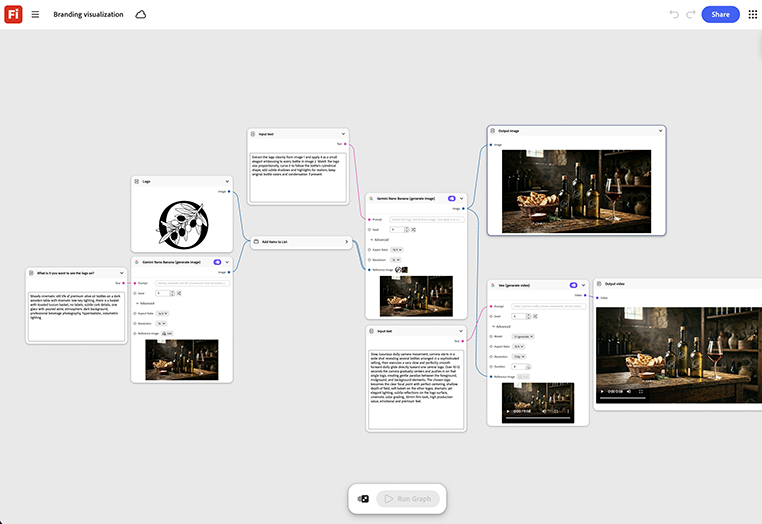

# ブランディングの視覚化

製品シーンでロゴやブランドを視覚化する方法について説明します。 ブランドガイドライン、またはロゴとカラーパレット、およびグラフ出力を、静的キーアートと短いモーションパスの両方で一度に入力することで、両方の形式が視覚的に整列した状態を保ちます。[ブランディング可視化テンプレートを開きます](https://firefly.adobe.com/graph/edit/id/urn:aaid:sc:US:c11ecbe0-0751-58ce-9f30-2eb6518bfd51)。

[!BADGE 業界の例]{type=Informative tooltip="業界の例"}

* **技術** – デザインやメディアの予算をフル生産に投入する前に、新しい製品サブブランドをキーアートとローンチティーザーの両方として視覚化します。
* **飲み物** - 3つのロゴとカラーパレットの方向を、完成したキーアートとしてテストしてから、いずれかの方向を選んで制作を開始します。
* **財務** – デザインレビューに到達する前に、ブランド化されたビジュアルとして新しいカードまたはアプリIDをプレビューします。

>[!TIP]
>
>**始める前** – 最適な結果を得るには、このテンプレートを独自のブランド、製品、およびワークフローにカスタマイズしてください。 出力を使用する前に、参照画像やプロンプトを入れ替えて、コピーします。

{align="center"}

[ホタルグラフの使用](https://experienceleague.adobe.com/ja/docs/creative-cloud-enterprise-learn/cce-learning-hub/fireflyoverview/firefly-graph/overview-firefly-graph)に戻ります。
