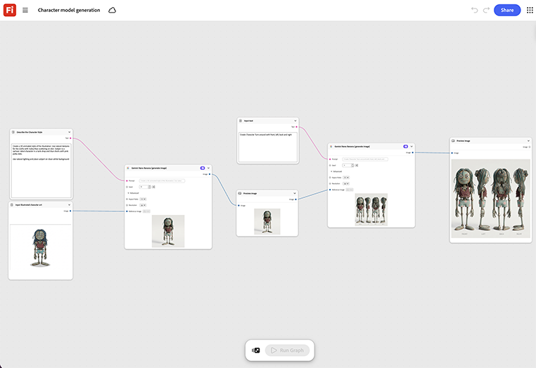

# 文字モデルの生成

イラストの3Dアニメーションスタイルを作成する方法を説明します。 テンプレートは、空のシーンから開始するのではなく、クリーンアップのためにモデラに渡す準備ができたベース3Dモデルパスを生成します。[文字モデル生成テンプレートを開きます](https://firefly.adobe.com/graph/edit/id/urn:aaid:sc:US:4008fbc8-083b-5766-ace9-6abf998df840)。

[!BADGE 業界の例]{type=Informative tooltip="業界の例"}

* **屋外** – パッケージのレンダリングやビデオで使用するトレイルマスコットの3Dモデルを作成します。まず、1つの承認済みキャラクターの概要を作成します。
* **技術** – クリーンアップのためにモデル管理者に提出する準備が整った手書きの簡単な説明から、基本3D文字モデルを生成します。
* **教育機関向け** – コースのビデオレッスンで使用する3Dインストラクターのキャラクターモデルを作成します。

>[!TIP]
>
>**始める前** – 最適な結果を得るには、このテンプレートを独自のブランド、製品、およびワークフローにカスタマイズしてください。 出力を使用する前に、参照画像やプロンプトを入れ替えて、コピーします。

{align="center"}

[Fireflyグラフの使い方](https://experienceleague.adobe.com/ja/docs/creative-cloud-enterprise-learn/cce-learning-hub/fireflyoverview/firefly-graph/overview-firefly-graph)に戻ります。
