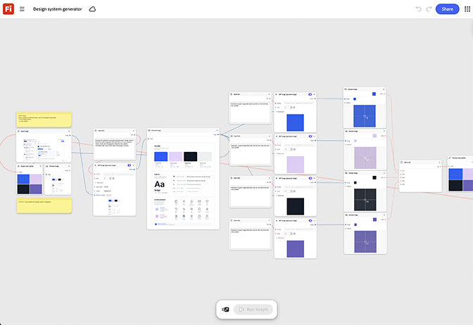

# デザインシステムジェネレータ

webサイトのスクリーンショットに基づいてデザインシステムを生成する方法について説明します。 このグラフを使用すると、一致するアイコン、パターン、レイアウトコンポーネントのセットを1回のバッチ処理で作成できます。 [デザインシステムジェネレーターを開きます](https://firefly.adobe.com/graph/edit/id/urn:aaid:sc:US:b40cd34c-66b2-586c-ab4a-5595490cded6)。

[!BADGE 業界の例]{type=Informative tooltip="業界の例"}

* **技術** – 四半期ごとの機能開始に使用する、再利用可能なアイコンと背景パターンのセットを生成します。このセットは、デザインの再確認を行わずに広告、ランディングページ、ソーシャル全体で再利用されます。
* **財務** – 開発を開始する前に、新しいアプリの再設計のために一貫性のあるアイコンとカラーシステムを構築します。
* **コミュニケーションと通信** - Webと店舗のサイネージを通じて、新しいプラン層に適した視覚言語を生成します。

>[!TIP]
>
>**始める前** – 最適な結果を得るには、このテンプレートを独自のブランド、製品、およびワークフローにカスタマイズしてください。 出力を使用する前に、参照画像やプロンプトを入れ替えて、コピーします。

{align="center"}

[ホタルグラフの使用](https://experienceleague.adobe.com/en/docs/creative-cloud-enterprise-learn/cce-learning-hub/fireflyoverview/firefly-graph/overview-firefly-graph)に戻ります。
