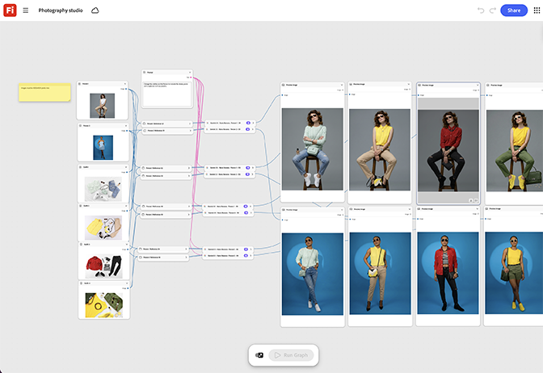

# フォトスタジオ

スタジオの背景ノードに製品のレンダリングを配置し、ライティングリグノードを調整して、実際のスタジオキャプチャのような結果を得る方法について説明します。 [フォトスタジオテンプレートを開きます](https://firefly.adobe.com/graph/edit/id/urn:aaid:sc:US:63ad7c3b-2cb3-5474-ba8c-7e1c8d8a570f)。

[!BADGE 業界の例]{type=Informative tooltip="業界の例"}

* **飲み物** – スケジュールされている物理的な製品の写真に先行して、新しい味のSKUのクリーンなスタジオ製品の写真を生成します。
* **技術** – ユニットが撮影可能になる前に、起動ページ用に新しいデバイスのスタジオ品質のレンダリングを作成します。
* **小売業** – 個々の撮影セッションを予約せずに、製品ライン全体で一貫したスタジオ写真を作成します。

>[!TIP]
>
>**始める前** – 最適な結果を得るには、このテンプレートを独自のブランド、製品、およびワークフローにカスタマイズしてください。 出力を使用する前に、参照画像やプロンプトを入れ替えて、コピーします。

{align="center"}

[Fireflyグラフの使い方](https://experienceleague.adobe.com/ja/docs/creative-cloud-enterprise-learn/cce-learning-hub/fireflyoverview/firefly-graph/overview-firefly-graph)に戻ります。
