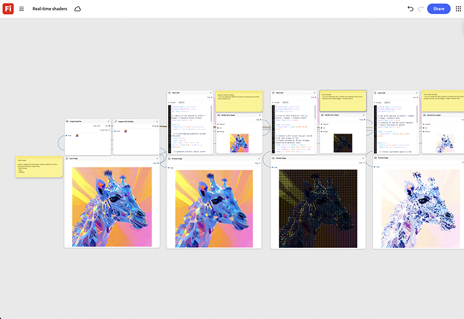

# リアルタイムシェーダ

イメージから始めて、3つの異なるカスタムシェーダを適用し、その結果をリアルタイムでプレビューする方法を学習します。 最初から再レンダリングするのではなく、ノード上でシェーダパラメータを直接調整します。 [リアルタイムシェーダーテンプレートを開く](https://firefly.adobe.com/graph/edit/id/urn:aaid:sc:US:51848c67-e360-5c40-8eff-8517b3395d54)。

[!BADGE 業界の例]{type=Informative tooltip="業界の例"}

* **技術** – カスタムのスタイル化されたシェーダーを構築するインタラクティブな展示会のデモで使用される3D製品コンフィギュレーターを検索します。
* **自動車** – 物理プロトタイプが存在する前に、車両モデル上のカスタムペイントおよびマテリアルシェーダをプレビューします。
* **小売店** – デジタルシェルフディスプレイ用の3D製品レンダリングで、スタイル化されたマテリアルの外観をテストします。

>[!TIP]
>
>**始める前** – 最適な結果を得るには、このテンプレートを独自のブランド、製品、およびワークフローにカスタマイズしてください。 出力を使用する前に、参照画像やプロンプトを入れ替えて、コピーします。

{align="center"}

[Fireflyグラフの使い方](https://experienceleague.adobe.com/en/docs/creative-cloud-enterprise-learn/cce-learning-hub/fireflyoverview/firefly-graph/overview-firefly-graph)に戻ります。
