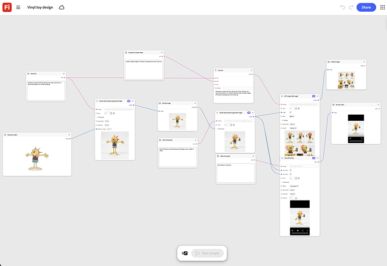

# ビニール玩具のデザイン

キャラクターまたはマスコットのリファレンスを入力し、それをスタイライズされたビニールのおもちゃフォームにレンダリングする方法を説明します。 ライセンスや製品レビューのデッキには、折り返し式があります。 [ビニール玩具のデザインテンプレートを開きます](https://firefly.adobe.com/graph/edit/id/urn:aaid:sc:US:6b1e062a-bf16-5dc9-99dd-c3bd4061e238)。

[!BADGE 業界の例]{type=Informative tooltip="業界の例"}

* **小売店** – ロイヤルティプログラムの立ち上げに結びついた限定版の回収可能な商品を設計し、製造を開始する前にコンセプトとして確認します。
* **飲み物** – ブランドのマスコットのコレクション可能なフィギュアをモックアップにして、限定販売の商品をドロップします。
* **エンターテイメント** – ライセンスピッチデッキ用にビニール玩具の形式でキャラクターをプレビューします。

>[!TIP]
>
>**始める前** – 最適な結果を得るには、このテンプレートを独自のブランド、製品、およびワークフローにカスタマイズしてください。 出力を使用する前に、参照画像やプロンプトを入れ替えて、コピーします。

{align="center"}

[ホタルグラフの使用](https://experienceleague.adobe.com/en/docs/creative-cloud-enterprise-learn/cce-learning-hub/fireflyoverview/firefly-graph/overview-firefly-graph)に戻ります。
