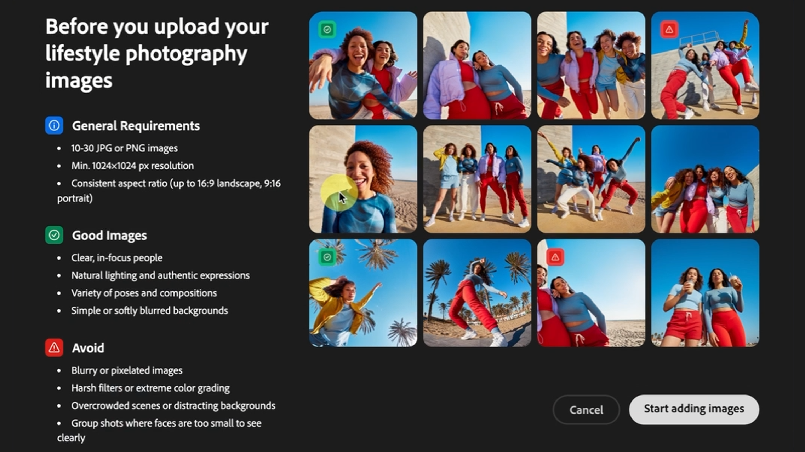

# Adobe [!DNL Firefly]の概要

Fireflyは、クリエイティブなAI生成モデルの新しいファミリーであり、最初は画像とテキストの効果の生成に重点を置いて、Adobe製品に追加されます。 Fireflyは、クリエイティブなワークフローを大幅に改善しながら、アイデア、作成、コミュニケーションを実現する新しい方法を提供します。

## Adobe Fireflyでできること

  

>[!VIDEO](https://video.tv.adobe.com/v/3416970t1?quality=12&learn=on&hidetitle=true)

## Fireflyチュートリアル

<table style="table-layout:fixed">
<tr>
   <td>
      
   </td>
   <td>
      
   </td>
   <td>
      
   </td>
   <td>
      
   </td>
</tr>
<tr>
  <td>
      
   </td>
   <td>
      
   </td>
   <td>
      
   </td>
    <td>
      
   </td>
</tr>
<tr>
 <td>
      
   </td>
   <td>
      
   </td>
   <td>
      
   </td>
   <td>
      
   </td>
</tr>
<tr>
  <td>
      
   </td>
  <td>
      
   </td>
  <td>
      
  </td>
  <td>
      
   </td>
</table>
