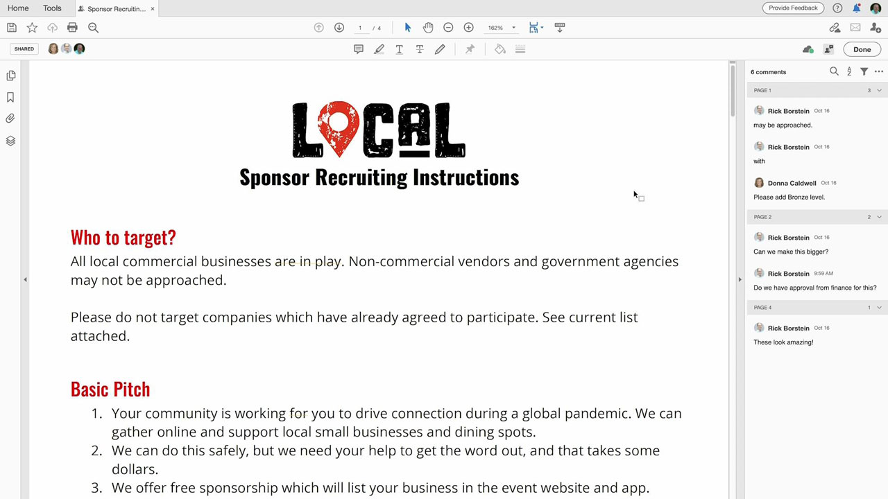
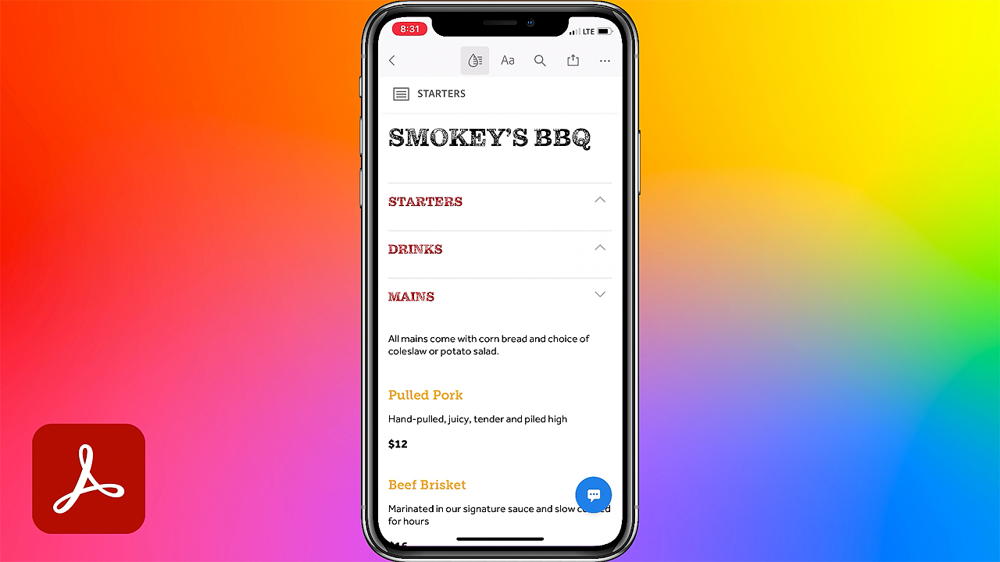
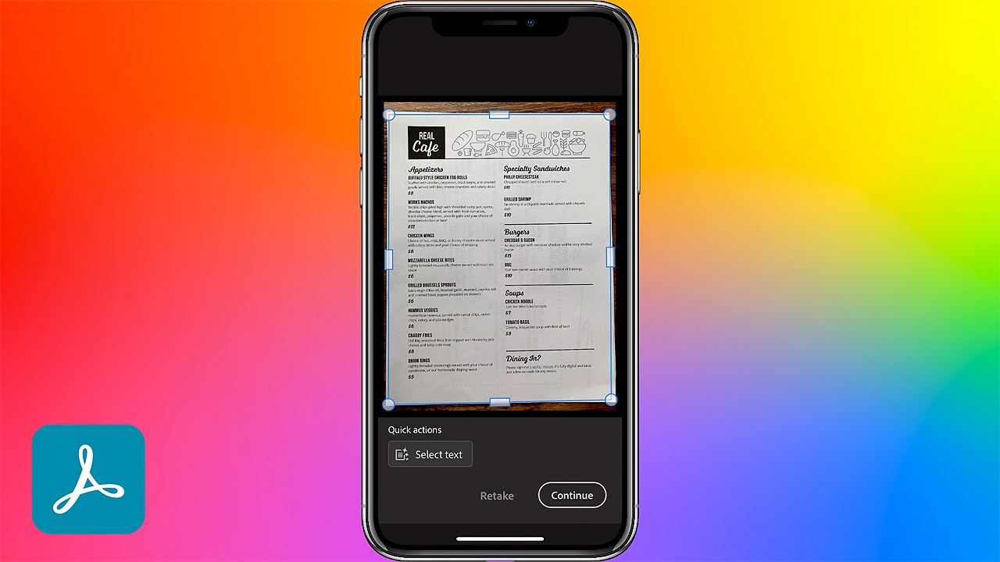

# Acrobat &amp; Sign

世界トップクラスのPDFおよび電子サインソリューションを備えたAdobe Document Cloudを使用すると、手動の文書プロセスを効率的なデジタル文書プロセスに変換できます。 複数の画面やデバイスで、いつでも、どこでも、そしてお気に入りのMicrosoftやエンタープライズアプリ内で、ドキュメント、ワークフロー、タスクに対してクイックアクションを実行できるようになりました。

## 製品のTutorialsを参照

<table style="table-layout:fixed">
<tr>
 <td>
   
    

   <a href="acrobat-sign.md#tutorial1"><strong>Acrobat共有レビューを開始しています</strong></a>
    

    <em>レビュー担当者を招待してPDF文書にコメントを追加する</em>
     
  </td>
  <td>
    
    

    <a href="acrobat-sign.md#tutorial2"><strong>Adobe Signを使用したオンライン権利放棄Formsの作成</strong></a>
    

    <em>文書をすばやくオンラインフォームに変換してオンラインに投稿し、必要とするユーザーが誰でも入力して署名できるようにします</em>
     
  </td>
  <td>
   
    

    <a href="acrobat-sign.md#tutorial3"><strong>Adobe Signで署名を依頼</strong></a>
    

    <em>WordからPDFに移動して、Adobe Signで署名用に送信</em>
     
  </td>
</tr>
<tr>
 <td>
   
    

   <a href="acrobat-sign.md#tutorial4"><strong>Liquid Modeを使用したモバイルでのメニューの表示</strong></a>
    

    <em>Liquid Modeを使用して、モバイルデバイスでのPDFの閲覧体験を向上させる</em>
     
  </td>
  <td>
    
    

    <a href="acrobat-sign.md#tutorial5"><strong>携帯電話から文書をスキャンしてPDFに送信</strong></a>
    

    <em>Adobe Scanを使用すると、文書、フォーム、名刺、ホワイトボードを簡単にキャプチャして、高品質のAdobePDFに変換できます</em>
     
  </td>
  <td>
    
    

     
  </td>
</tr>
</table>

## Acrobat共有レビューを開始しています(3:49) {#tutorial1}

>[!VIDEO](https://video.tv.adobe.com/v/326777?hidetitle=true)

**説明**
レビュー担当者を招待して、PDFの文書にコメントを追加してもらいます。

このチュートリアルでは、次の方法を学習します。
* Document CloudでのホストPDFのコメント
* コメントを1か所で収集
* 共同作業を促す同時コメント

**Adobeのレビューとコメントオプションの比較PDF**

**発表者：**
ソリューションコンサルタント、Dan Armstrong氏（デジタルメディア）
ソリューション・コンサルティング（デジタル・メディア）担当シニア・マネージャ、Rick Borstein氏

## Adobe Sign (5:19)を使用してオンライン権利放棄Formsを作成 {#tutorial2}

>[!VIDEO](https://video.tv.adobe.com/v/326776?hidetitle=true)

**説明**
文書をオンラインフォームにすばやく変換してオンラインに投稿し、必要な人が誰でも入力して署名できます。

このチュートリアルでは、次の方法を学習します。
* 紙のフォームをデジタル文書に変換してデジタル化
* 顧客が自分のデバイスからアクセスできるWebサイトにデジタルフォームを投稿する
* 入力済みのフォームは、自動的にアーカイブされて記録に残されます

**発表者：**
Taylor Kobey氏、ソリューションコンサルタント（デジタルメディア）
ソリューション・コンサルタント（デジタル・メディア）、Emily Palmer氏

## Adobe Sign (3:21)で署名を依頼 {#tutorial3}

>[!VIDEO](https://video.tv.adobe.com/v/326801?hidetitle=true)

**説明**
WordからPDFに移動し、Adobe Signで署名用に送信

このチュートリアルでは、次の方法を学習します。
* 署名用に電子文書を送信するために毎日使用するツールを活用

**発表者：**
ソリューション・コンサルティング（デジタル・メディア）担当シニア・マネージャ、Rick Borstein氏

## Liquid Mode (2:57)を使用したモバイルでのメニューの表示 {#tutorial4}

>[!VIDEO](https://video.tv.adobe.com/v/327093?hidetitle=true)

**説明**
Liquid Modeを使用すると、モバイルデバイスでのPDFの読み取りエクスペリエンスが向上します。

このチュートリアルでは、次の方法を学習します。
* モバイルデバイスでのPDFファイルのレスポンシブ化
* PDFレイアウトを改善
* モバイルやタブレットから文書を簡単に読み取れるように、その場で機能を追加

**発表者：**
アソシエイトソリューションコンサルタント、Emilie Enke氏（デジタルメディア）

## 携帯電話(5:53)から文書をスキャンしてPDFに送信 {#tutorial5}

>[!VIDEO](https://video.tv.adobe.com/v/327094?hidetitle=true)

**説明**
Adobe Scanを使用すると、文書、フォーム、名刺、ホワイトボードを簡単にキャプチャし、高品質のAdobePDFに変換できます。

このチュートリアルでは、次の方法を学習します。
* 携帯電話を使用して、文書、フォーム、名刺、ホワイトボードをキャプチャし、高品質のPDFに変換
* 手書きまたは印刷されたテキストを自動的に識別してシャープにし、グレアやシャドウなどの不要な要素を削除します
* Acrobat ReaderでスキャンしたPDFを開いて、メモやコメントを作成し、チームでレビューします

**発表者：**
アソシエイトソリューションコンサルタント、Emilie Enke氏（デジタルメディア）

**AcrobatおよびAdobe Signのリソース**

[ラーニングとサポート](https://helpx.adobe.com/jp/support/document-cloud.html)は、追加のチュートリアル、[新機能](https://helpx.adobe.com/jp/acrobat/using/whats-new.html)、およびコミュニティフォーラムへのリンクのハブです。

**2020年10月リリース**

これらの機能の使用を開始しましょう（さらに多くの機能を使用できます）。 Creative Cloudのデスクトップアプリから最新のアップデートをダウンロードする方法を説明します。
