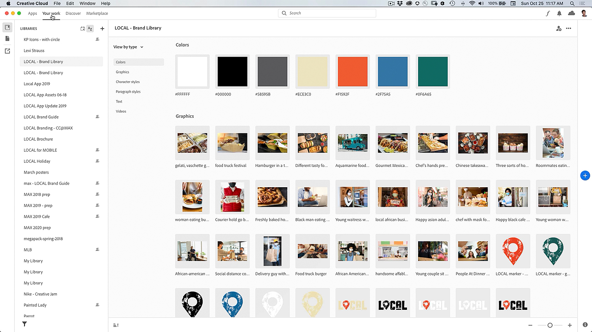

# Creative Cloud デスクトップアプリ

Creative Cloudデスクトップアプリは、CCのアプリケーション、サービス、共同作業などを管理するためのハブです。

## 製品のTutorialsを参照

<table style="table-layout:fixed">
<tr>
 <td>
   
    

   <a href="creativeclouddesktopapp.md#tutorial1"><strong>CCデスクトップアプリの紹介：次のユーザーのハブ 
Creative Cloud</strong></a>
    

    <em>Creative Cloudデスクトップアプリは、CCのアプリ、サービス、共同作業などを管理するためのハブです。</em>
     
  </td>
  <td>
    
    

     
  </td>
  <td>
    
    

     
  </td>
</tr>
</table>

## CCデスクトップアプリケーションの詳細： Creative Cloud用のハブ(2:50) {#tutorial1}

>[!VIDEO](https://video.tv.adobe.com/v/327095?hidetitle=true)

**説明**
Creative Cloudデスクトップアプリは、CCのアプリケーション、サービス、共同作業などを管理するためのハブです。

このチュートリアルでは、次の方法を学習します。
* デスクトップアプリの起動とアップデート
* モバイルアプリとwebアプリの検索
* アセットの管理と共有
* Adobe Fontsにアクセス
* チュートリアルを見つける
* Behance で作品を共有

**発表者：**
プリンシパルソリューションコンサルタント（デジタルメディア）、Patti Sokol氏
