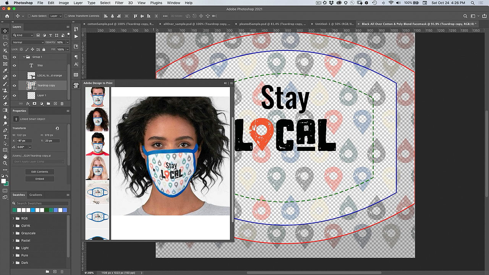
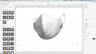

# 印刷プラグインによるフェイスマスクのカスタマイズのデザイン

自分のアートワークでフェイスマスクをカスタマイズすることもできたら、素敵だと思いませんか？ Adobeのデザインからプリントへプラグインを使用すると、数多くのZazzle製品でデザインを視覚化し、直接オンラインマーケットプレイスに公開することができます。

## FacemaskプロジェクトTutorialsを参照

<table style="table-layout:fixed">
<tr>
 <td>
   
    

   <a href="handsonproject.md#tutorial1"><strong>Photoshop Design to Printプラグインをインストール</strong></a>
    

    <em>Adobe Photoshopの強力な選択ツールとカラー編集ツールを使用して、企業のブランディングのニーズに合わせて画像を劇的に変化させます</em>
     
  </td>
  <td>
    
    

    <a href="handsonproject.md#tutorial2"><strong>デザインをプリントしてフェイスマスクをカスタマイズする</strong></a>
    

    <em>独自のZazzleフェイスマスクをカスタマイズする</em>
     
  </td>
  <td>
    
    

   <a href="handsonproject.md#tutorial3"><strong>フェイスマスクの3D可視化を作成する</strong></a>
    

    <em>イベントギャラリーのフェイスマスクの3D可視化を作成します</em>
     
  </td>
</tr>
</table>

## Photoshop Design to Printプラグイン(1:50)をインストールする {#tutorial1}

>[!VIDEO](https://video.tv.adobe.com/v/327096?hidetitle=true)

**説明**
Photoshop用のDesign to Printプラグインをインストールする方法について説明します。

このチュートリアルでは、次の方法を学習します。
* 衣服、アクセサリー、文房具、壁のアートなどの製品でデザインをリアルタイムで視覚化できます。
* DazzleオンラインマーケットプレイスにPublish

**発表者：**
プリンシパルソリューションコンサルタント（デジタルメディア）、Patti Sokol氏

## デザインをプリントしてフェイスマスクをカスタマイズする(7:54) {#tutorial2}

>[!VIDEO](https://video.tv.adobe.com/v/327097?hidetitle=true)

**説明**
独自のZazzleフェイスマスクをカスタマイズする

このチュートリアルでは、次の方法を学習します。
* 衣服、アクセサリー、文房具、壁のアートなどの製品でデザインをリアルタイムで視覚化できます。
* DazzleオンラインマーケットプレイスにPublish

**画像をクリックしてダウンロード学ぶデザインを印刷するPDF**

**発表者：**
プリンシパルソリューションコンサルタント（デジタルメディア）、Patti Sokol氏

## フェイスマスクの3Dビジュアライゼーションを作成します(7:54) {#tutorial3}

>[!VIDEO](https://video.tv.adobe.com/v/327098?hidetitle=true)

**説明**
イベントギャラリー用にフェイスマスクの3D可視化を作成

このチュートリアルでは、次の方法を学習します。
* フォトリアルな3Dビジュアライゼーションを簡単に作成
* マテリアルを追加し、照明を調整して、プロフェッショナルな外観にします
* アセットを読み込んで、ブランドや他のデザインを適用する

**画像をクリックして、白いマスクの3Dモデルが含まれた[!DNL Dimension]ファイルをダウンロード**

**発表者：**
プリンシパルソリューションコンサルタント（デジタルメディア）、Patti Sokol氏
