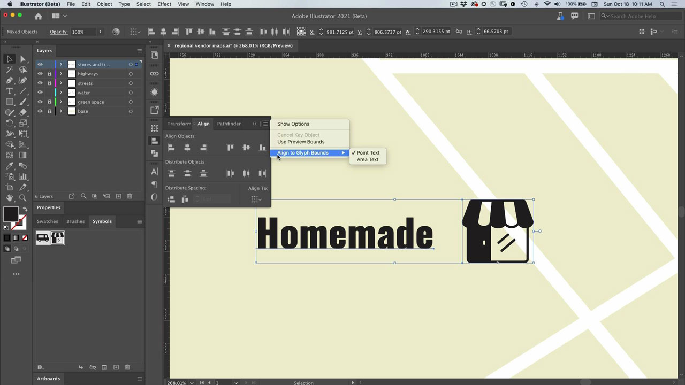

# Illustrator

イラストやグラフィック用の最新のアプリです。 ロゴ、アイコン、イラスト、その他のweb、モバイル、印刷に適したデザインを作成できます。

## 製品のTutorialsを参照

<table style="table-layout:fixed">
<tr>
 <td>
   
    

   <a href="illustrator.md#tutorial1"><strong>シンボルを使用して複数のアイコンインスタンスを更新する</strong></a>
    

    <em>手作業を減らし、シンボルとの一貫性を維持する</em>
     
  </td>
  <td>
    
    

    <a href="illustrator.md#tutorial2"><strong>グリフのスナップを使用したテキストと画像の整列</strong></a>
    

    <em>字形をドキュメントの重要な領域にすばやくスナップする</em>
     
  </td>
  <td>
    
    

     
  </td>
</tr>
</table>

## シンボルを使用して複数のアイコンインスタンス(5:08)を更新する {#tutorial1}

>[!VIDEO](https://video.tv.adobe.com/v/326816?hidetitle=true)

**説明**
手作業を減らし、シンボルとの一貫性を維持します。

このチュートリアルでは、次の方法を学習します。
* 手作業を減らし、シンボルとの一貫性を維持する

**発表者：**
プリンシパルソリューションコンサルタント（デジタルメディア）、Patti Sokol氏

## グリフのスナップを使用したテキストと画像の整列(6:48) {#tutorial2}

>[!VIDEO](https://video.tv.adobe.com/v/326817?hidetitle=true)

**説明**
字形を文書の重要な領域にすばやくスナップできます。

このチュートリアルでは、次の方法を学習します。
* 字形を文書の重要な領域にすばやくスナップ

**発表者：**
プリンシパルソリューションコンサルタント（デジタルメディア）、Patti Sokol氏

**Illustratorリソース**

[ラーニングとサポート](https://helpx.adobe.com/support/illustrator.html)は、追加のチュートリアルやコミュニティフォーラムへのリンクのハブです。

**2020年10月リリース**

これらの機能の使用を開始しましょう（さらに多くの機能を使用できます）。 Creative Cloudのデスクトップアプリから最新のアップデートをダウンロードする方法を説明します。
