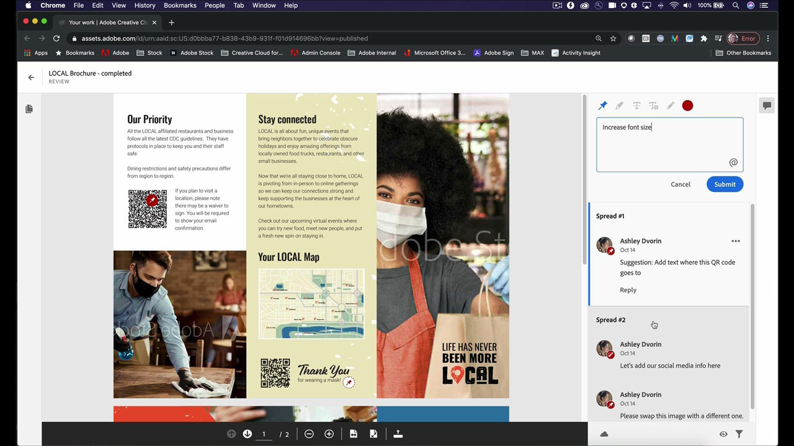
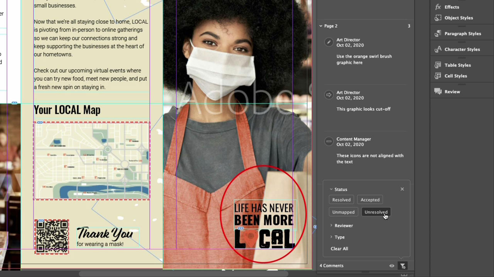

# InDesign

印刷およびデジタルパブリッシング用の美しいドキュメントを作成するための業界標準のアプリです。 電子書籍や電子雑誌から、書籍、レポート、ホワイトペーパーまで、豊富なデジタル印刷体験を作成できます。

## 製品のTutorialsを参照

<table style="table-layout:fixed">
<tr>
 <td>
    
    

    <a href="indesign.md#tutorial1"><strong>QRコードの生成</strong></a>
    

    <em>WebサイトにリンクするQRコードを生成する</em>
     
  </td>
  <td>
   
    

   <a href="indesign.md#tutorial2"><strong>InDesignからレビュー用に共有</strong></a>
    

    <em>デザイナーとそのチームメンバーのシームレスなクリエイティブレビュー体験</em>
     
  </td>
  <td>
    
    

    <a href="indesign.md#tutorial3"><strong>文書からPDFのコメントを取り込む 
クラウドレビュー</strong></a>
    

    <em>PDFのコメントを直接InDesignに読み込み、要求された変更内容をすばやく適用する</em>
     
  </td>
</tr>
<tr>
<td>
   
    

   <a href="indesign.md#tutorial4"><strong>InDesignドキュメントにビデオファイルを追加</strong></a>
    

    <em>InDesignにビデオを追加します。 PDFに出力してオンラインで公開</em>
     
  </td>
 <td>
    
    

     
 </td>
 <td>
    
    

     
 </td>
</tr>
</table>

## QRコードの生成(2:34) {#tutorial1}

>[!VIDEO](https://video.tv.adobe.com/v/326818?hidetitle=true)

**説明**
WebサイトにリンクするQRコードを生成します。

このチュートリアルでは、次の方法を学習します。
* モバイルデバイスを介してWebコンテンツに無料でアクセス
* お客様に安心を
* デジタル化により、コンテンツを最新の状態に簡単に維持

**発表者：**
プリンシパルソリューションコンサルタント（デジタルメディア）、Patti Sokol氏

## InDesignからレビュー用に共有(4:04) {#tutorial2}

>[!VIDEO](https://video.tv.adobe.com/v/326824?hidetitle=true)

**説明**
レビュー用にInDesign共有を使用すると、デザイナーとチームメンバーはさらにシームレスにクリエイティブレビューエクスペリエンスを実現できます。

このチュートリアルでは、次の方法を学習します。
* PDFを作成せずに、InDesignから直接レビューを開始
* Webブラウザーからのレビューとコメント
* 複数の関係者からのフィードバックを1か所で収集
* アプリ内でフィードバックを管理し、すぐに変更を行うことができます。

**Adobeのレビューとコメントオプションの比較PDF**

**発表者：**
ソリューション・コンサルタント（デジタル・メディア）、Emily Palmer氏

## Document CloudレビューからPDFのコメントを読み込む(4:52) {#tutorial3}

>[!VIDEO](https://video.tv.adobe.com/v/326959?hidetitle=true)

**説明**
PDFのコメントをInDesignに直接読み込み、要求された変更をすばやく適用できます。

このチュートリアルでは、次の方法を学習します。
* 既存のPDFコメントワークフローをサポート
* 複数のソースから組み合わせたPDFで機能

**Adobeのレビューとコメントオプションの比較PDF**

**発表者：**
シニアソリューションコンサルタント（デジタルメディア）、Michael Murphy氏

## InDesignドキュメントにビデオファイルを追加する(5:58) {#tutorial4}

>[!VIDEO](https://video.tv.adobe.com/v/326757?hidetitle=true)

**説明**
InDesignにビデオを追加します。 PDFに出力し、オンラインで公開します。

このチュートリアルでは、次の方法を学習します。
* InDesignへのビデオの追加
* PDFに出力してオンラインで公開

**発表者：**
プリンシパルソリューションコンサルタント（デジタルメディア）、Patti Sokol氏

**InDesignリソース**

[ラーニングとサポート](https://helpx.adobe.com/support/indesign.html)は、追加のチュートリアル、[新機能](https://helpx.adobe.com/indesign/user-guide.html/indesign/using/whats-new.ug.html)、およびコミュニティフォーラムへのリンクのハブです。

**2020年10月リリース**

これらの機能の使用を開始しましょう（さらに多くの機能を使用できます）。 Creative Cloudのデスクトップアプリから最新のアップデートをダウンロードする方法を説明します。
