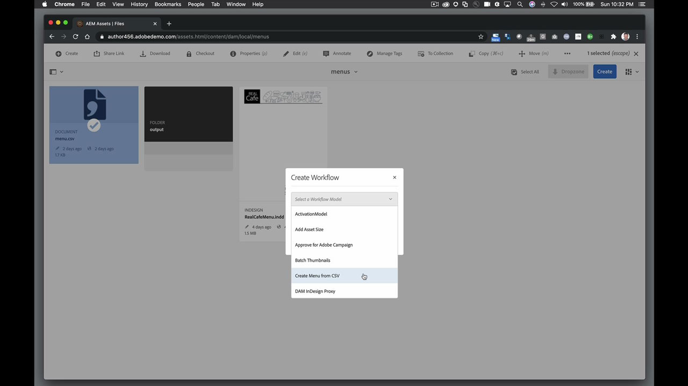

# InDesign Server

Adobe InDesign® Serverは、InDesignのデザイン機能、レイアウト機能、タイポグラフィー機能を活用する堅牢でスケーラブルなエンジンであり、プログラムを使用して魅力的な自動文書を作成できます。

## 製品のTutorialsを参照

<table style="table-layout:fixed">
<tr>
 <td>
   
    

   <a href="indesignserver.md#tutorial1"><strong>データ駆動型InDesign Serverコンテンツ</strong></a>
    

    <em>データ駆動型のデザインは、InDesign Serverを使用してプログラム的に実現できます</em>
     
  </td>
  <td>
    
    

     
  </td>
  <td>
    
    

     
  </td>
</tr>
</table>

## データ駆動型InDesign Serverコンテンツ(4:14) {#tutorial1}

>[!VIDEO](https://video.tv.adobe.com/v/326901?hidetitle=true)

**説明**
データ駆動型の設計は、InDesign Serverを使用してプログラム的に実現できます。

このチュートリアルでは、次の方法を学習します。
* 事前にフォーマットされたテキストスタイルまたはオブジェクトスタイルを使用してInDesignテンプレートを作成する
* 外部データ駆動型コンテンツのフローにより、コンテンツをより迅速にカスタマイズ
* レイアウトからスポットPDFを生成するか、AEMを使用して他の出力形式に関連付けます

**発表者：**
シニアソリューションコンサルタント（デジタルメディア）、Eric Rowse氏

## その他のInDesign Serverリソース

<table>
<tr>
 <td>
   
    

   <a href="https://www.adobe.com/products/indesignserver/buying-guide.html"><strong>InDesign Server：購入ガイド</strong></a>
    

    <em>社内の開発者またはパートナーが利用できるリソース</em>
     
  </td>
  <td>
   
    

   <a href="https://www.adobe.com/products/indesignserver/partner.html"><strong>InDesign Server:パートナーの検索</strong></a>
    

    <em>お客様は社内で開発できる専門知識を持っていますが、Adobeでは、お客様の要件を満たすソリューションを見つけるためにパートナーと協力することをお勧めします</em>
     
  </td>
  <td>
    
    

     
  </td>
</tr>
</table>

**InDesign Serverリソース**

[ラーニングとサポート](https://www.adobe.com/products/indesignserver.html)は、追加のチュートリアル、新機能、およびコミュニティフォーラムへのリンクのハブです。

**2020年10月リリース**

これらの機能の使用を開始しましょう（さらに多くの機能を使用できます）。 Creative Cloudのデスクトップアプリから最新のアップデートをダウンロードする方法を説明します。
