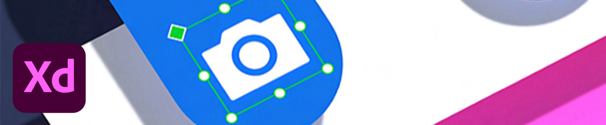

# チュートリアル

企業のクリエイターは、分散したチームで共同作業をおこない、拡張性の高いプロセスを確立し、企業のシステムとガイドラインを遵守する必要があります。 このチュートリアルでは、エンタープライズの観点から、Creative Cloudの 2021 リリースの新機能について説明します。

## Tutorials（デスクトップ製品別）

<table style="table-layout:fixed">
<tr>
 <td>
    
    

    <a href="acrobat-sign.md"><strong>AcrobatとAdobe Sign</strong></a>
    

    <em>文書やフォームの作成、編集、PDFへの署名</em>
     
  </td>
  <td>
    
    

    <a href="dimension.md"><strong>Dimension</strong></a>
    

    <em>グラフィックデザイナーのための 3D ツール</em>
     
  </td>
  <td>
    
    

    <a href="illustrator.md"><strong>Illustrator</strong></a>
    

    <em>ベクター画像やイラスト作成の業界標準ツール</em>
     
  </td>
</tr>
<tr>
 <td>
    
    

    <a href="indesign.md"><strong>InDesign</strong></a>
    

    <em>高品質なページレイアウトと文字組</em>
     
  </td>
  <td>
    
    

    <a href="photoshop.md"><strong>Photoshop</strong></a>
    

    <em>画像補正から加工、web デザインまで対応のプロフェッショナル画像編集ツール</em>
     
  </td>
  <td>
    
    

    <a href="rush.md"><strong>Rush</strong></a>
    

    <em>どこからでも簡単にビデオを作成してオンラインでシェア</em>
     
  </td>
</tr>
<tr>
 <td>
    
    

    <a href="xd.md"><strong>XD</strong></a>
    

    <em>ユーザーエクスペリエンスをデザイン、プロトタイプ作成、共有します</em>
     
  </td>
  <td>
    
    

     
  </td>
  <td>
    
    

     
  </td>
</tr>
</table>

### Tutorials（モバイルアプリ）

<table style="table-layout:fixed">
<tr>
 <td>
    
    

    <a href="capture.md"><strong>Capture</strong></a>
    

    <em>画像をカラーテーマ、ベクターグラフィック、ブラシなどに変換</em>
     
  </td>
  <td>
    
    

    <a href="fresco.md"><strong>Fresco</strong></a>
    

    <em>今までになかった究極のイラストレーションツール</em>
     
  </td>
  <td>
    
    

    <a href="illustratoripad.md"><strong>Illustrator iPad 版</strong></a>
    

    <em>ベクター画像やイラスト作成の業界標準ツール</em>
     
  </td>
</tr>
<tr>
 <td>
    
    

    <a href="photoshopipad.md"><strong>Photoshop iPad 版</strong></a>
    

    <em>デスクトップと iPad で美しい画像、グラフィック、アートを編集、合成、作成できます</em>
     
  </td>
  <td>
    
    

     
  </td>
  <td>
    
    

     
  </td>
</tr>
</table>

### Tutorials（統合別）

<table style="table-layout:fixed">
<tr>
 <td>
    
    

    <a href="aem.md"><strong>AEM Assets &amp; Asset Link</strong></a>
    

    <em>次世代のデジタルアセット管理</em>
     
  </td>
  <td>
    
    

    <a href="creativeclouddesktopapp.md"><strong>Creative Cloud デスクトップアプリケーション</strong></a>
    

    <em>Creative Cloudデスクトップアプリケーションは、CC アプリケーション、サービス、共同作業などを管理するためのハブです。</em>
     
  </td>
  <td>
    
    

    <a href="cclibraries.md"><strong>CC ライブラリ</strong></a>
    

    <em>素材を手元に置き、プロジェクトのブランドを統一</em>
     
  </td>
</tr>
<tr>
<td>
    
    

    <a href="indesignserver.md"><strong>InDesign Server</strong></a>
    

    <em>カスタマイズされた自動化と組み合わせたInDesignの洗練されたツール</em>
     
  </td>
 <td>
    
    

    <a href="stock.md"><strong>Adobe [!DNL Stock]</strong></a>
    

    <em>高品質なデジタル画像、イラスト、ビデオ、オーディオ、テンプレートなど</em>
     
  </td>
  <td>
    
    

     
  </td>
</tr>
</table>

### ハンズオンプロジェクト：独自の顔マスクを作成

<table style="table-layout:fixed">
<tr>
 <td>
    
    

    <a href="handsonproject.md"><strong>独自の顔マスクを作成</strong></a>
    

    <em>Adobeの Design to Print プラグインを使用すると、数百もの Zazzle 製品でデザインを視覚化し、オンラインマーケットプレイスに直接公開することができます</em>
     
  </td>
  <td>
    
    

     
  </td>
  <td>
    
    

     
  </td>
</tr>
</table>
